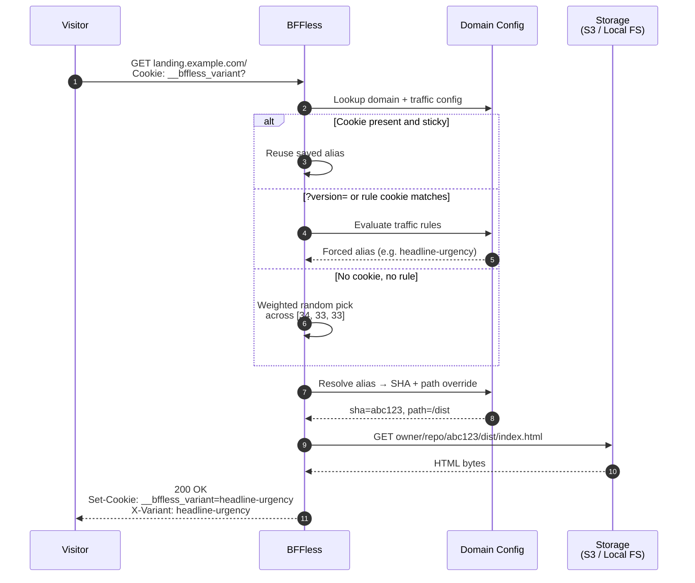

If you run Google Ads for a living, you already know the drill. You want to test three headlines and two hero images, you open Unbounce or Instapage, and within twenty minutes you're deciding whether this experiment is worth bumping the plan tier for. A/B testing is the feature that actually moves CPA — and it's the feature every landing page builder puts behind their highest-priced plan.

This post is about the other way to do it: deploy each variant as a static site, split traffic at the edge, and read a cookie to attribute conversions. No per-page pricing, no template jail, works with whatever stack your team already ships.

<!-- truncate -->

:::info This post is itself an A/B test
Meta moment: the page you're reading right now is being served by the exact mechanism it describes. We deployed two versions of this article as separate aliases (`blog-main` and `blog-git-native`) and BFFless is splitting traffic 50/50 between them. The headline, the lede, and a few paragraphs differ — same takeaway, different angle.

Want to see the other variant? Append `?version=git-native` to the URL. To force the original, use `?version=main`. The `__bffless_variant` cookie will keep you on whichever you land on so the rest of the post stays consistent. Open in an incognito window to get re-rolled.
:::


Two things this screenshot makes obvious that a client-side A/B testing tool can't:

- **It's the whole site, not a page.** Because each variant is a complete build artifact from its own git branch, the title, lede, section headings, meta description, OG card, and even the blog-index preview you see above all change together. You're not testing a button color — you're testing a whole positioning, end to end, across every URL the site serves.
- **It's decided at build time and at the edge.** There's no flash of the wrong content, no client-side flicker, no JavaScript swap-in mid-paint. By the time the first byte of HTML reaches the browser, the variant has already been chosen — what loads is what was in `dist/`, fully cached, fully fast, indistinguishable from a regular static page.

## The PPC experimentation problem

Drag-and-drop builders are great at what they do. But when you scale landing pages across a dozen client accounts, the same pain points show up every time:

- **A/B testing is a premium feature.** Unbounce's Smart Traffic, Instapage's experimentation suite, and Leadpages' split testing all sit on plans that run $200–$600/month per seat before you're testing at any real volume.
- **Templates cap what you can ship.** Custom components, design systems, and anything your frontend team has already built in React or Astro tend not to survive the round-trip through a WYSIWYG editor.
- **Client approval is its own product.** Sending a stakeholder a preview of variant B without showing them the live split usually means upgrading *again* to the tier with share links.
- **Page speed is the hidden tax.** Google Ads Quality Score punishes slow LCPs. Every builder layers its own runtime on top of your page; static HTML doesn't.

None of these are fatal on their own. Stack them together and you end up paying a premium tool to do a job that mostly consists of serving HTML.

## Why static hosting fits PPC landing pages

Paid landing pages are the ideal case for static hosting. They're small, they're read-heavy, and the two metrics that matter most — Quality Score and conversion rate — both reward raw page speed. Shipping a landing page as a pre-built bundle gives you the fastest TTFB and LCP you can physically achieve, and it scales to any traffic spike without autoscaling config.

It also means your designers and devs keep shipping in the tools they already use. Next.js, Astro, Eleventy, Hugo, a folder full of HTML — doesn't matter. Each variant is just another build artifact.

The missing piece is usually traffic splitting. That's what BFFless adds on top.

## How A/B testing works on BFFless

The primitive is simple: every variant is a **deployment alias**, and traffic splitting routes visitors across aliases by weight.


When a visitor lands on your domain, BFFless does roughly this:

1. Check for an existing `__bffless_variant` cookie. If it's set, route to that alias.
2. Otherwise, evaluate traffic rules (query parameters, cookies). If one matches, force that alias.
3. Otherwise, pick an alias using weighted random selection — for weights `[50, 30, 20]`, random 0–50 routes to the first alias, 51–80 to the second, 81–100 to the third.
4. Resolve the alias to its current deployment SHA (and optional path override), fetch the file from storage, and serve it back.
5. Set the `__bffless_variant` cookie so the visitor sticks to that variant on return visits.

The variant cookie is intentionally readable from JavaScript (not `HttpOnly`), so your analytics layer can pick it up and attribute conversions without any server-side glue. The selected alias is also returned in the `X-Variant` response header if you prefer reading it from the network layer.

Visually, a single request from a first-time visitor looks like this:



Step by step:

1. **Request hits BFFless.** The visitor's browser sends a normal `GET /` to your landing-page domain. If they've been here before, the request also carries a `__bffless_variant` cookie naming the alias they were assigned last time.
2. **Domain config lookup.** BFFless resolves the `Host` header to a domain mapping and pulls the traffic config for it: the list of aliases, their weights, sticky-session settings, and any traffic rules. If the domain has only one alias, this whole flow short-circuits and serves it directly.
3. **Cookie branch — sticky session.** If sticky sessions are on and the cookie's alias is still valid (still in the weights list, or still referenced by an active rule), BFFless reuses that alias and skips selection entirely. This is why a returning visitor never flips between variants mid-test.
4. **Rule branch — forced routing.** If there's no usable cookie, BFFless evaluates traffic rules in order: query parameters first, then cookies, then headers. The first match wins and forces that alias. This is the path that powers `?version=headline-urgency` preview links and segment overrides like `Cookie: plan=enterprise`.
5. **Random branch — weighted pick.** With no cookie and no matching rule, BFFless rolls a weighted random number across the configured splits. For weights `[34, 33, 33]` the math is exactly what you'd expect: 34% of new visitors land on the first alias, 33% on each of the other two.
6. **Alias resolution.** Aliases are mutable pointers — `landing-headline-urgency` resolves to whichever immutable deployment SHA is currently promoted to it, plus an optional **path override** if the variant lives in a subfolder of a single shared deployment instead of its own branch build.
7. **Config returns SHA + path.** The domain config hands back the resolved deployment coordinates: the commit SHA (e.g. `abc123`) and the path prefix (e.g. `/dist`). Together these form the storage key prefix for every file in that variant.
8. **Storage fetch.** BFFless requests the file from whichever storage backend you've configured — S3, GCS, Azure Blob, MinIO, or the local filesystem — using the key `owner/repo/abc123/dist/index.html`. The storage adapter is pluggable; the routing logic above doesn't care which one is wired up.
9. **Bytes back.** The storage backend returns the raw file contents. BFFless streams them through without rewriting HTML or injecting any runtime — what was in your `dist/` folder is what the visitor gets.
10. **Response with cookie + header.** BFFless writes the body back to the visitor along with `Set-Cookie: __bffless_variant=headline-urgency` (so the next request is sticky) and `X-Variant: headline-urgency` (so your edge logs, analytics, and curl debugging can see which variant was served without parsing cookies).

That's the whole mechanism. Nothing you put in front of it — routing, caching, rules, previews — requires a new SDK or a new plan tier.

## Shipping a headline test, end to end

Here's a concrete walkthrough. Say you're testing three headline variants on `landing.clientname.com`.

### 1. Deploy each variant as its own alias

Branch per variant, one GitHub Actions workflow, one alias per push. The action uploads whatever's in `dist/` to BFFless under an alias named after the branch:

```yaml title=".github/workflows/deploy.yml"
on:
  push:
    branches: [main, headline-outcome, headline-urgency]
jobs:
  deploy:
    runs-on: ubuntu-latest
    steps:
      - uses: actions/checkout@v4
      - run: pnpm install && pnpm build
      - uses: bffless/upload-artifact@v1
        with:
          path: dist
          api-url: ${{ vars.BFFLESS_URL }}
          api-key: ${{ secrets.BFFLESS_API_KEY }}
          alias: landing-${{ github.ref_name }}
```

After three pushes you have `landing-main`, `landing-headline-outcome`, and `landing-headline-urgency` — three live static sites, each with its own preview URL. Git is your variant manager.

### 2. Configure the split

In **Admin → Settings → Domain Mapping → Traffic**, attach those three aliases to `landing.clientname.com`:

```
landing-main:             34%
landing-headline-outcome: 33%
landing-headline-urgency: 33%
```

Turn on **sticky sessions** so return visitors stay on the same variant, and add a `?version=` query-param rule for each alias:


Now anyone can preview a specific variant by appending `?version=headline-outcome` to the URL — which is exactly the "share a preview with the client" workflow that enterprise builders charge extra for. Send the three links to your PM, let them pick, done.

:::tip Skip the admin panel
If you use Claude Code, the [BFFless plugin](/features/claude-code-plugin) ships a `traffic-splitting` skill that knows this whole configuration shape — weights, sticky sessions, query-param rules, alias naming. It pairs with the [BFFless MCP server](https://docs.bffless.app/features/mcp-server/), which is what actually executes the API calls — the plugin teaches Claude *how* to configure things, the MCP server gives it the tools to do it. You'll need both.

Connect the MCP server once (see [MCP Server — Setup](https://docs.bffless.app/features/mcp-server/#setup) for the API key and config), then install the plugin:

```
/plugin marketplace add bffless/claude-skills
/plugin install bffless
```

Then just describe the test: *"split landing.clientname.com 34/33/33 across landing-main, landing-headline-outcome, and landing-headline-urgency, sticky sessions on, with ?version= query-param rules for each."* Claude handles the API calls. Source: [claude-skills/plugins/bffless/skills/traffic-splitting](https://github.com/bffless/claude-skills/tree/main/plugins/bffless/skills/traffic-splitting).
:::

### 3. Read the cookie and attribute conversions

Your frontend doesn't need to know *which* variant it is at build time. At runtime, read the cookie:

```javascript
function getVariant() {
  const match = document.cookie.match(/(?:^|; )__bffless_variant=([^;]*)/);
  return match ? decodeURIComponent(match[1]) : null;
}
```

Then attach that value to every conversion event your analytics tool sends. GA4 example:

```javascript
document.querySelector('#cta').addEventListener('click', () => {
  gtag('event', 'cta_click', {
    variant: getVariant(),
  });
});
```

Same one-liner works for Mixpanel, Amplitude, Pendo, PostHog, or whatever internal pipeline you pipe events to. Segment by `variant` in your dashboard and you have per-variant conversion rates without paying for a second analytics product.

### 4. Pick a winner and roll out

When the test is conclusive, flip the winner to 100% in the traffic splitting panel. Instant rollback, no redeploy. Keep the losing aliases around as a history of what didn't work, or delete them.

## What you get that the builders don't

This isn't a full replacement for Unbounce or Instapage — BFFless is not a drag-and-drop page builder, and if your team doesn't have a dev who can ship HTML, you probably want one of those tools. But if you *do* have a dev, you get a handful of things that stop being hypothetical:

- **Any framework, any CI.** Next.js, Astro, plain HTML, an internal design system — whatever builds into a static folder works.
- **Branches are variants.** Git is your variant manager, code review is your QA process, `git revert` is your rollback.
- **No per-page pricing.** Experiments aren't billable events. Run twenty at once if you want to.
- **Client preview links for free.** `?version=` rules give every stakeholder a stable URL per variant without another plan tier.
- **Static-fast by default.** LCP stays wherever your build tool puts it. Quality Score benefits compound into lower CPCs over the life of the account.
- **Self-hostable.** If your client's legal team has opinions about where landing page data lives, BFFless runs on your own infra.

## Try it

There's a live traffic-splitting demo running at [demo.docs.bffless.app](https://demo.docs.bffless.app/) — open it in an incognito window a few times and watch the button color change. Our own homepage at [bffless.app](https://bffless.app) is currently running a four-way headline test using exactly the pattern above.

If you want to go deeper, the [A/B testing recipe](/recipes/ab-testing) walks through the GitHub Actions setup, analytics integrations for GA4, Mixpanel, and Pendo, and the full cookie behavior. The [traffic splitting reference](/features/traffic-splitting) covers weights, rules, and canary rollouts in detail.

Spin up an instance, point a client's landing page at it, and see what your experiment velocity looks like when variants are free.
