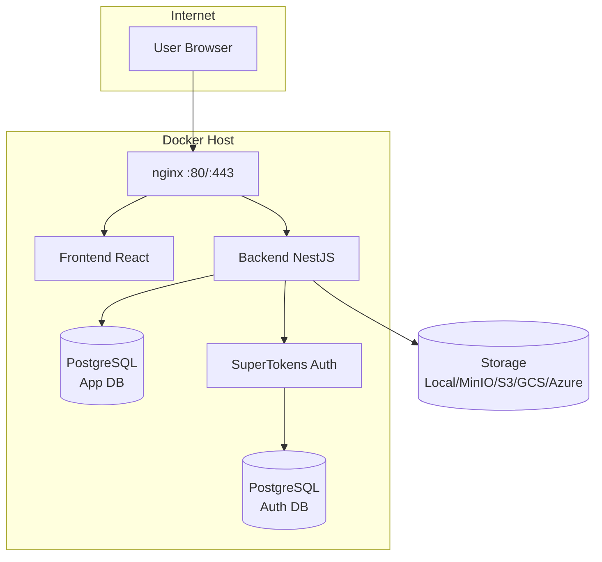

# Deployment Overview

Choose the deployment method that best fits your needs.

## Deployment Options

| Method | Best For | Complexity | Cost |
|--------|----------|------------|------|
| [Quick Start](/getting-started/quickstart) | First-time users | Low | Varies |
| [DigitalOcean](/deployment/digitalocean) | Simple cloud hosting | Medium | $6-12/mo |
| [GitHub Actions CI/CD](/deployment/github-actions) | Automated deployments | Medium | Free tier |

## Requirements

All deployment methods require:

- **Domain name** with DNS pointing to your server
- **SSL certificates** (can be auto-generated with Let's Encrypt)
- **Ports 80 and 443** open for web traffic

### Server Requirements

| Resource | Minimum | Recommended |
|----------|---------|-------------|
| RAM | 1GB | 2GB |
| Disk | 20GB | 40GB |
| CPU | 1 vCPU | 2 vCPU |

## Architecture

All deployment methods use the same architecture:



## Subdomains

The platform uses the following subdomains:

| Subdomain | Purpose |
|-----------|---------|
| `admin.yourdomain.com` | Admin panel (main application) |
| `www.yourdomain.com` | Welcome page / Primary content |
| `minio.yourdomain.com` | MinIO console (only if using MinIO for storage) |
| `*.yourdomain.com` | User-created dynamic domains |

## Managing Services

Use the provided scripts to start and stop BFFless. These scripts read your `.env` configuration to determine the correct Docker commands.

### Start Services

```bash
./start.sh [options]
```

| Option | Description |
|--------|-------------|
| (none) | Start with services configured in `.env` |
| `--all` | Start all services (PostgreSQL + MinIO + Redis + SuperTokens) |
| `--minimal` | Start without optional services (use external databases) |
| `--fresh` | Clear frontend cache (use after pulling new images) |

### Stop Services

```bash
./stop.sh
```

### Environment Configuration

Without flags, `./start.sh` reads these settings from `.env`:

| Variable | Default | Description |
|----------|---------|-------------|
| `ENABLE_POSTGRES` | `true` | Run PostgreSQL in Docker (set `false` to use external) |
| `ENABLE_MINIO` | `true` | Run MinIO in Docker (set `false` to use S3/GCS/Azure) |
| `ENABLE_REDIS` | `true` | Run Redis in Docker for caching |
| `SUPERTOKENS_MODE` | `local` | `local` for Docker container, `platform` for external |

When disabling a service, provide the external connection:
- `ENABLE_POSTGRES=false` requires `DATABASE_URL`
- `ENABLE_MINIO=false` → configure storage in setup wizard
- `SUPERTOKENS_MODE=platform` requires `SUPERTOKENS_CONNECTION_URI`

## Next Steps

1. Choose a deployment method from the table above
2. Follow the [SSL Certificates](/deployment/ssl-certificates) guide if needed
3. Configure your [Environment Variables](/configuration/environment-variables)
