# Umbrel Deployment

Deploy BFFless on your [Umbrel](https://umbrel.com/) home server with Cloudflare Tunnel for secure external access.

## How It Works

BFFless on Umbrel uses Cloudflare Tunnel to securely expose your home server to the internet without opening ports on your router.

```mermaid
flowchart LR
    A["🌐 Users"] -->|mysite.domain.com| B["☁️ Cloudflare"]
    B <-.->|Tunnel| C["🏠 Umbrel"]
    C --> D["BFFless"]

    style B fill:#f6821f,color:#fff
    style D fill:#d96459,color:#fff
```



**Key Benefits:**

- **No port forwarding** - Cloudflare Tunnel creates an outbound connection from your home
- **Free SSL** - Cloudflare handles HTTPS certificates automatically
- **Wildcard subdomains** - Host unlimited sites on `*.yourdomain.com`
- **DDoS protection** - Cloudflare shields your home IP from attacks

## Prerequisites

Before you begin, you'll need:

- **Umbrel** running on your home server (Raspberry Pi or x86)
- **Cloudflare account** with at least one domain
- **Domain managed by Cloudflare** (DNS hosted on Cloudflare)

## Installation

### Step 1: Install BFFless from Umbrel App Store

1. Open your Umbrel dashboard
2. Go to the **App Store**
3. Search for "BFFless" or browse the **Developer Tools** category
4. Click **Install**

The app will be available at `http://umbrel.local:5537`, but you'll see a setup page explaining that Cloudflare Tunnel is required.

### Step 2: Install Cloudflare Tunnel App

1. In the Umbrel App Store, install [**Cloudflare Tunnel**](https://apps.umbrel.com/app/cloudflared)
2. Once installed, open the app and follow the authentication flow to connect to your Cloudflare account

## Setting Up Cloudflare Tunnel

### Step 3: Create a Tunnel

If you don't already have a tunnel, create one:

1. Go to [Cloudflare Zero Trust Dashboard](https://one.dash.cloudflare.com/)
2. Navigate to **Networks** → **Connectors**
3. Click **Create a tunnel**
4. Select **Cloudflared** as the tunnel type


5. Name your tunnel (e.g., "BFFless Umbrel")


6. On the **Install and run connectors** step, copy the token from the install command (the `eyJh...` part)


7. Open the **Cloudflare Tunnel** app in Umbrel and paste the token into the settings, then click **Save & Restart**


Once connected, you'll see your tunnel with a **HEALTHY** status:


### Step 4: Add Routes for BFFless

1. In the Cloudflare Zero Trust dashboard, go to **Networks** → **Connectors**
2. Click on your tunnel name (e.g., "Umbrel")
3. Go to the **Published application routes** tab
4. Click **Add a published application route** and create the following 3 routes:

| Subdomain | Domain           | Service                    |
| --------- | ---------------- | -------------------------- |
| `admin`   | `yourdomain.com` | `http://umbrel.local:5537` |
| `*`       | `yourdomain.com` | `http://umbrel.local:5537` |
| `www`     | `yourdomain.com` | `http://umbrel.local:5537` |


:::tip Wildcard Routes
Using `*` as the subdomain allows BFFless to host sites on any subdomain (e.g., `mysite.yourdomain.com`, `blog.yourdomain.com`). This is recommended for maximum flexibility.
:::

### Step 5: Configure Wildcard DNS

Cloudflare doesn't automatically create DNS records for wildcard routes, so you need to add one manually:

1. Go to your domain's DNS settings in Cloudflare (not Zero Trust)
2. Click **Add record**
3. Configure:

| Field            | Value                          |
| ---------------- | ------------------------------ |
| **Type**         | CNAME                          |
| **Name**         | `*`                            |
| **Target**       | `<tunnel-id>.cfargotunnel.com` |
| **Proxy status** | Proxied (orange cloud)         |

:::tip
The `admin` and `www` routes from Step 4 automatically created CNAME records. You can copy the target value (e.g., `abc123.cfargotunnel.com`) from one of those DNS records.
:::


## Configure BFFless Domain

### Step 6: Set Your Domain

SSH into your Umbrel and create the domain configuration file:

```bash
ssh umbrel@umbrel.local
```

Create the domain file:

```bash
echo "yourdomain.com" > ~/umbrel/app-data/bffless/data/config/domain.txt
```

Replace `yourdomain.com` with your actual domain.

### Step 7: Restart BFFless

Restart the app to apply the domain configuration:

1. Go to your Umbrel dashboard
2. Find the BFFless app
3. Click the three dots menu (⋮)
4. Select **Restart**

## Access Your App

Visit your admin subdomain (e.g., `https://admin.yourdomain.com`) to access BFFless and complete the [setup wizard](/getting-started/setup-wizard).

## Troubleshooting

### "Cloudflare Tunnel Required" Page

If you see this page when accessing via your domain:

- Verify your Cloudflare Tunnel route is correctly configured
- Check that the tunnel is showing "HEALTHY" status
- Ensure DNS is properly pointing to the tunnel

### 502 Bad Gateway

- Make sure BFFless is running in Umbrel
- Check that the route URL is `umbrel.local:5537` (not `localhost`)
- Verify the tunnel connector is online

### Cookies Not Working

If you can't stay logged in:

- Make sure `domain.txt` contains just your domain (e.g., `yourdomain.com`), not the full URL
- Restart BFFless after creating/modifying `domain.txt`

### View Logs

To debug issues, view the BFFless logs:

```bash
ssh umbrel@umbrel.local
sudo docker logs bffless_backend_1 --tail 100
```

## Custom Domains

BFFless supports custom domains for your deployed sites. When you add a custom domain through the admin panel:

1. **Add the domain in BFFless** - Go to your deployment settings and add the custom domain
2. **Configure DNS** - Point your custom domain to your Cloudflare Tunnel (CNAME to `<tunnel-id>.cfargotunnel.com`)
3. **Add a route in Cloudflare Tunnel** - Create a route for the custom domain pointing to `umbrel.local:5537`
4. **Restart BFFless** - After adding custom domains, restart the app from the Umbrel dashboard to apply the nginx configuration

:::note
Unlike the standard CE deployment, Umbrel requires a manual app restart after adding custom domains. This is because the containerized environment doesn't allow automatic nginx reloads.
:::

## Next Steps

Once BFFless is running:

- [Upload your first site](/getting-started/quickstart)
- [Set up GitHub Actions](/deployment/github-actions) for CI/CD deployments
