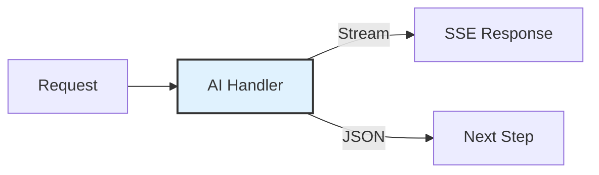
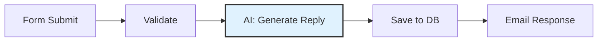
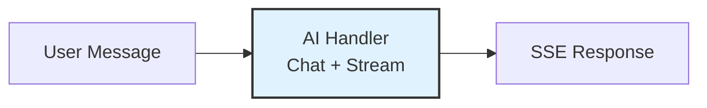
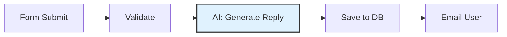

# AI Pipelines

Add AI-powered chat and content generation to your site without writing backend code. The AI handler integrates directly into BFFless [pipelines](/features/pipelines), supporting real-time streaming chat, single-response generation, and conversation persistence.


## Overview

The AI pipeline handler connects your site to large language models (LLMs) from OpenAI, Anthropic, or Google AI. It supports two primary modes:

- **Chat mode** — Interactive conversations with streaming responses, compatible with the <a href="https://ai-sdk.dev/docs/ai-sdk-ui/chatbot" target="_blank" rel="noopener noreferrer">AI SDK `useChat` hook ↗</a>
- **Completion mode** — Single AI-generated responses for form processing, content generation, or any pipeline step



### Supported Providers

| Provider     | Models                                              | Default Model      |
| ------------ | --------------------------------------------------- | ------------------ |
| **OpenAI**   | gpt-4o, gpt-4-turbo, gpt-4, gpt-4o-mini, gpt-3.5-turbo | gpt-4o             |
| **Anthropic**| claude-opus-4-6, claude-sonnet-4-6, claude-haiku-4-5    | claude-sonnet-4-6  |
| **Google AI**| gemini-1.5-pro, gemini-1.5-flash, gemini-1.5-flash-8b  | gemini-1.5-pro     |

## Quick Start

### 1. Configure an AI Provider

Navigate to **Settings → AI** in your project's admin panel. Add your API key for at least one provider:

1. Select a provider (OpenAI, Anthropic, or Google AI)
2. Enter your API key
3. Choose a default model
4. Click **Test Connection** to verify
5. Save

API keys are encrypted at rest using AES-256-GCM and never exposed in pipeline configurations.

### 2. Generate a Chat Schema

The fastest way to get started is to generate a pre-configured chat schema:

1. Go to **Pipelines → DB Records**
2. Click **Generate Schema**
3. Select **Chat Schema**
4. Enter a name (e.g., `support`)
5. Click **Generate**

This creates:
- A `{name}_conversations` DB Record for conversation metadata
- A `{name}_messages` DB Record for individual messages
- A pipeline with a `POST /api/chat` endpoint pre-configured with the AI handler

### 3. Connect Your Frontend

Use the AI SDK's `useChat` hook to connect your React app:

```tsx
import { useChat } from '@ai-sdk/react';

function Chat() {
  const { messages, input, handleInputChange, handleSubmit, status } = useChat({
    api: 'https://your-site.bffless.app/api/chat',
  });

  return (
    <div>
      {messages.map((m) => (
        <div key={m.id}>
          <strong>{m.role}:</strong> {m.parts.map(p => p.text).join('')}
        </div>
      ))}
      <form onSubmit={handleSubmit}>
        <input value={input} onChange={handleInputChange} placeholder="Type a message..." />
        <button type="submit" disabled={status === 'streaming'}>Send</button>
      </form>
    </div>
  );
}
```

:::tip
See the <a href="https://github.com/bffless/demo-chat" target="_blank" rel="noopener noreferrer">demo-chat repository ↗</a> for a complete working example with streaming, markdown rendering, and rate limit handling.
:::

## Modes

### Chat Mode

For interactive conversations where the client sends the full message history on each request. The AI handler reads the messages array, calls the LLM, and streams the response back.

**How it works:**

1. Client sends `{ id: "conv-123", messages: [...] }` via `useChat`
2. AI handler passes messages to the LLM
3. Response streams back as Server-Sent Events (SSE)
4. Optionally, new messages are persisted to DB Records

**Configuration:**

| Field                  | Description                                      | Default                    |
| ---------------------- | ------------------------------------------------ | -------------------------- |
| `messagesField`        | Expression for the messages array                | `request.body.messages`    |
| `maxHistoryMessages`   | Max messages to include in LLM context           | `50`                       |

### Completion Mode

For single AI-generated responses within a pipeline. The AI processes a templated message and returns a complete JSON response that subsequent pipeline steps can use.

**Example: AI-enhanced contact form**



**Configuration:**

| Field           | Description                                               | Default     |
| --------------- | --------------------------------------------------------- | ----------- |
| `messageField`  | Template for the message (supports `{{expressions}}`)     | `message`   |

Completion mode supports Handlebars expressions to inject data from previous pipeline steps:

```
Generate a thank-you message for: {{steps.form.feedback}}
```

## Response Formats

### Stream (SSE)

Streams tokens in real-time using Server-Sent Events. Compatible with the AI SDK's `useChat` hook. This is the **terminal step** in a pipeline — no subsequent handlers run after a streaming response.

Best for: Chat interfaces, interactive conversations, long-form content generation.

### JSON

Returns the complete AI response as a JSON object. The response is available to subsequent pipeline steps via `steps.<stepName>.content`.

```json
{
  "content": "Thank you for your feedback! We appreciate...",
  "tokensUsed": 150,
  "usage": { "inputTokens": 50, "outputTokens": 100, "totalTokens": 150 },
  "finishReason": "stop"
}
```

Best for: Form processing, content generation, data enrichment, any pipeline that continues after the AI step.

## Configuration Reference

### Basic Settings

| Setting          | Description                              | Options                              |
| ---------------- | ---------------------------------------- | ------------------------------------ |
| **Mode**         | Chat or Completion                       | `chat`, `completion`                 |
| **Provider**     | AI provider to use                       | `openai`, `anthropic`, `google`      |
| **Model**        | Specific model (or use provider default) | See [Supported Providers](#supported-providers) |
| **Response Format** | Stream or JSON                        | `stream`, `message`                  |
| **System Prompt**| Instructions for the AI                  | Free-text (supports expressions)     |

### Advanced Settings

| Setting              | Description                        | Default | Range         |
| -------------------- | ---------------------------------- | ------- | ------------- |
| **Temperature**      | Controls response creativity       | `0.7`   | `0` – `2`     |
| **Max Tokens**       | Maximum output length              | `4096`  | `256` – `100000` |
| **Max History**      | Messages to include (chat mode)    | `50`    | `0` – `200`   |

## Message Persistence

When using chat mode with streaming, you can optionally persist conversations and messages to DB Records. This enables conversation history across sessions and devices.

### How It Works

1. Enable **Message Persistence** in the AI handler configuration
2. Select a **Conversations Schema** and **Messages Schema** (or use auto-generated ones)
3. The handler automatically saves:
   - New user messages
   - AI assistant responses
   - Conversation metadata (message count, total tokens, model used)

### Auto-Managed Fields

When persistence is enabled, the handler automatically manages these fields:

**Conversations:**
- `chat_id` — Unique conversation identifier (from client)
- `message_count` — Auto-incremented on each exchange
- `total_tokens` — Running total of token usage
- `model` — Model used for the conversation

**Messages:**
- `conversation_id` — Links to the parent conversation
- `role` — `user` or `assistant`
- `content` — Message text
- `tokens_used` — Token count for AI responses

:::note
Message persistence is optional. For simple use cases (like a demo chatbot), you can skip persistence entirely and the chat will work without any database configuration.
:::

## AI Skills

Skills extend your AI chatbot with specialized knowledge. Define skills as markdown files in your repository, deploy them with your site, and the AI can load them on-demand during conversations.

### Creating a Skill

Add a `SKILL.md` file to the `.bffless/skills/` directory in your repository:

```
my-app/
├── dist/                          ← Build output
└── .bffless/
    └── skills/
        ├── pricing-faq/
        │   └── SKILL.md
        └── support-guide/
            └── SKILL.md
```

Each `SKILL.md` uses YAML frontmatter with a name and description, followed by markdown instructions:

```markdown
---
name: pricing-faq
description: Answer questions about pricing, plans, and billing
---

# Pricing FAQ

## Plans

| Plan       | Price  | Features                                  |
| ---------- | ------ | ----------------------------------------- |
| Free       | $0/mo  | 1 project, 1GB storage, community support |
| Pro        | $29/mo | 10 projects, 50GB storage, email support  |
| Enterprise | Custom | Unlimited, SSO, dedicated support         |

## Common Questions

**Can I upgrade/downgrade anytime?**
Yes, plan changes take effect immediately.

**Is there a free trial?**
Pro plan includes a 14-day free trial. No credit card required.
```

Skills provide **context and instructions** to the AI — not executable code. The AI uses this embedded knowledge to answer questions accurately.

### Deploying Skills

Skills are uploaded alongside your build artifacts using the `bffless/upload-artifact` GitHub Action:

```yaml
# .github/workflows/deploy.yml
- name: Deploy build
  uses: bffless/upload-artifact@v1
  with:
    source: dist

- name: Deploy skills
  uses: bffless/upload-artifact@v1
  with:
    source: .bffless
```

Skills are versioned with each deployment — when an alias points to a commit, the skills for that commit are used. This means:

- **Git-managed** — Add, update, or remove skills through normal pull requests and code review
- **Version-controlled** — Each deployment has its own set of skills, tied to a specific commit
- **A/B testable** — Combine with [traffic splitting](/features/traffic-splitting) to serve different skills to different users. For example, test a new pricing FAQ skill on 10% of traffic before rolling it out to everyone
- **Rollback-safe** — Revert a deployment alias to a previous commit and the old skills are restored automatically

:::tip
Since skills are just files in your repo, you can maintain different skill sets across branches. Use traffic splitting to A/B test how different skill content affects user satisfaction or conversion rates.
:::

### Configuring Skills in Pipelines

In your AI handler configuration, set the skills mode:

| Mode         | Description                                     |
| ------------ | ----------------------------------------------- |
| **None**     | Disable all skills (default)                    |
| **All**      | Enable all uploaded skills                      |
| **Selected** | Enable only specific skills by name             |

When skills are enabled, the AI handler:

1. Discovers available skills from your deployment
2. Adds skill summaries to the system prompt
3. Provides a `load_skill` tool the AI can call to get full instructions
4. The AI loads relevant skills on-demand based on the user's question

### Skills Path

By default, skills are read from `.bffless/skills/` in your deployment. You can change this path in **Settings → AI → Skills Path**.

## Use Cases

### Interactive Chat Interface

Build a customer support bot or general-purpose chatbot with streaming responses.



**Config:** Mode: Chat, Response: Stream, Persistence: Enabled

### AI-Enhanced Form Processing

Generate personalized responses to form submissions.



**Config:** Mode: Completion, Response: JSON

**Pipeline steps:**
1. **Form Handler** — Validate fields
2. **AI Handler** — Generate personalized thank-you (`{{steps.form.feedback}}`)
3. **Data Create** — Store submission + AI response
4. **Email Handler** — Send the AI-generated response

### Content Categorization

Use AI to classify or tag user-submitted content before storing it.

**Config:** Mode: Completion, Response: JSON, System Prompt: "Categorize the following feedback into: bug, feature-request, praise, or other. Return only the category."

### Knowledge Base Chatbot with Skills

Deploy a chatbot that uses skills to answer domain-specific questions accurately.

**Config:** Mode: Chat, Response: Stream, Skills: All (or Selected)

**Repository structure:**
```
my-docs-site/
├── dist/
└── .bffless/
    └── skills/
        ├── product-faq/
        │   └── SKILL.md
        ├── api-reference/
        │   └── SKILL.md
        └── troubleshooting/
            └── SKILL.md
```

## Demo Application


The <a href="https://github.com/bffless/demo-chat" target="_blank" rel="noopener noreferrer">bffless/demo-chat ↗</a> repository is a complete working example of an AI chat interface built with BFFless. It demonstrates:

- Real-time streaming responses using `useChat` from `@ai-sdk/react`
- Markdown rendering of AI responses
- Rate limit handling with countdown timers
- Suggested prompts for getting started
- AI skills deployment (`.bffless/skills/`)
- Automated deployment via GitHub Actions

**Tech stack:** React + TypeScript + Vite + AI SDK

The demo is live at <a href="https://chat.docs.bffless.app/" target="_blank" rel="noopener noreferrer">chat.docs.bffless.app ↗</a> and deploys automatically on push to `main`.

## Security

- **API keys are encrypted** at rest using AES-256-GCM
- **Keys are never exposed** in pipeline configurations — the handler resolves them at runtime from project settings
- **Keys are masked** in the admin UI (shows only first 4 + last 4 characters)
- **Exported pipelines** don't contain credentials
- **Skills are read-only** — they provide text/markdown context only, no executable code
- **`load_skill` tool** only returns skills that are explicitly enabled for the pipeline

## Troubleshooting

### "AI provider not configured"

No API key has been set up for the selected provider. Go to **Settings → AI** and add your API key.

### "Test Connection" fails

1. Verify your API key is correct and has not expired
2. Check that the API key has the necessary permissions
3. Ensure your network allows outbound HTTPS connections to the provider's API

### Chat responses not streaming

1. Verify the response format is set to **Stream (SSE)**
2. Ensure the AI handler is the **last step** in your pipeline (streaming terminates the pipeline)
3. Check that your frontend is using `useChat` from `@ai-sdk/react`

### Skills not loading

1. Verify skills are uploaded — check that `.bffless/skills/` exists in your deployment
2. Ensure skills mode is set to **All** or **Selected** (not None)
3. Check that each skill has a valid `SKILL.md` with YAML frontmatter (`name` and `description` fields)
4. Verify the skills path in **Settings → AI** matches your deployment structure

### Messages not persisting

1. Ensure **Message Persistence** is enabled in the AI handler config
2. Verify both a Conversations Schema and Messages Schema are selected
3. Check that the schemas exist and have the expected fields

## Related Features

- [Pipelines](/features/pipelines) — Build backend workflows with chained handlers
- [Proxy Rules](/features/proxy-rules) — Route requests to external APIs
- [Authorization](/features/authorization) — Control access to pipeline endpoints
