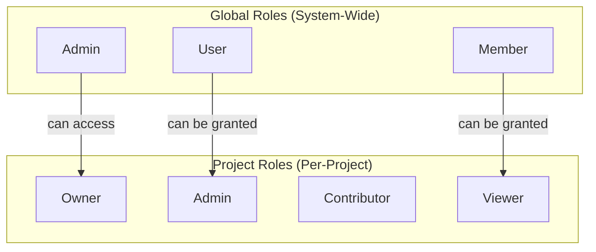

# Authorization

BFFless uses a two-level permission system: **global roles** for system-wide access and **project roles** for per-project permissions.

## Overview



## Global Roles

Global roles determine system-wide capabilities. Every user has exactly one global role.

| Role | Description | Capabilities |
|------|-------------|--------------|
| **Admin** | System administrator | Full access to all projects, user management, system settings |
| **User** | Regular user | Create projects, manage own projects, access granted projects |
| **Member** | Basic member (default) | Access granted projects only, cannot create projects |

New users are assigned the **member** role by default. Admins can promote users to higher roles.

### Admin Capabilities

Admins have unrestricted access to:

- View and manage all projects
- Create, edit, and delete users
- Access system settings and configuration
- View platform analytics and logs
- Manage API keys for any user

### User Capabilities

Users can:

- Create new projects (become owner automatically)
- Manage projects where they have appropriate permissions
- Create personal API keys
- Invite others to their projects

### Member Capabilities

Members can:

- Access projects where they've been granted permissions
- View and interact based on their project role
- Cannot create new projects

## Project Roles

Project roles control access to individual projects. Users can have different roles on different projects.

| Role | Level | Capabilities |
|------|-------|--------------|
| **Owner** | 4 | Full control, transfer ownership, delete project |
| **Admin** | 3 | Manage permissions, all read/write operations |
| **Contributor** | 2 | Create deployments, upload assets, modify content |
| **Viewer** | 1 | Read-only access, view deployments and files |

### Role Hierarchy

Roles are hierarchical—higher roles include all permissions of lower roles:

```
Owner (4) → Admin (3) → Contributor (2) → Viewer (1)
```

For example, a user with **Admin** role automatically has all **Contributor** and **Viewer** permissions.

### Owner

Each project has exactly one owner. The owner:

- Has complete control over the project
- Can transfer ownership to another user
- Can delete the project
- Cannot have their access revoked (must transfer ownership first)
- Is automatically assigned when creating a project

### Admin

Project admins can:

- Grant and revoke permissions (except owner)
- Manage project settings
- Create and delete deployments
- Configure domains and traffic rules
- View all project analytics

### Contributor

Contributors can:

- Create new deployments
- Upload assets via API or GitHub Action
- Modify traffic splitting rules
- Cannot manage other users' permissions

### Viewer

Viewers have read-only access:

- View deployments and their status
- Browse uploaded files
- View traffic configuration
- Cannot modify anything

## Permission Sources

Users can receive project permissions through multiple sources:

### Direct Permissions

Permissions granted directly to a user on a project:

```
User → Project (role: contributor)
```

### Group Permissions

Permissions inherited through group membership:

```
User → Group → Project (role: viewer)
```

Groups cannot be assigned the **owner** role.

### Effective Permission

When a user has permissions from multiple sources, they receive the **highest** role:

| Direct Role | Group Role | Effective Role |
|-------------|------------|----------------|
| viewer | contributor | **contributor** |
| admin | viewer | **admin** |
| (none) | contributor | **contributor** |
| contributor | (none) | **contributor** |

## API Key Access

API keys provide programmatic access for CI/CD pipelines and automation.

### Project-Scoped Keys

API keys can be scoped to a specific project:

- Only works for that project
- Inherits **contributor** permissions
- Ideal for CI/CD deployments

### Global Keys

Admin users can create global API keys:

- Work across all projects
- Used for automation and integrations
- Should be carefully protected

## Public vs Private Access

Projects and deployments can be public or private:

### Public Projects

- Anyone can view deployments
- No authentication required for viewing
- Modifications still require appropriate permissions

### Private Projects

- Only users with granted permissions can access
- Unauthorized access returns 404 (hides existence)
- Or redirects to login (configurable)

### Visibility Hierarchy

Visibility can be set at multiple levels:

1. **Project level** - Default for all deployments
2. **Alias level** - Override for specific aliases (e.g., `production`)
3. **Domain level** - Override for specific custom domains

The most specific setting takes precedence.

## Managing Permissions

### Granting Permissions

Admins and owners can grant permissions:

1. Go to Project → Settings → Permissions
2. Click "Add User" or "Add Group"
3. Select the user/group and role
4. Click Save

### Revoking Permissions

1. Go to Project → Settings → Permissions
2. Find the user or group
3. Click Remove
4. Confirm revocation

### Transferring Ownership

Only owners can transfer ownership:

1. Go to Project → Settings → General
2. Click "Transfer Ownership"
3. Select the new owner
4. Confirm transfer

You will become an admin after transferring ownership.

## Permission Matrix

| Action | Owner | Admin | Contributor | Viewer |
|--------|:-----:|:-----:|:-----------:|:------:|
| View project | Yes | Yes | Yes | Yes |
| View deployments | Yes | Yes | Yes | Yes |
| Browse files | Yes | Yes | Yes | Yes |
| Create deployment | Yes | Yes | Yes | - |
| Delete deployment | Yes | Yes | - | - |
| Configure traffic | Yes | Yes | Yes | - |
| Manage domains | Yes | Yes | - | - |
| Manage settings | Yes | Yes | - | - |
| Grant permissions | Yes | Yes | - | - |
| Delete project | Yes | - | - | - |
| Transfer ownership | Yes | - | - | - |

## User Groups

Groups simplify permission management for teams:

### Creating Groups

1. Go to Settings → Groups
2. Click "Create Group"
3. Name the group (e.g., "Frontend Team")
4. Add members

### Assigning Group Permissions

1. Go to Project → Settings → Permissions
2. Click "Add Group"
3. Select the group and role
4. All group members inherit this permission

### Group Limitations

- Groups cannot be assigned the **owner** role
- Users can belong to multiple groups
- Removing a user from a group immediately revokes inherited permissions

## Best Practices

### Principle of Least Privilege

Grant the minimum permissions needed:

- Use **viewer** for stakeholders who only need to see deployments
- Use **contributor** for developers who deploy but don't manage access
- Reserve **admin** for team leads who manage permissions

### Use Groups for Teams

Instead of granting individual permissions:

1. Create groups matching your team structure
2. Assign project permissions to groups
3. Add/remove users from groups as needed

This simplifies onboarding and offboarding.

### Protect Production

For production deployments:

- Limit who has **contributor** or higher access
- Use project-scoped API keys for CI/CD
- Review permissions regularly

### API Key Security

- Use project-scoped keys when possible
- Rotate keys periodically
- Never commit keys to source control
- Use GitHub Secrets for CI/CD

## Related Documentation

- [API Reference](/reference/api) - API authentication details
- [GitHub Actions](/deployment/github-actions) - CI/CD with API keys
- [Security](/reference/security) - Security best practices
