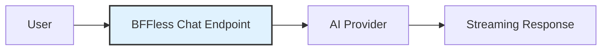

# Chat

Add an AI-powered chat experience to any site — no backend code required. Choose between a full page chat interface or a popup widget, give your chatbot domain knowledge with skills, and let BFFless handle streaming, persistence, and deployment.


## Overview

BFFless Chat gives you a production-ready AI chat feature out of the box:

- **No backend code** — configure everything through the admin UI
- **Streaming responses** — real-time token-by-token output via Server-Sent Events
- **Skills** — give your chatbot domain-specific knowledge with markdown files
- **Message persistence** — conversations and messages saved automatically to DB Records
- **A/B testable** — combine with traffic splitting to test different skills or prompts
- **Two layouts** — full page chat or floating popup widget



## Quick Start

### 1. Generate a Chat Schema


1. Go to **Pipelines → DB Records**
2. Click **Generate Schema**
3. Select **Chat Schema**
4. Enter a name (e.g., `support`)
5. Choose a scope:
   - **User-scoped** — conversations tied to authenticated users
   - **Guest-scoped** — conversations accessible without authentication
6. Click **Generate**

This creates everything you need:

- A `{name}_conversations` DB Record for conversation metadata
- A `{name}_messages` DB Record for individual messages
- A pipeline with a `POST /api/chat` endpoint pre-configured with the AI handler

### 2. Connect Your Frontend

Use the AI SDK's `useChat` hook to connect your React app:

```tsx
import { useChat } from '@ai-sdk/react';

function Chat() {
  const { messages, input, handleInputChange, handleSubmit, status } = useChat({
    api: '/api/chat',
  });

  return (
    <div>
      {messages.map((m) => (
        <div key={m.id}>
          <strong>{m.role}:</strong> {m.parts.map((p) => p.text).join('')}
        </div>
      ))}
      <form onSubmit={handleSubmit}>
        <input value={input} onChange={handleInputChange} placeholder="Type a message..." />
        <button type="submit" disabled={status === 'streaming'}>
          Send
        </button>
      </form>
    </div>
  );
}
```

:::tip
See the <a href="https://github.com/bffless/demo-chat" target="_blank" rel="noopener noreferrer">demo-chat repository ↗</a> for a complete working example with streaming, markdown rendering, and suggested prompts.
:::

### 3. Deploy

Push your code to GitHub and deploy with the <a href="https://github.com/marketplace/actions/bffless-upload-artifact" target="_blank" rel="noopener noreferrer">bffless/upload-artifact ↗</a> GitHub Action. Your chat endpoint is live as soon as the deployment completes.

## Chat Layouts

### Full Page Chat


A standalone chat page that takes over the full viewport. Includes suggested prompts to help users get started, real-time streaming with markdown rendering, and a clean conversational UI.

Best for: dedicated support pages, knowledge base assistants, internal tools.

### Popup Widget


A floating chat bubble that opens a slide-up chat panel. Users can start a new conversation or close the widget without losing context. The widget stays accessible on any page.


Best for: landing pages, documentation sites, e-commerce — anywhere you want chat available without dedicating a full page.

## Skills

Skills are markdown files that give your chatbot domain-specific knowledge. Deploy them alongside your site and the AI loads relevant skills on-demand during conversations.


:::tip
See a working example: <a href="https://github.com/bffless/demo-chat/tree/main/.bffless/skills" target="_blank" rel="noopener noreferrer">demo-chat skills directory ↗</a>
:::

Skills are **versioned with each deployment** — when an alias points to a commit, the skills for that commit are used. This makes them git-managed, rollback-safe, and A/B testable.

### Example Skill

```markdown
---
name: pricing-faq
description: Answer questions about pricing, plans, and billing
---

# Pricing FAQ

## Plans

| Plan       | Price  | Features                                  |
| ---------- | ------ | ----------------------------------------- |
| Free       | $0/mo  | 1 project, 1GB storage, community support |
| Pro        | $29/mo | 10 projects, 50GB storage, email support  |
| Enterprise | Custom | Unlimited, SSO, dedicated support         |

## Common Questions

**Can I upgrade/downgrade anytime?**
Yes, plan changes take effect immediately.

**Is there a free trial?**
Pro plan includes a 14-day free trial. No credit card required.
```

### Deploying Skills

Upload skills alongside your build artifacts using the `bffless/upload-artifact` GitHub Action:

```yaml
# .github/workflows/deploy.yml
- name: Deploy build
  uses: bffless/upload-artifact@v1
  with:
    source: dist

- name: Deploy skills
  uses: bffless/upload-artifact@v1
  with:
    source: .bffless
```

### A/B Testing Skills

Combine skills with [traffic splitting](/features/traffic-splitting) to test different knowledge content. For example, test a new pricing FAQ on 10% of traffic before rolling it out to everyone. Since skills are just files in your repo, maintain different skill sets across branches and measure the impact on user satisfaction or conversion rates.

## Message Persistence


When persistence is enabled, conversations and messages are automatically saved to DB Records. The handler manages conversation metadata (message count, total tokens, model used) and individual messages (role, content, token usage).

:::note
Message persistence is optional. For simple use cases, you can skip persistence entirely and the chat will work without any database configuration.
:::

See [AI Pipelines — Message Persistence](/features/ai-pipelines#message-persistence) for full configuration details including auto-managed fields and schema setup.

## Configuration


Key settings for the AI chat handler:

| Setting              | Description                              | Options / Default           |
| -------------------- | ---------------------------------------- | --------------------------- |
| **Mode**             | Chat or Completion                       | `chat`, `completion`        |
| **Provider**         | AI provider to use                       | `openai`, `anthropic`, `google` |
| **Model**            | Specific model                           | Provider-dependent          |
| **System Prompt**    | Instructions for the AI                  | Free-text                   |
| **Response Format**  | Stream or JSON                           | `stream`, `message`         |
| **Skills Mode**      | Which skills to enable                   | `none`, `all`, `selected`   |

See [AI Pipelines — Configuration Reference](/features/ai-pipelines#configuration-reference) for the full list of settings including temperature, max tokens, and max history.

## Demo Application

Try the live demos:

- <a href="https://chat.docs.bffless.app/" target="_blank" rel="noopener noreferrer">Full page chat ↗</a>
- <a href="https://chat.docs.bffless.app/popup/" target="_blank" rel="noopener noreferrer">Popup widget ↗</a>

Source code: <a href="https://github.com/bffless/demo-chat" target="_blank" rel="noopener noreferrer">bffless/demo-chat ↗</a>

**Tech stack:** React + TypeScript + Vite + AI SDK

## Related Features

- [AI Pipelines](/features/ai-pipelines) — Full handler configuration, completion mode, and provider setup
- [Traffic Splitting](/features/traffic-splitting) — A/B test different skills or prompts
- [Pipelines](/features/pipelines) — Backend workflows with chained handlers
