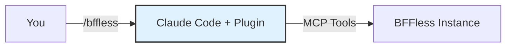

# Claude Code Plugin

The BFFless plugin for [Claude Code](https://docs.anthropic.com/en/docs/claude-code) gives your AI assistant deep knowledge of the BFFless platform — deployments, pipelines, proxy rules, domains, chat, and more. Instead of reading docs yourself, just describe what you want and Claude handles the rest.



## Why Use the Plugin?

The [MCP Server](/features/mcp-server) gives Claude Code access to BFFless tools (create projects, manage deployments, etc.), but the tools alone don't teach Claude *how* to use them effectively. The plugin adds:

- **Domain knowledge** — Claude understands BFFless concepts like aliases, pipeline handlers, proxy rule sets, and traffic splitting
- **Guided workflows** — Ask for "a contact form with email notifications" and Claude knows the exact handler chain to build
- **Best practices** — The plugin encodes patterns like "all proxy rules must go in a single rule set per project" and "assign rule sets to aliases for them to take effect"
- **Reference for every feature** — Chat setup, auth patterns, the `use-bff-state` React hook, GitHub Actions CI/CD, and more

## Prerequisites

- [Claude Code](https://docs.anthropic.com/en/docs/claude-code) installed
- A BFFless instance with an API key (see [MCP Server — Setup](/features/mcp-server#setup))
- The BFFless MCP server connected to Claude Code

If you haven't set up the MCP server yet, see the [MCP Server](/features/mcp-server) page first.

## Installation

### Via Claude Code Plugin Marketplace

From within Claude Code, add the marketplace and install:

```
/plugin marketplace add bffless/claude-skills
/plugin install bffless
```

### Via CLI

```bash
claude plugin install bffless --scope user
```

Then reload plugins to activate:

```
/reload-plugins
```

That's it. The plugin is now available in all your Claude Code sessions.

## Usage

Invoke the plugin with the `/bffless` slash command:

```
/bffless
```

This loads BFFless domain knowledge into your current conversation. From there, just describe what you want in plain language:

> "Set up a chat endpoint with message persistence for my project"

> "Create a proxy rule that forwards /api/weather to a weather API"

> "Add a custom domain for my landing page project"

> "Build a pipeline that validates a contact form, saves it to a DB Record, and sends an email"

Claude will use the MCP tools to execute each step, applying the correct patterns automatically.

### When to Use `/bffless`

Use the slash command when you're about to do BFFless-related work:

| Task | Example Prompt |
|------|---------------|
| **Deploy & promote** | "Show my latest deployments and promote the newest to production" |
| **Build APIs** | "Create GET and POST endpoints for a todos schema at /api/todos" |
| **Set up chat** | "Add AI chat to my project with Anthropic and message persistence" |
| **Configure domains** | "Map blog.example.com to my blog project's production alias" |
| **Manage data** | "Query the last 10 records from my contacts schema" |
| **CI/CD setup** | "Show me a GitHub Actions workflow that deploys to BFFless on push to main" |
| **Debug pipelines** | "Enable debug logging on /api/contacts and show recent logs" |

You don't need to invoke `/bffless` for every message — once loaded, the knowledge persists for the rest of the conversation.

## What the Plugin Knows

The plugin includes reference material for every major BFFless feature:

| Topic | Coverage |
|-------|----------|
| **Deployments & Aliases** | Immutable deployments, alias types, promotion, rollbacks |
| **Domains** | Subdomains, custom domains, redirects, primary content, SPA mode |
| **Pipelines** | Schema field types, handler types, expression syntax, data CRUD |
| **Proxy Rules** | Rule sets, pipeline rules, handler chains, state management |
| **Chat** | AI handler config, streaming, message persistence, skills, AI SDK v3 integration |
| **Auth** | Session endpoints, login flow, cross-subdomain auth, React hook patterns |
| **use-bff-state** | React hook setup, API, guest ID, type safety |
| **GitHub Actions** | `bffless/upload-artifact` and `bffless/download-artifact` inputs, outputs, CI/CD patterns |
| **Cache & Storage** | Cache rules, storage backends, API keys |

## Example Session

Here's what a typical interaction looks like after loading the plugin:

```
You:  /bffless
      I want to add a contact form to my project "acme/website" that saves
      submissions and emails me

Claude: I'll set that up. Let me:
        1. Create a "contacts" DB Record with name, email, and message fields
        2. Create a proxy rule set for the project
        3. Add a POST /api/contact pipeline with form_handler → data_create → email_handler
        4. Assign the rule set to your production alias

        [executes each step via MCP tools]

        Done! Your contact form endpoint is live at POST /api/contact.
        Here's a React component to use it: ...
```

## Updating the Plugin

To update to the latest version:

```
/plugin uninstall bffless
/plugin install bffless
/reload-plugins
```

## Troubleshooting

**Plugin not found after install?**
Run `/reload-plugins` to activate newly installed plugins.

**MCP tools not working?**
The plugin provides knowledge but relies on the MCP server for tool execution. Verify your MCP connection:
1. Check that the `bffless` MCP server is configured in `~/.claude.json`
2. Ensure your API key is valid and has appropriate permissions
3. See [MCP Server — Setup](/features/mcp-server#setup) for connection details

**Plugin not loading domain knowledge?**
Make sure you invoke `/bffless` at the start of your conversation. The plugin loads context on demand, not automatically.

## Related Features

- [MCP Server](/features/mcp-server) — Raw MCP tool access for programmatic BFFless management
- [Pipelines](/features/pipelines) — Backend automation with chained handlers
- [Chat](/features/chat) — AI-powered chat with streaming and persistence
- [Proxy Rules](/features/proxy-rules) — API endpoints and request routing
