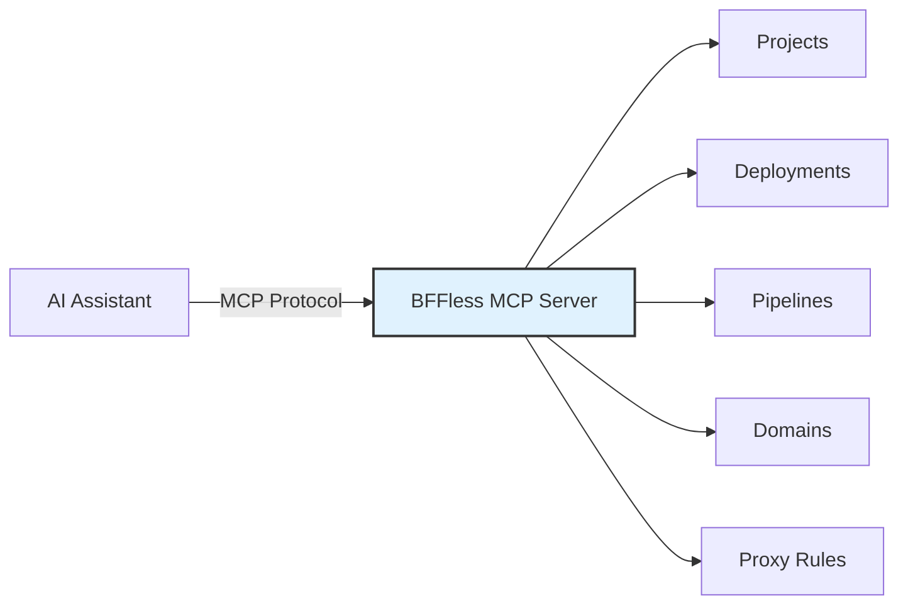

# MCP Server

Manage your BFFless instance directly from AI coding assistants using the [Model Context Protocol (MCP)](https://modelcontextprotocol.io/). The built-in MCP server exposes all admin operations as tools — projects, deployments, aliases, domains, pipelines, proxy rules, cache rules, and more — so your AI assistant can create, update, and query resources on your behalf.



## Overview

The MCP server is available at `/mcp` on every BFFless instance. It uses the **Streamable HTTP** transport and authenticates via API key. Any MCP-compatible client can connect — including Claude Code, Cursor, Windsurf, and custom integrations.

**What you can do:**

- Create projects and manage deployments
- Promote and roll back aliases
- Configure custom domains and subdomains
- Build data-backed APIs with pipeline schemas and proxy rules
- Set up file uploads, cache rules, and AI chat pipelines
- Query and manage pipeline data records
- Debug pipeline execution with logs
- Manage users, roles, and API keys

## Setup

### Prerequisites

- A running BFFless instance (self-hosted or managed)
- An API key with appropriate permissions

### 1. Create an API Key

Navigate to **Settings → API Keys** in your BFFless admin panel and create a new key. Copy it — you'll need it for the next step.

:::tip
API keys can be scoped to a specific project or granted global access. For AI assistants, a global key is usually most convenient.
:::

### 2. Connect Your MCP Client

#### Claude Code

```bash
claude mcp add --transport http bffless https://admin.yourdomain.com/mcp \
  --header "X-API-Key: YOUR_API_KEY"
```

This adds the server to your `~/.claude.json` configuration:

```json
{
  "mcpServers": {
    "bffless": {
      "type": "http",
      "url": "https://admin.yourdomain.com/mcp",
      "headers": {
        "X-API-Key": "YOUR_API_KEY"
      }
    }
  }
}
```

#### Cursor / Other MCP Clients

Add the following to your MCP client configuration:

- **Transport:** Streamable HTTP
- **URL:** `https://admin.yourdomain.com/mcp`
- **Header:** `X-API-Key: YOUR_API_KEY`

### 3. Verify the Connection

Ask your AI assistant to list your projects:

> "List all my BFFless projects"

The assistant will call the `list_projects` tool and return your project list.

### Connecting Multiple Instances

You can connect to multiple BFFless instances simultaneously by giving each a unique name:

```bash
claude mcp add --transport http bffless-production https://admin.production.yourdomain.com/mcp \
  --header "X-API-Key: PROD_KEY"

claude mcp add --transport http bffless-staging https://admin.staging.yourdomain.com/mcp \
  --header "X-API-Key: STAGING_KEY"
```

Each instance is fully isolated — tools are scoped to the workspace they're connected to.

## Available Tools

### Projects

| Tool | Description |
|------|-------------|
| `list_projects` | List all projects accessible to the current user |
| `get_project` | Get a project by owner and name |
| `create_project` | Create a new project |
| `update_project` | Update project settings (display name, description, visibility) |
| `delete_project` | Delete a project and all its deployments, aliases, and storage files |

### Deployments & Aliases

| Tool | Description |
|------|-------------|
| `list_deployments` | List deployments with optional filters (repository, branch, commit SHA) |
| `get_deployment` | Get deployment details including files and aliases |
| `delete_deployment` | Delete a deployment and its files from storage |
| `list_aliases` | List aliases for a project |
| `create_alias` | Create a new alias pointing to a commit SHA |
| `update_alias` | Update an alias to point to a different commit SHA |
| `delete_alias` | Delete an alias |

### Domains

| Tool | Description |
|------|-------------|
| `list_domains` | List all domain mappings |
| `get_domain` | Get domain details |
| `create_domain` | Create a subdomain, custom domain, or redirect |
| `update_domain` | Update domain settings |
| `delete_domain` | Remove a domain mapping |

### Pipeline Schemas & Data

| Tool | Description |
|------|-------------|
| `list_pipeline_schemas` | List all schemas for a project |
| `get_pipeline_schema` | Get schema details with record count |
| `create_pipeline_schema` | Create a schema with typed fields |
| `update_pipeline_schema` | Update schema name or fields |
| `delete_pipeline_schema` | Delete a schema and all its data |
| `generate_upload_schema` | Generate a file upload schema with upload/serve pipelines |
| `query_pipeline_data` | Query records with pagination, search, and sorting |
| `get_pipeline_record` | Get a single record by ID |
| `create_pipeline_record` | Create a new data record |
| `update_pipeline_record` | Update an existing record |
| `delete_pipeline_record` | Delete a record |

### Proxy Rules

| Tool | Description |
|------|-------------|
| `list_proxy_rule_sets` | List rule sets for a project |
| `get_proxy_rule_set` | Get rule set details with all rules |
| `create_proxy_rule_set` | Create a new rule set |
| `delete_proxy_rule_set` | Delete a rule set |
| `get_proxy_rule` | Get a single proxy rule |
| `create_proxy_rule` | Create a rule (path + method + pipeline config) |
| `update_proxy_rule` | Update a proxy rule |
| `delete_proxy_rule` | Delete a proxy rule |

### Cache Rules

| Tool | Description |
|------|-------------|
| `list_cache_rules` | List cache rules for a project |
| `get_cache_rule` | Get cache rule details |
| `create_cache_rule` | Create a cache policy for a path pattern |
| `delete_cache_rule` | Delete a cache rule |

### Pipeline Debugging

| Tool | Description |
|------|-------------|
| `enable_pipeline_debug` | Toggle debug logging on a proxy rule |
| `list_pipeline_logs` | List execution logs for a proxy rule |
| `get_pipeline_log` | Get full execution log with step details |
| `get_pipeline_log_step` | Get input/output for a specific pipeline step |

### Users & API Keys

| Tool | Description |
|------|-------------|
| `list_users` | List all users |
| `get_user` | Get user details |
| `update_user_role` | Change a user's role |
| `list_api_keys` | List all API keys |
| `create_api_key` | Create a new API key |
| `delete_api_key` | Revoke an API key |

### Settings

| Tool | Description |
|------|-------------|
| `get_primary_content_config` | Get which project/alias serves on the root domain |
| `update_primary_content_config` | Update the primary content configuration |

## Common Workflows

### Deploy a Static Site

Ask your AI assistant:

> "Create a new project called `my-org/landing-page`, then set up a production alias and map it to `landing.example.com`"

Behind the scenes, the assistant will:

1. `create_project` — Create the project
2. `create_alias` — Point "production" to the latest deployment
3. `create_domain` — Map the subdomain to the project

### Build a Data-Backed API

> "Create a contacts schema with name, email, and company fields, then set up GET and POST endpoints at `/api/contacts`"

The assistant will:

1. `create_pipeline_schema` — Define the data model
2. `create_proxy_rule_set` — Group the API rules
3. `create_proxy_rule` — Create GET endpoint with `data_query` handler
4. `create_proxy_rule` — Create POST endpoint with `data_create` handler

### Promote a Deployment

> "Show me the latest deployments for `my-org/app` and promote the most recent one to production"

1. `list_deployments` — Find the latest commit SHA
2. `update_alias` — Point the production alias to the new SHA

### Roll Back

> "Roll back the production alias for `my-org/app` to the previous deployment"

1. `list_deployments` — Find the previous commit SHA
2. `update_alias` — Point production back to the old SHA

### Debug a Pipeline

> "Enable debug logging on my `/api/contacts` endpoint and show me the last few execution logs"

1. `enable_pipeline_debug` — Turn on logging for the rule
2. `list_pipeline_logs` — View recent executions
3. `get_pipeline_log` — Inspect a specific execution's step-by-step data

## Technical Details

### Authentication

All MCP requests are authenticated via the `X-API-Key` header. The server uses the same API key system as the REST API — keys created in the admin panel work for both.

### Transport

The MCP server uses **Streamable HTTP** transport in stateless mode with JSON responses enabled. This means:

- No persistent WebSocket connections required
- Each request is independent (no session state)
- Compatible with HTTP proxies and load balancers

### Endpoint

The MCP endpoint is always available at:

```
https://admin.<your-domain>/mcp
```

For self-hosted instances, this is typically:

```
https://admin.<PRIMARY_DOMAIN>/mcp
```

### Rate Limiting

MCP requests are subject to the same rate limits as the REST API. For high-volume automation, consider using the REST API directly.

## Related Features

- [Pipelines](/features/pipelines) — Learn about pipeline schemas, field types, and handler configurations
- [Proxy Rules](/features/proxy-rules) — Detailed guide on setting up API endpoints with proxy rules
- [AI Pipelines](/features/ai-pipelines) — Configure AI-powered chat and content generation