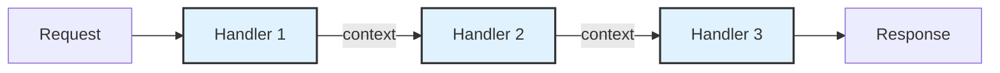
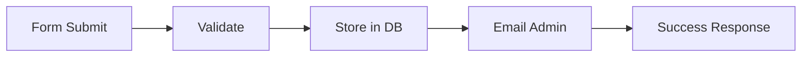
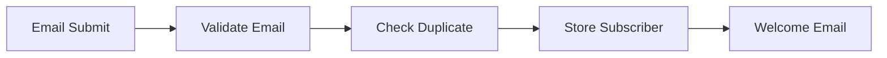
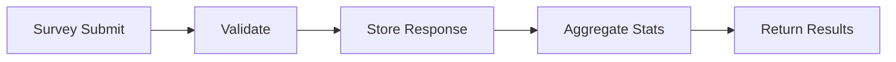
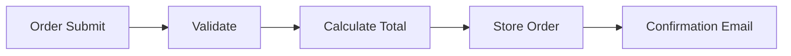

# Pipelines

Build backend automation workflows by chaining handlers together. Pipelines let you create APIs, process forms, store data, and send emails—all without writing server code.


## Overview

Pipelines are composable backend workflows that execute when a request hits your pipeline endpoint. Each pipeline consists of one or more **handlers** that run sequentially, passing data between steps.

**Key benefits:**

- **No backend code** - Build APIs visually in the BFFless admin
- **Data persistence** - Store form submissions and user data in BFFless DB Records
- **Email integration** - Send transactional emails without external services
- **Validation** - Validate inputs before processing
- **Context passing** - Each step can access data from previous steps

## How Pipelines Work

When a request arrives at your pipeline endpoint, BFFless executes each handler in sequence:



Each handler:

1. Receives input from the request and previous steps
2. Performs its operation (validate, store, email, etc.)
3. Adds its output to the context for subsequent steps

If any handler fails, the pipeline stops and returns an error response.

## Handler Library

Pipelines support 8 handler types that you can combine to build any workflow:

| Handler               | Description                                     |
| --------------------- | ----------------------------------------------- |
| **Form Handler**      | Validates incoming form data against a schema   |
| **Data Create**       | Creates a new record in a DB Record table       |
| **Data Query**        | Retrieves records from a DB Record table        |
| **Data Update**       | Updates existing records in a DB Record table   |
| **Data Delete**       | Deletes records from a DB Record table          |
| **Email Handler**     | Sends transactional emails                      |
| **Response Handler**  | Returns a custom JSON response                  |
| **Function Handler**  | Runs custom JavaScript for transformations      |
| **Aggregate Handler** | Performs aggregations (count, sum, avg) on data |


### Form Handler

Validates incoming request data before processing. Define required fields, types, and validation rules.

**Configuration:**

- **Fields** - Define expected fields with types (string, number, email, etc.)
- **Required** - Mark fields as required or optional
- **Validation** - Add regex patterns, min/max length, ranges

### Data Handlers

The four data handlers (Create, Query, Update, Delete) interact with **DB Records**—BFFless's built-in data storage.


**Data Create** - Insert a new row into a DB Record table. Map input fields to columns using expressions.

**Data Query** - Retrieve records with filters, sorting, and pagination. Access results in subsequent steps.

**Data Update** - Modify existing records by ID or filter criteria.

**Data Delete** - Remove records by ID or filter criteria.

### Email Handler

Send transactional emails with dynamic content. Uses expressions to inject data from previous steps.


**Configuration:**

- **To** - Recipient email (use expressions like `{{input.email}}`)
- **Subject** - Email subject line
- **Body** - HTML or plain text body with template expressions
- **From** (optional) - Override default sender

### Response Handler

Return a custom JSON response. Useful for API endpoints that need structured responses.

```json
{
  "success": true,
  "message": "Thank you for your submission!",
  "id": "{{steps.createRecord.id}}"
}
```

### Function Handler

Run custom JavaScript for data transformations. Has access to the full context object.

```javascript
// Transform or combine data from previous steps
const fullName = `${input.firstName} ${input.lastName}`;
return { fullName, submittedAt: new Date().toISOString() };
```

### Aggregate Handler

Perform aggregations on DB Record data:

- **Count** - Count matching records
- **Sum** - Sum a numeric field
- **Average** - Calculate average of a numeric field
- **Min/Max** - Find minimum or maximum values

## Data Storage (DB Records)

Pipelines can persist data using **DB Records**—a simple schema-based data store built into BFFless.


### Creating a DB Record

1. Navigate to your project
2. Go to **Pipelines** → **DB Records** tab
3. Click **Create DB Record**
4. Define your schema with field names and types

### Supported Field Types

| Type        | Description               | Example               |
| ----------- | ------------------------- | --------------------- |
| **String**  | Text data                 | Names, descriptions   |
| **Number**  | Integer or decimal        | Quantities, prices    |
| **Boolean** | True/false                | Opt-in flags          |
| **Date**    | Date and time             | Submission timestamps |
| **Email**   | Email address (validated) | Contact emails        |
| **JSON**    | Arbitrary JSON object     | Complex nested data   |

### Auto-Generated Fields

Every DB Record automatically includes:

- **id** - Unique identifier (UUID)
- **createdAt** - Creation timestamp
- **updatedAt** - Last modification timestamp

## Creating Your First Pipeline

Let's build a contact form that validates input, stores the submission, and sends a notification email.

### Step 1: Create a DB Record

First, create a table to store submissions:

1. Go to **Pipelines** → **DB Records**
2. Click **Create DB Record**
3. Name it `contact_submissions`
4. Add fields:
   - `name` (String, required)
   - `email` (Email, required)
   - `message` (String, required)
   - `company` (String, optional)

### Step 2: Create the Pipeline

1. Go to **Pipelines** → **Pipelines** tab
2. Click **Create Pipeline**
3. Name it `contact-form`
4. Set the path: `/api/contact`

### Step 3: Add Handlers

**Handler 1: Form Handler**

Validate the incoming form data:

```json
{
  "fields": [
    { "name": "name", "type": "string", "required": true },
    { "name": "email", "type": "email", "required": true },
    { "name": "message", "type": "string", "required": true, "minLength": 10 },
    { "name": "company", "type": "string", "required": false }
  ]
}
```

**Handler 2: Data Create**

Store the submission in your DB Record:

- **Table**: `contact_submissions`
- **Mapping**:
  - `name` → `{{input.name}}`
  - `email` → `{{input.email}}`
  - `message` → `{{input.message}}`
  - `company` → `{{input.company}}`

**Handler 3: Email Handler**

Send a notification email:

- **To**: `admin@yourcompany.com`
- **Subject**: `New contact form submission from {{input.name}}`
- **Body**:
  ```html
  <h2>New Contact Form Submission</h2>
  <p><strong>Name:</strong> {{input.name}}</p>
  <p><strong>Email:</strong> {{input.email}}</p>
  <p><strong>Company:</strong> {{input.company}}</p>
  <p><strong>Message:</strong></p>
  <p>{{input.message}}</p>
  ```

**Handler 4: Response Handler**

Return a success response:

```json
{
  "success": true,
  "message": "Thank you for contacting us!"
}
```

### Step 4: Test Your Pipeline

Send a POST request to your pipeline endpoint:

```bash
curl -X POST https://your-site.bffless.app/api/contact -H "Content-Type: application/json" -d '{"name":"John Doe","email":"john@example.com","message":"I would like to learn more about your services."}'
```

## Use Cases

### Contact Form



**Handlers:** Form Handler → Data Create → Email Handler → Response Handler

### Newsletter Signup



**Handlers:** Form Handler → Data Query (check existing) → Data Create → Email Handler

### Survey Collection



**Handlers:** Form Handler → Data Create → Aggregate Handler → Response Handler

### Order Processing



**Handlers:** Form Handler → Function Handler → Data Create → Email Handler

## Expression Syntax

Pipelines use expressions to reference data from the request and previous steps. Expressions are wrapped in double curly braces: `{{expression}}`.

### Available Contexts

| Context   | Description              | Example                     |
| --------- | ------------------------ | --------------------------- |
| `input`   | Request body data        | `{{input.email}}`           |
| `query`   | URL query parameters     | `{{query.page}}`            |
| `params`  | URL path parameters      | `{{params.id}}`             |
| `headers` | Request headers          | `{{headers.authorization}}` |
| `steps`   | Previous handler outputs | `{{steps.createRecord.id}}` |
| `user`    | Authenticated user info  | `{{user.email}}`            |
| `env`     | Environment variables    | `{{env.API_KEY}}`           |

### Expression Examples

```javascript
// Access form field
{
  {
    input.firstName;
  }
}

// Access nested data
{
  {
    input.address.city;
  }
}

// Reference previous step output
{
  {
    steps.queryRecords.data[0].name;
  }
}

// Use authenticated user
{
  {
    user.id;
  }
}

// Combine values
('Hello {{input.name}}, your order #{{steps.create.id}} is confirmed');
```

## Validators

Pipelines support validation beyond field-level checks in the Form Handler.

### Auth Required

Require authentication to access the pipeline. Unauthenticated requests receive a 401 response.

**Use cases:**

- User profile updates
- Order submissions
- Any user-specific operations

When enabled, the `{{user}}` context is available with:

- `user.id` - User's unique identifier
- `user.email` - User's email address
- `user.roles` - User's assigned roles

### Rate Limiting

Limit request frequency to prevent abuse.

**Configuration:**

- **Requests** - Maximum requests allowed
- **Window** - Time window (e.g., "1 minute", "1 hour")
- **Key** - Rate limit key (IP address, user ID, etc.)

**Example:** 10 requests per minute per IP address

## Best Practices

### Design Patterns

1. **Validate early** - Always start with a Form Handler to catch invalid data
2. **Handle errors gracefully** - Use Response Handler to return user-friendly messages
3. **Keep pipelines focused** - One pipeline per workflow (don't combine unrelated operations)
4. **Use meaningful names** - Name steps clearly (e.g., `storeSubmission`, `sendConfirmation`)

### Error Handling

Pipelines stop execution when a handler fails. Plan for failure scenarios:

- **Form Handler** fails: Returns 400 with validation errors
- **Data Handler** fails: Returns 500 with database error
- **Email Handler** fails: Consider if this should block the response

### Performance Tips

1. **Minimize data queries** - Fetch only what you need
2. **Use aggregates** - Instead of fetching all records to count, use Aggregate Handler
3. **Cache results** - For expensive queries, consider response caching

### Security

1. **Validate all inputs** - Never trust user data
2. **Use auth when needed** - Protect sensitive operations
3. **Rate limit public endpoints** - Prevent abuse
4. **Sanitize email content** - Prevent injection in dynamic email content

## Troubleshooting

### Pipeline Not Executing

1. **Check the path** - Ensure your request URL matches the pipeline path
2. **Verify method** - Pipelines respond to POST requests by default
3. **Check enabled status** - Ensure the pipeline is enabled
4. **Review deployment** - Make sure the pipeline is deployed to your target alias

### Validation Errors

1. **Check field names** - Field names are case-sensitive
2. **Verify types** - Ensure data matches expected types
3. **Review required fields** - Check all required fields are present

### Data Not Saving

1. **Check DB Record schema** - Ensure all mapped fields exist in the schema
2. **Verify expressions** - Test expressions return valid values
3. **Review field types** - Data must match the column type

### Emails Not Sending

1. **Verify recipient** - Check the To expression resolves to a valid email
2. **Check email configuration** - Ensure SMTP is configured in your workspace
3. **Review spam filters** - Check recipient's spam folder

## Related Features

- [Proxy Rules](/features/proxy-rules) - Forward requests to external APIs
- [Authorization](/features/authorization) - Control access to pipelines
