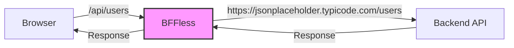
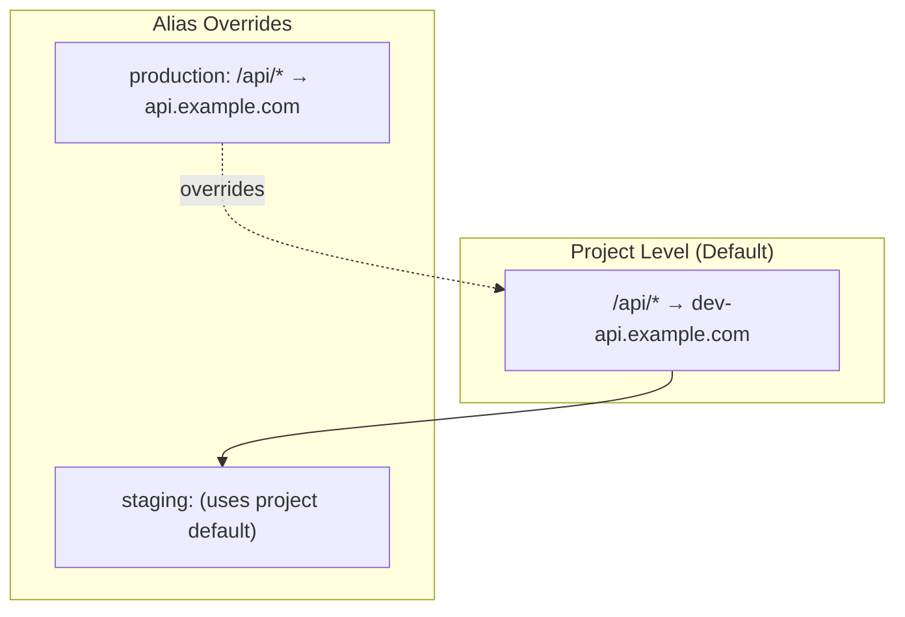
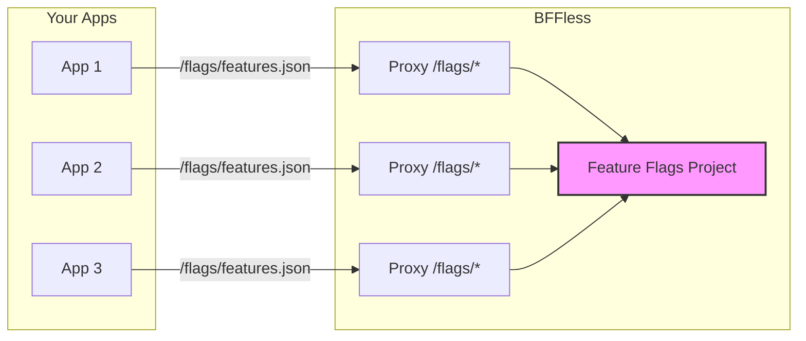

# Proxy Rules

Forward specific paths from your deployed content to external backend APIs, eliminating the need for CORS configuration.


## Overview

Proxy rules allow your SPAs and static sites to communicate with backend services using relative URLs. Instead of making cross-origin requests that require CORS headers, your frontend can call `/api/*` and BFFless will proxy those requests to your backend.



**Live Example:** `https://orbs.sandbox.workspace.bffless.app/api/users` proxies to `https://jsonplaceholder.typicode.com/users`

## Key Concepts

### Two-Level Configuration

Proxy rules use a two-level configuration system:

1. **Project Defaults**: Rules defined at the project level apply to:
   - All aliases (production, staging, etc.)
   - Direct SHA URL access
   - Unless overridden by alias-level rules

2. **Alias Overrides**: Rules defined at the alias level:
   - Override project defaults for that specific alias
   - Useful for different backends per environment



### Example Configuration

**Project Default:**
- `/api/*` → `https://dev-api.example.com` (development API)

**Production Alias Override:**
- `/api/*` → `https://api.example.com` (production API)

**Result:**
- `production` alias uses production API
- `staging` alias uses dev API (project default)
- Direct SHA access uses dev API (project default)

## Creating Proxy Rules

### Via Project Settings

1. Navigate to your project
2. Go to **Settings** → **Proxy Rules** tab
3. Click **Add Rule**
4. Fill in the rule configuration:
   - **Path Pattern**: The URL pattern to match (e.g., `/api/*`)
   - **Target URL**: The backend URL to proxy to (must be HTTPS)
   - **Strip Prefix**: Whether to remove the matched prefix before forwarding
   - **Timeout**: Request timeout in milliseconds (default: 30000)
   - **Description**: Optional description for the rule
5. Click **Create Rule**

### Via Alias Settings

1. Navigate to your project
2. Go to **Aliases** tab
3. Click the **Proxy** button on an alias
4. Add rules specific to that alias (these override project defaults)

## Path Pattern Matching

Proxy rules support three types of patterns:

### Prefix Wildcards (`/api/*`)

Matches any path starting with the prefix:
- `/api/*` matches `/api/users`, `/api/users/123`, `/api/posts`

### Suffix Wildcards (`*.json`)

Matches any path ending with the suffix:
- `*.json` matches `/config.json`, `/data/settings.json`

### Exact Match (`/graphql`)

Matches the exact path only:
- `/graphql` matches only `/graphql`, not `/graphql/v2`

## Strip Prefix Option

The **Strip Prefix** option controls whether the matched path prefix is removed before forwarding:

| Request | Pattern | Target | Strip Prefix | Forwarded To |
|---------|---------|--------|--------------|--------------|
| `/api/users` | `/api/*` | `https://jsonplaceholder.typicode.com` | ✓ Yes | `https://jsonplaceholder.typicode.com/users` |
| `/api/users` | `/api/*` | `https://jsonplaceholder.typicode.com` | ✗ No | `https://jsonplaceholder.typicode.com/api/users` |

## Rule Ordering

Rules are evaluated in order (lower order number = higher priority). When multiple rules could match a request, the first matching rule is used.

To reorder rules:
1. Go to the Proxy Rules tab
2. Use drag-and-drop to reorder
3. Or use the API to set specific order values

## Header Configuration

### Adding Custom Headers

You can add custom headers to proxied requests, useful for:
- API authentication keys
- Authorization tokens
- Custom tracking headers

```json
{
  "headerConfig": {
    "add": {
      "X-API-Key": "your-secret-key",
      "Authorization": "Bearer your-token"
    }
  }
}
```

:::note Security
Header values are encrypted at rest using AES-256-GCM.
:::

### Default Header Handling

By default, the proxy:
- **Forwards**: `accept`, `content-type`, `user-agent`, and most standard headers
- **Strips**: `cookie`, `authorization` (unless explicitly added)
- **Adds**: `x-forwarded-for`, `x-forwarded-proto`, `x-forwarded-host`

## Security

### HTTPS Requirement

All target URLs must use HTTPS. HTTP targets are rejected to ensure data security in transit.

### SSRF Protection

To prevent Server-Side Request Forgery attacks, the following targets are blocked:
- `localhost` and `127.0.0.1`
- Internal IP ranges: `10.x.x.x`, `172.16-31.x.x`, `192.168.x.x`
- Cloud metadata endpoints: `169.254.169.254`
- IPv6 local addresses

### Timeout Limits

- Default timeout: 30 seconds
- Maximum allowed: 60 seconds
- Requests exceeding the timeout return a 504 Gateway Timeout

## API Reference

### Endpoints

| Method | Endpoint | Description |
|--------|----------|-------------|
| GET | `/api/proxy-rules/project/:projectId` | List project-level rules |
| POST | `/api/proxy-rules/project/:projectId` | Create project-level rule |
| PUT | `/api/proxy-rules/project/:projectId/reorder` | Reorder project rules |
| GET | `/api/proxy-rules/alias/:aliasId` | List alias-level rules |
| POST | `/api/proxy-rules/alias/:aliasId` | Create alias-level rule |
| PUT | `/api/proxy-rules/alias/:aliasId/reorder` | Reorder alias rules |
| GET | `/api/proxy-rules/:id` | Get specific rule |
| PATCH | `/api/proxy-rules/:id` | Update rule |
| DELETE | `/api/proxy-rules/:id` | Delete rule |

### Example: Create a Proxy Rule

```bash
curl -X POST https://your-bffless.com/api/proxy-rules/project/{projectId} \
  -H "Content-Type: application/json" \
  -H "Cookie: sAccessToken=..." \
  -d '{
    "pathPattern": "/api/*",
    "targetUrl": "https://jsonplaceholder.typicode.com",
    "stripPrefix": true,
    "timeout": 30000,
    "description": "JSON Placeholder API proxy"
  }'
```

### Example Response

```json
{
  "id": "uuid-here",
  "projectId": "project-uuid",
  "aliasId": null,
  "pathPattern": "/api/*",
  "targetUrl": "https://jsonplaceholder.typicode.com",
  "stripPrefix": true,
  "order": 0,
  "timeout": 30000,
  "preserveHost": false,
  "headerConfig": null,
  "isEnabled": true,
  "description": "JSON Placeholder API proxy",
  "createdAt": "2025-12-06T12:00:00Z",
  "updatedAt": "2025-12-06T12:00:00Z"
}
```

## Troubleshooting

### Rule Not Matching

1. Check the path pattern is correct
2. Verify the rule is enabled (`isEnabled: true`)
3. Check rule order - a higher-priority rule might be matching first
4. For alias access, verify alias-level rules vs project defaults

### 502 Bad Gateway

The target server is unreachable or returned an error:
- Verify the target URL is correct and accessible
- Check if the target server is running
- Review target server logs for errors

### 504 Gateway Timeout

The request took longer than the configured timeout:
- Increase the timeout value if the backend is slow
- Check if the backend is responding within normal time

### Connection Refused

The target URL hostname resolved but connection was refused:
- Verify the target port is correct
- Check firewall rules
- Ensure the target service is running

## Best Practices

1. **Use specific patterns**: Prefer `/api/v1/*` over `/api/*` when possible
2. **Set appropriate timeouts**: Don't set excessively long timeouts
3. **Document rules**: Use the description field to explain each rule's purpose
4. **Test thoroughly**: Verify proxy behavior after creating or modifying rules
5. **Use alias overrides wisely**: Only override at alias level when environments need different backends

## Use Case: Centralized Feature Flags

Proxy rules enable powerful patterns like centralized feature flags that multiple projects can consume.

### Architecture



### Setup

1. **Create a feature flags project** with JSON files:

```
feature-flags/
└── flags/
    ├── features.json       # Flag definitions
    └── environments/
        ├── production.json
        └── staging.json
```

2. **Deploy to BFFless** using the GitHub Action (uploads `flags/` directory)

3. **Add proxy rule to consuming apps**:
   - **Path Pattern**: `/flags/*`
   - **Target URL**: `https://demo-feature-flags.docs.bffless.app`
   - **Strip Prefix**: Yes (so `/flags/features.json` → `/features.json`)

### Example: Feature Flags JSON

```json
{
  "flags": {
    "dark_mode": {
      "enabled": true,
      "description": "Enable dark mode UI theme",
      "rollout_percentage": 100
    },
    "new_checkout_flow": {
      "enabled": true,
      "description": "New streamlined checkout experience",
      "rollout_percentage": 50
    },
    "beta_dashboard": {
      "enabled": false,
      "description": "New analytics dashboard beta",
      "rollout_percentage": 0
    }
  },
  "version": "1.0.0",
  "last_updated": "2026-02-08T12:00:00Z"
}
```

### Example: React Component

```tsx
import { useState, useEffect } from 'react'

function App() {
  const [flags, setFlags] = useState(null)

  useEffect(() => {
    // Fetches from your domain, proxied to feature-flags project
    fetch('/flags/features.json')
      .then((res) => res.json())
      .then((data) => setFlags(data))
  }, [])

  if (!flags) return <p>Loading...</p>

  return (
    <div>
      {flags.flags.dark_mode.enabled && <DarkModeToggle />}
      {flags.flags.new_checkout_flow.enabled && <NewCheckout />}
    </div>
  )
}
```

### Benefits

- **No CORS issues** - Flags fetched from same origin via proxy
- **Centralized management** - Update flags once, all apps get changes
- **Version control** - Flag changes tracked in Git
- **Environment-specific** - Use different flag files per environment
- **No backend required** - Pure static JSON files

**Live Demo:** [demo.docs.bffless.app](https://demo.docs.bffless.app) fetches flags from [demo-feature-flags.docs.bffless.app](https://demo-feature-flags.docs.bffless.app)

## Related Features

- [Traffic Splitting](/features/traffic-splitting) - A/B testing and canary deployments
- [Share Links](/features/share-links) - Share private content without authentication
