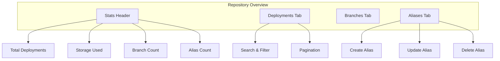
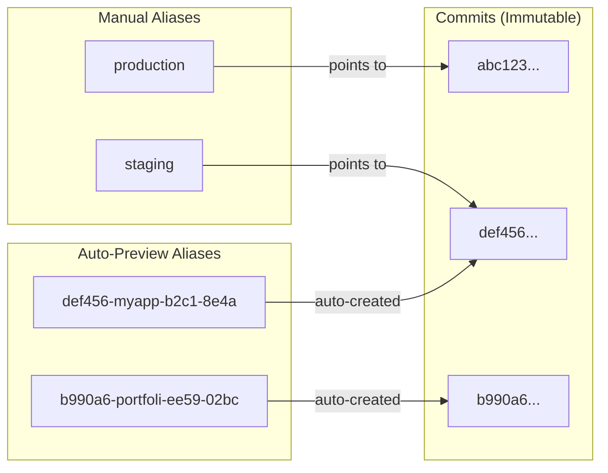

# Repository Overview

The Repository Overview provides a comprehensive view of all your deployments, aliases, and branches for each repository.

## Overview

Every repository in BFFless has a dedicated overview page that displays:

- **Repository Statistics**: Total deployments, storage used, branch count, alias count
- **Deployments List**: Paginated list of all deployments with filtering and sorting
- **Alias Management**: Create, update, and delete deployment aliases
- **Branch Overview**: View all branches with deployment counts and latest commits

## Navigating to Repository Overview

1. From the dashboard, click on a repository name
2. You will land on the repository overview page at `/repo/:owner/:repo`
3. The page displays repository statistics and three tabs: Deployments, Branches, and Aliases

## Deployments Tab

The **Deployments Tab** shows all deployments for the repository:

### View Deployments List

Each row shows:
- **Commit SHA** (short) - Click to copy full SHA
- **Branch** - The branch this deployment came from
- **Workflow Name** - The CI/CD workflow that created it
- **Deployed Date** - When the deployment was created
- **File Count** - Number of files in the deployment
- **Total Size** - Storage size of the deployment

### Search Deployments

Use the search box to filter by commit SHA, description, or workflow name. Search is case-insensitive and filters in real-time.

### Filter by Branch

1. Click the branch filter dropdown
2. Select a specific branch or "All Branches"
3. The list updates to show only deployments from that branch

### Sort Deployments

Use the sort dropdown to sort by:
- Date (Newest First / Oldest First)
- Branch (A-Z / Z-A)

### Pagination

- Use the pagination controls at the bottom
- Shows "Page X of Y • Z total deployments"
- Previous/Next buttons navigate between pages

## Aliases Tab

The **Aliases Tab** allows you to create named references to deployments (e.g., "production", "staging").

### Understanding Aliases

BFFless supports two types of aliases:

**Manual Aliases** - User-created named references (e.g., `production`, `staging`):
- Created and updated via the Aliases tab
- Point to any commit SHA you choose
- Ideal for stable environments

**Auto-Preview Aliases** - Automatically generated for every upload:
- Created automatically when CI/CD uploads a build
- Deterministic subdomain based on commit + repository
- Format: `{shortSha}-{repoPrefix}-{repoHash}-{basePathHash}`
- Example: `b990a6-portfoli-ee59-02bc`

**URL Access Patterns:**

| Type | URL Format | Example |
|------|------------|---------|
| **Preview Subdomain** (recommended) | `https://{alias}.yourdomain.com/` | `https://b990a6-portfoli-ee59-02bc.j5s.dev/` |
| **Alias Path** | `/repo/{owner}/{repo}/alias/{alias}/` | `/repo/acme/web-app/alias/production/` |
| **SHA Path** (fallback) | `/repo/{owner}/{repo}/{sha}/` | `/repo/acme/web-app/abc123/` |

:::tip
Preview subdomain URLs require wildcard DNS (`*.yourdomain.com`) to be configured. The SHA path URL works without wildcard DNS and is useful for development environments.
:::

### View Aliases

See all existing aliases with their target commits. Each row shows:
- Alias Name
- Commit SHA
- Branch
- Last Updated Date

### Create Alias

1. Click "Create Alias" button
2. Enter an alias name (alphanumeric, hyphens, underscores only)
3. Select a commit from the dropdown
4. Click "Create Alias"

### Update Alias

1. Click "Edit" button on any alias
2. Select a new commit to point the alias to
3. Click "Update"

### Delete Alias

1. Click "Delete" button on any alias
2. Confirm deletion in the dialog
3. Alias is permanently removed

:::note
Alias management requires authentication. You must be logged in and have write access to the repository.
:::

## Branches Tab

The **Branches Tab** displays all branches in the repository:

### View Branches List

Each row shows:
- **Branch Name**
- **Latest Commit SHA** - The most recent deployment
- **Last Deployed** - Relative time (e.g., "2 hours ago")
- **Deployments** - Total number of deployments on this branch

### Navigate to Branch

Click the "View" button to navigate to the latest deployment on that branch.

## Repository Statistics

The stats header shows four key metrics:

| Metric | Description |
|--------|-------------|
| **Deployments** | Total number of deployments in the repository |
| **Storage** | Total storage used (e.g., "1.2 GB") |
| **Branches** | Number of unique branches with deployments |
| **Aliases** | Number of configured aliases |

## Common Workflows

### Deploy to Production

1. CI/CD uploads new build → Creates deployment with commit SHA
2. Test the deployment via auto-generated preview subdomain
3. Go to Aliases tab → Update `production` alias to new commit
4. Live site now serves the new version

### Rollback

1. Go to Aliases tab
2. Find the `production` alias
3. Click "Edit"
4. Select the previous commit SHA
5. Click "Update"

The site instantly reverts to the previous version.

### Preview Pull Requests

1. CI/CD uploads PR build with commit SHA
2. BFFless automatically generates a preview subdomain
3. Share the preview URL for review: `https://b990a6-portfoli-ee59-02bc.j5s.dev/`
4. After merge, update staging/production alias to the new commit

The preview URL is deterministic—the same commit + repository always generates the same subdomain, making it easy to share and bookmark.

## Tips

- **Copy Commit SHA**: Click the copy button next to any commit SHA to copy the full SHA to your clipboard
- **Quick Navigation**: Use keyboard shortcuts for common actions
- **Search**: The search is instant and searches across SHA, description, and workflow name
- **Filters Persist**: Your branch filter and sort preferences persist during your session

## Related Features

- [Traffic Splitting](/features/traffic-splitting) - A/B testing with aliases
- [Share Links](/features/share-links) - Share private deployments
- [GitHub Actions](/deployment/github-actions) - Automated deployments
