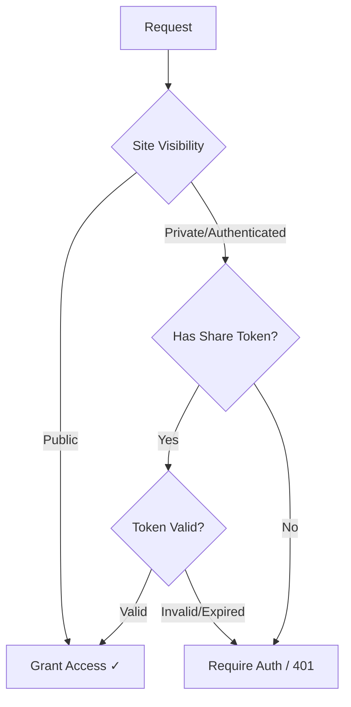
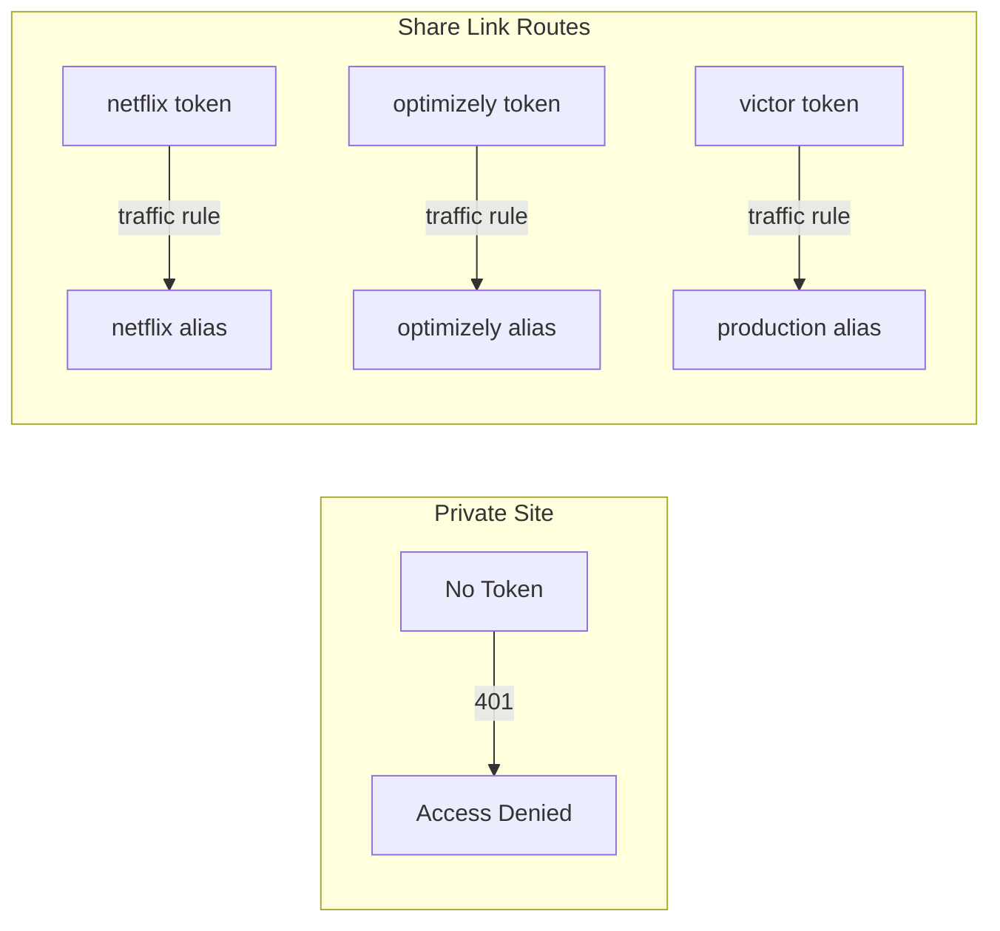

# Share Links

Share private content with specific people without requiring them to create an account—like sharing a Google Doc with "anyone with the link."


## Overview

Share Links provide a way to grant access to private deployments without user authentication. Each link contains a unique token that bypasses the normal visibility restrictions, allowing you to:

- **Share private sites** with recruiters, clients, or collaborators
- **Track engagement** by seeing how many times each link is used
- **Maintain control** by disabling or revoking links at any time
- **Organize access** by creating named links for different audiences

## How It Works

When you create a share link, the platform generates a unique token. Anyone with this token can access your private deployment, even when the site's visibility is set to "Private" or "Authenticated."



The token can be passed as:
- **Query parameter**: `https://yoursite.com?token=Xk9mP2qR`
- **Cookie**: Set automatically after first visit with token

## Configuration

Access share links from **Admin → Settings → Domain Mapping → Share Links tab**.

### Creating a Share Link

1. Click **+ Add** to create a new share link
2. Enter a **name** to identify the link (e.g., "Netflix", "Recruiter", "Client-Acme")
3. The platform generates a unique token automatically
4. Click **Copy** to copy the full URL to your clipboard

### Managing Share Links

Each share link shows:

| Element | Description |
|---------|-------------|
| **Name** | Identifier you assigned (e.g., "optimizely", "Recruiter") |
| **Status** | Active (green badge) or Disabled |
| **Uses** | Number of times the link has been accessed |
| **Copy** | Copy the share URL to clipboard |
| **Disable** | Temporarily disable without deleting |
| **Regenerate** | Create a new token (invalidates the old one) |
| **Delete** | Permanently remove the share link |

### Link Actions

| Action | Effect |
|--------|--------|
| **Copy** | Copies `https://yourdomain.com?token=Xk9mP2qR` to clipboard |
| **Disable** | Link stops working but keeps usage stats; can re-enable |
| **Regenerate** | Creates new token; old links stop working |
| **Delete** | Permanently removes link and all tracking data |

## Use Cases

### Portfolio Sharing with Recruiters

Keep your portfolio private by default, but share personalized links with each company you apply to:

```
Site Visibility: Private

Share Links:
├── netflix     → 241 uses  (Netflix-focused portfolio)
├── optimizely  → 138 uses  (Optimizely-focused portfolio)
├── victor      → 135 uses  (Specific recruiter contact)
└── Recruiter   →  23 uses  (General recruiter version)
```

Each share link can show personalized content using [Traffic Splitting](/features/traffic-splitting):

<div style={{display: 'flex', gap: '1rem', flexWrap: 'wrap', margin: '1.5rem 0'}}>
  
  
</div>

**Benefits:**
- Track which companies are viewing your portfolio
- See engagement (241 views from Netflix recruiters!)
- Personalize content for each audience
- Revoke access if a link gets shared too widely

### Client Project Reviews

Share staging environments with clients for review:

```
Share Links:
├── client-review    → Main review link for client team
├── stakeholder-bob  → Direct link for key stakeholder
└── legal-review     → Link for legal team review
```

**Benefits:**
- No client accounts needed
- Different links for different stakeholders
- Easy to revoke after project completion

### Beta Testing

Distribute access to beta testers without a full auth system:

```
Share Links:
├── beta-group-1  → First wave of testers
├── beta-group-2  → Second wave
└── press-preview → Early access for press
```

**Benefits:**
- Track which groups are most active
- Disable a group's access if issues arise
- No password management overhead

### Internal Team Sharing

Share private deployments with team members who don't have platform accounts:

```
Share Links:
├── design-team   → For design review
├── qa-team       → For QA testing
└── stakeholders  → For executive demos
```

## Combining with Traffic Splitting

Share links work seamlessly with [Traffic Splitting](/features/traffic-splitting) to show personalized content to each audience:



**Example: Personalized Job Application Portfolio**

1. **Create deployment aliases** for each company:
   - `netflix` - Contains Netflix-specific content and messaging
   - `optimizely` - Contains Optimizely-specific content and messaging
   - `production` - General portfolio version

2. **Create share links** for each company:
   - `netflix` share link
   - `optimizely` share link
   - `victor` share link (specific recruiter)

3. **Configure traffic rules** to route each token:
   - `netflix` token → `netflix` alias
   - `optimizely` token → `optimizely` alias
   - `victor` token → `production` alias

**Result:**
- Site is completely private (no public access)
- Netflix recruiters see "Built for Netflix" messaging
- Optimizely team sees "Built for Optimizely" messaging
- You track exactly how many times each link is used

## Security Considerations

### Token Security

- Tokens are randomly generated and cryptographically secure
- Tokens are long enough to prevent brute-force guessing
- Each token is unique to a specific domain mapping

### Best Practices

| Practice | Why |
|----------|-----|
| **Use descriptive names** | Track who has access at a glance |
| **Regenerate if leaked** | Old token immediately stops working |
| **Disable unused links** | Reduce attack surface |
| **Monitor usage** | Unusual spikes may indicate sharing |
| **Delete after purpose served** | Client project done? Remove their link |

### What Share Links Do NOT Provide

- **Authentication** - Users are anonymous; you can't identify individuals
- **Fine-grained permissions** - It's all-or-nothing access to the deployment
- **Audit logs** - You see usage counts, not detailed access logs
- **Expiration** - Links don't auto-expire (disable manually when done)

## Technical Details

### Token Format

Share link tokens are 8-character URL-safe strings (base64url encoded):
```
https://yourdomain.com?token=Xk9mP2qR
```

### Cookie Behavior

After first visit with a valid token:
1. A session cookie is set with the token
2. Subsequent requests don't need the query parameter
3. User can bookmark the site and return without the token in URL

### API Integration

Share links can also be used with API requests:
```bash
curl "https://yourdomain.com/api/endpoint?token=Xk9mP2qR"
```

## Troubleshooting

### "Access Denied" with valid token

**Causes:**
- Link has been disabled
- Link has been regenerated (old token invalid)
- Link has been deleted
- Token is for a different domain

**Fix:** Verify link status in Share Links tab; send updated link if regenerated

### Usage count not updating

**Cause:** Sticky cookie means repeat visits aren't counted as new "uses"

**Expected behavior:** Each unique visitor is counted once; return visits use the cookie

### Token visible in URL after sharing

**Concern:** Someone might see the token in a shared screen

**Solution:** After initial load, the token is stored in a cookie. Users can:
1. Visit the link once
2. Bookmark the page (without token in URL)
3. Clear the URL bar before screen sharing

## Related Features

- [Traffic Splitting](/features/traffic-splitting) - Route share link users to specific content
- [Proxy Rules](/features/proxy-rules) - URL rewriting and routing
