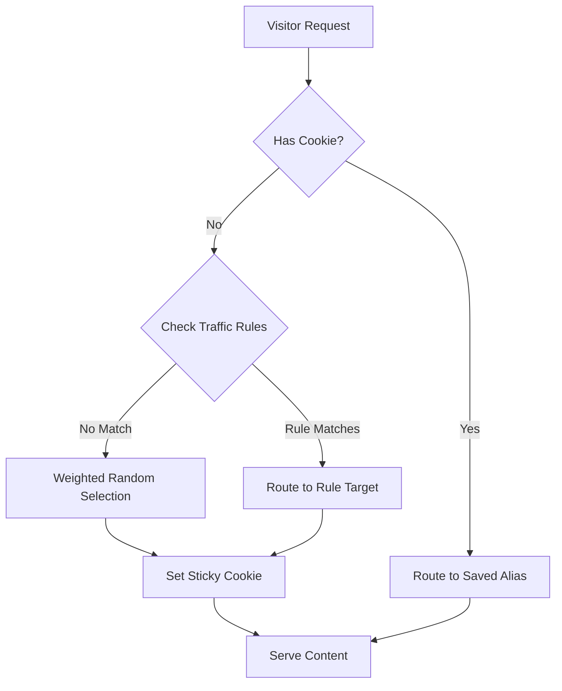
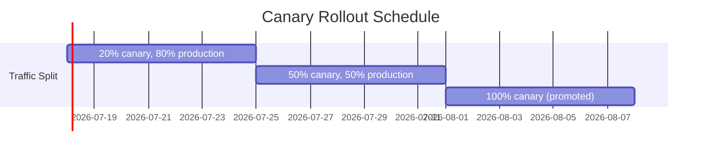

# Traffic Splitting

Split traffic across multiple deployment aliases for A/B testing, canary deployments, or personalized content delivery.


## Live Demo

Try traffic splitting yourself at <a href="https://demo.docs.bffless.app/" target="_blank" rel="noopener noreferrer">demo.docs.bffless.app ↗</a>. This demo splits traffic 50/50 between two versions:

- **production** - Purple button (default)
- **red** - Red button (<a href="https://github.com/bffless/demo/pull/1" target="_blank" rel="noopener noreferrer">see the PR ↗</a>)

<div style={{display: 'flex', gap: '1rem', flexWrap: 'wrap', margin: '1.5rem 0'}}>
  
  
</div>

Open in an incognito window to get randomly assigned, or use query parameters to force a specific variant:
- <a href="https://demo.docs.bffless.app/?version=default" target="_blank" rel="noopener noreferrer">demo.docs.bffless.app/?version=default ↗</a> - Force production (purple)
- <a href="https://demo.docs.bffless.app/?version=red" target="_blank" rel="noopener noreferrer">demo.docs.bffless.app/?version=red ↗</a> - Force red variant

## Overview

Traffic splitting allows you to distribute visitors across different versions of your site. This is useful for:

- **A/B Testing** - Compare two versions of a page to see which performs better
- **Canary Deployments** - Gradually roll out new features to a subset of users
- **Personalized Content** - Serve customized content to specific audiences
- **Feature Flags** - Test new features with a percentage of traffic before full rollout

## How It Works

When traffic splitting is enabled for a domain, incoming requests are distributed across your deployment aliases based on configured weights. The platform uses cookies to maintain **sticky sessions**, ensuring users see consistent content across page loads.



## Configuration

Access traffic splitting from **Admin → Settings → Domain Mapping → Traffic tab**.

### Traffic Distribution

Configure the percentage of traffic each alias receives:

| Setting | Description |
|---------|-------------|
| **Alias** | Select from your deployment aliases (e.g., `production`, `staging`, `canary`) |
| **Weight %** | Percentage of traffic to send to this alias (0-100) |
| **Total** | Must equal 100% (shown in green when valid) |

**Buttons:**
- **Add Alias** - Add another alias to the distribution
- **Auto-Balance** - Automatically distribute weights evenly across all aliases

### Sticky Sessions

Keep users on the same variant across page loads:

| Setting | Description |
|---------|-------------|
| **Sticky Sessions** | Toggle to enable/disable session persistence |
| **No expiration** | Cookie persists indefinitely (until browser clears cookies) |
| **Custom duration** | Set expiration time (e.g., 24 hours, 7 days) |

When enabled, a `__bffless_variant` cookie is set with the selected alias name.

### Traffic Rules

Override weighted distribution with deterministic routing rules. When a condition matches, the visitor is forced to that alias regardless of weights.


| Rule Type | Example | Use Case |
|-----------|---------|----------|
| **Query Parameter** | `version=red` → `red` | Force specific variant for testing/validation |
| **Cookie** | `audience=enterprise` → `enterprise` | Segment returning visitors |

This is useful for:
- **QA validation** - Test each variant before going live
- **Support debugging** - Reproduce what a user is seeing
- **Share links** - Direct links to specific variants for stakeholders

**Rule priority:** First matching rule wins. Rules are evaluated top-to-bottom.

## Use Cases

### A/B Testing

Test two versions of your site to see which performs better. The <a href="https://demo.docs.bffless.app/" target="_blank" rel="noopener noreferrer">live demo ↗</a> shows this in action:

```
production: 50%  (purple button - current design)
red:        50%  (red button - new design variant)
```

Track conversions using your analytics platform to determine the winner.

### Personalized Portfolios

Create customized experiences for different audiences using [Share Links](/features/share-links):

```
skills:      50%  (A/B test: skills-focused layout)
production:  50%  (A/B test: original layout)
netflix:      0%  (custom for Netflix recruiters)
optimizely:   0%  (custom for Optimizely team)
```

Aliases at **0% weight** don't receive random traffic—they're only accessible via share links with traffic rules:
- Share link `netflix` → Routes to `netflix` alias
- Share link `optimizely` → Routes to `optimizely` alias

<div style={{display: 'flex', gap: '1rem', flexWrap: 'wrap', margin: '1.5rem 0'}}>
  
  
</div>

This setup lets you:
1. A/B test `skills` vs `production` for general visitors (50/50 split)
2. Show personalized content to Netflix and Optimizely recruiters via their unique share links

### Canary Deployments

Gradually roll out a new version:



| Week | Production | Canary | Action |
|------|------------|--------|--------|
| 1 | 95% | 5% | Monitor error rates |
| 2 | 80% | 20% | Check performance metrics |
| 3 | 50% | 50% | Validate with broader traffic |
| 4 | 0% | 100% | Promote canary to production |

### Geographic or Segment Testing

Combine with traffic rules for targeted experiences:

```
production: 100%  (default)
enterprise:   0%  (enterprise customers only)
```

Traffic Rule: Cookie `plan=enterprise` → `enterprise`

Set the cookie when users log in to your SaaS, and they'll automatically see the enterprise variant.

## Technical Details

### Cookie Behavior

| Cookie | Value | Attributes |
|--------|-------|------------|
| `__bffless_variant` | Alias name (e.g., `production`) | HttpOnly, Secure, SameSite=Lax |

The cookie is set on first visit and read on subsequent requests to maintain session consistency.

### Response Headers

The selected variant is also returned in a response header:

```
X-Variant: production
```

This can be useful for debugging or analytics integration.

### Weight Distribution Algorithm

Weights are normalized to 100%. The selection algorithm:

1. Generate random number 0-100
2. Iterate through aliases, accumulating weights
3. Select alias when cumulative weight exceeds random number

Example with weights `[50, 30, 20]`:
- Random 0-50 → First alias
- Random 51-80 → Second alias
- Random 81-100 → Third alias

### Traffic Rules Priority

Rules are evaluated before weighted distribution:

1. Check query parameters against rules
2. Check cookies against rules
3. If no rule matches, use weighted random selection

## Best Practices

### A/B Testing

1. **Define success metrics** before starting the test
2. **Run tests long enough** to reach statistical significance
3. **Test one variable at a time** for clear results
4. **Use sticky sessions** to avoid user confusion

### Canary Deployments

1. **Start small** (1-5% traffic)
2. **Monitor error rates and performance** closely
3. **Have a rollback plan** ready
4. **Gradually increase** traffic if metrics look good

### Personalized Content

1. **Use secure, unguessable tokens** for share links
2. **Set aliases to 0% weight** so personalized variants don't appear in random rotation
3. **Track which links are shared** for analytics

## Troubleshooting

### Users seeing inconsistent content

**Cause:** Sticky sessions disabled or cookie cleared

**Fix:** Enable sticky sessions and consider "No expiration" for longer tests

### Traffic rule not working

**Cause:** Rule syntax or priority issue

**Fix:**
- Verify the query parameter or cookie name matches exactly
- Check rule is enabled (toggle on)
- Remember first matching rule wins

### Weights don't add to 100%

**Cause:** Configuration error

**Fix:** Use "Auto-Balance" button or manually adjust percentages

### Cookie not being set

**Cause:** Browser blocking third-party cookies or site not using HTTPS

**Fix:** Ensure site is served over HTTPS; check browser privacy settings

## Related Features

- [Share Links](/features/share-links) - Share private content without requiring login
- [Proxy Rules](/features/proxy-rules) - URL rewriting and routing
