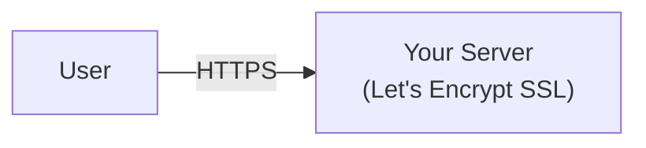

# Let's Encrypt Setup

Use Let's Encrypt for automated SSL certificates if you prefer not to use Cloudflare.

:::tip Free Setup
Both Let's Encrypt and Cloudflare provide free SSL certificates. Your only cost is server hosting, which typically runs $5-20/month depending on your provider.
:::

## Overview

With Let's Encrypt, your server handles SSL directly:



**Key characteristics:**

- Free SSL certificates from a trusted Certificate Authority
- Certificates expire every 90 days (auto-renewal available)
- Requires port 80 open for certificate verification
- No CDN or DDoS protection (add separately if needed)

## Prerequisites

Before starting, ensure you have:

- A Linux server (Ubuntu 22.04+ recommended)
- A domain name pointing to your server's IP
- **Ports 80 and 443 open** in your firewall
- No other web server running on port 80

## Step 1: Get Your Server's IP Address

On your server, run:

```bash
curl -4 ifconfig.me && echo
```

This prints your server's public IP address. Note it down - you'll need it for DNS records.

## Step 2: Configure DNS Records

At your DNS provider (GoDaddy, Namecheap, Route 53, etc.), create these A records pointing to your server's IP:

| Type | Name    | Value            | TTL  |
| ---- | ------- | ---------------- | ---- |
| A    | `@`     | `YOUR_SERVER_IP` | 3600 |
| A    | `www`   | `YOUR_SERVER_IP` | 3600 |
| A    | `admin` | `YOUR_SERVER_IP` | 3600 |
| A    | `minio` | `YOUR_SERVER_IP` | 3600 |

:::tip Verify DNS Propagation
```bash
dig yourdomain.com +short
dig admin.yourdomain.com +short
```

Both should return your server's IP address. If not, wait a few minutes for DNS propagation.
:::

## Step 3: Install Certbot

**From your local machine**, SSH into your server to run the remaining steps:

```bash
ssh root@YOUR_SERVER_IP
```

Once connected, install Certbot (the official Let's Encrypt client):

**Ubuntu/Debian:**

```bash
sudo apt update
sudo apt install -y certbot
```

**CentOS/RHEL:**

```bash
sudo dnf install -y certbot
```

## Step 4: Obtain SSL Certificates

Run certbot in standalone mode to obtain certificates for all subdomains:

```bash
sudo certbot certonly --standalone \
  -d yourdomain.com \
  -d www.yourdomain.com \
  -d admin.yourdomain.com \
  -d minio.yourdomain.com \
  --email your-email@example.com \
  --agree-tos \
  --no-eff-email
```

:::warning Port 80 Must Be Free
Certbot needs port 80 for domain verification. If you see an error about port 80, stop any service using it:

```bash
sudo lsof -i :80
sudo systemctl stop nginx apache2  # if running
```
:::

On success, you'll see:

```
Successfully received certificate.
Certificate is saved at: /etc/letsencrypt/live/yourdomain.com/fullchain.pem
Key is saved at: /etc/letsencrypt/live/yourdomain.com/privkey.pem
```

## Step 5: Run the Installer

Run the BFFless installer:

```bash
INSTALL_DIR=/opt/bffless sh -c "$(curl -fsSL https://raw.githubusercontent.com/bffless/ce/main/install.sh)"
```

This installs BFFless to `/opt/bffless`.

When prompted:

- Enter your domain name
- Select **Let's Encrypt** when asked about SSL configuration
- The installer will detect your certificates in `/etc/letsencrypt/live/`

The installer copies the certificates to the project's `ssl/` directory automatically.

## Step 6: Start and Complete Setup

```bash
cd /opt/bffless
./start.sh
```

Visit `https://admin.yourdomain.com` to complete the setup wizard.

👉 **[Setup Wizard Guide](/getting-started/setup-wizard)** - Detailed walkthrough of the setup wizard

## Step 7: Set Up Auto-Renewal

Let's Encrypt certificates expire every 90 days. Set up automatic renewal to avoid downtime.

### Create Renewal Script

```bash
sudo mkdir -p /opt/scripts

sudo tee /opt/scripts/renew-ssl.sh > /dev/null << 'EOF'
#!/bin/bash
INSTALL_DIR=/opt/bffless  # Change if installed elsewhere

cd $INSTALL_DIR
certbot renew --quiet \
  --pre-hook "docker compose stop nginx" \
  --post-hook "cp /etc/letsencrypt/live/*/fullchain.pem ssl/ && \
               cp /etc/letsencrypt/live/*/privkey.pem ssl/ && \
               docker compose start nginx"
EOF

sudo chmod +x /opt/scripts/renew-ssl.sh
```

### Add Cron Job

```bash
# Run twice daily (recommended by Let's Encrypt)
(sudo crontab -l 2>/dev/null; echo "0 0,12 * * * /opt/scripts/renew-ssl.sh") | sudo crontab -
```

### Test Renewal

Verify the renewal process works:

```bash
sudo certbot renew --dry-run
```

You should see "Congratulations, all simulated renewals succeeded!"

## Wildcard Certificates (Optional)

For subdomain-based deployments (e.g., `mysite.yourdomain.com`), you'll need a wildcard certificate.

:::info DNS Challenge Required
Wildcard certificates require DNS verification instead of HTTP. This means you'll need API access to your DNS provider for automated renewal.
:::

### Manual Wildcard (One-Time)

```bash
sudo certbot certonly --manual \
  -d yourdomain.com \
  -d "*.yourdomain.com" \
  --preferred-challenges dns \
  --email your-email@example.com \
  --agree-tos
```

You'll be prompted to create a DNS TXT record. Add it at your DNS provider and wait for propagation before continuing.

### Automated Wildcard with DNS Plugins

For automatic renewal, use a DNS provider plugin:

**DigitalOcean:**

```bash
sudo apt install -y python3-certbot-dns-digitalocean

sudo tee /etc/letsencrypt/digitalocean.ini > /dev/null << EOF
dns_digitalocean_token = YOUR_API_TOKEN
EOF
sudo chmod 600 /etc/letsencrypt/digitalocean.ini

sudo certbot certonly \
  --dns-digitalocean \
  --dns-digitalocean-credentials /etc/letsencrypt/digitalocean.ini \
  -d yourdomain.com \
  -d "*.yourdomain.com" \
  --email your-email@example.com \
  --agree-tos
```

**AWS Route 53:**

```bash
sudo apt install -y python3-certbot-dns-route53

# Ensure AWS credentials are configured (~/.aws/credentials or environment variables)
sudo certbot certonly \
  --dns-route53 \
  -d yourdomain.com \
  -d "*.yourdomain.com" \
  --email your-email@example.com \
  --agree-tos
```

## Next Steps

👉 **[Setup Wizard](/getting-started/setup-wizard)** - Complete the setup wizard to configure storage and create your admin account

## Troubleshooting

### Certificate Verification Failed

```
Failed authorization procedure. yourdomain.com (http-01):
urn:ietf:params:acme:error:connection
```

**Causes:**
1. DNS not pointing to your server - verify with `dig yourdomain.com +short`
2. Port 80 blocked by firewall - check `sudo ufw status` or cloud provider firewall
3. Another service using port 80 - check with `sudo lsof -i :80`

### Port 80 In Use

```bash
# Find what's using port 80
sudo lsof -i :80

# Common culprits
sudo systemctl stop nginx
sudo systemctl stop apache2
```

### Certificate Not Found After Install

If the installer can't find your certificates:

```bash
# Check certificates exist
sudo ls -la /etc/letsencrypt/live/

# Manually copy to project
cd /opt/bffless
sudo mkdir -p ssl
sudo cp /etc/letsencrypt/live/yourdomain.com/fullchain.pem ssl/
sudo cp /etc/letsencrypt/live/yourdomain.com/privkey.pem ssl/
sudo chmod 644 ssl/*.pem
```

### Renewal Failing

```bash
# Check certbot logs
sudo cat /var/log/letsencrypt/letsencrypt.log

# Test renewal manually
sudo certbot renew --dry-run

# Common fix: ensure port 80 is available during renewal
```

### Check Certificate Expiry

```bash
# View certificate details
sudo openssl x509 -in /etc/letsencrypt/live/yourdomain.com/fullchain.pem -text -noout | grep "Not After"

# Or check all certificates
sudo certbot certificates
```
