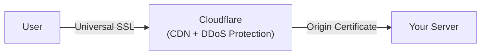
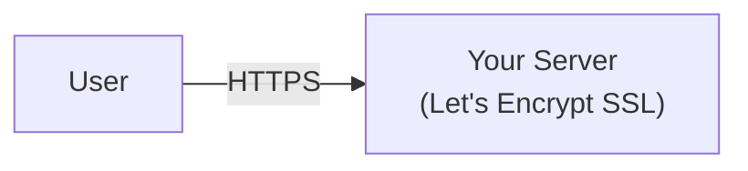

# Quick Start

Deploy BFFless in under 5 minutes using the automated installer.

## Prerequisites

- A Linux server (Ubuntu 22.04+ recommended)
- Docker and Docker Compose installed
- A domain name
- Port 443 open (port 80 also needed if not using Cloudflare)

:::tip No Server Yet?
You can deploy on any cloud provider. A basic $5-10/month VPS from DigitalOcean, Linode, or Hetzner works well for most use cases.
:::

## Choose Your SSL Approach

Both options provide **free SSL certificates**. Choose one to get started:

### Cloudflare (Recommended)

:::tip Why We Recommend Cloudflare
Cloudflare is the easiest path to production. You get SSL certificates that last 15 years (no renewal headaches), plus free DDoS protection and CDN caching. Most users are up and running in under 10 minutes.
:::

- SSL certificates with 15-year validity (no renewal needed)
- DDoS protection and CDN caching included
- Easy DNS management
- No certbot or port 80 required

<a href="/getting-started/cloudflare-setup" class="button button--primary button--lg">Get Started with Cloudflare →</a>

---

### Let's Encrypt (Alternative)

Use this if you need direct connections without a proxy, or if your organization has policies against third-party CDNs:

- Direct connection to your server (no intermediary)
- Certificates auto-renew every 90 days
- Requires port 80 open for verification
- You manage SSL renewal (automated via cron)

<a href="/getting-started/letsencrypt-setup" class="button button--secondary button--lg">Get Started with Let's Encrypt →</a>
