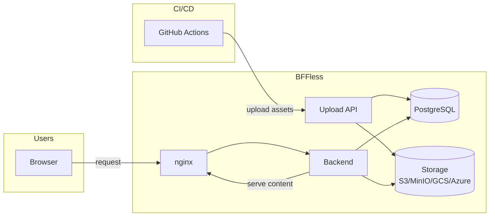

<div style={{textAlign: 'center', marginBottom: '2rem'}}>
  
</div>

# Welcome to BFFless

BFFless is a self-hosted platform for hosting static assets and build artifacts from CI/CD pipelines. Deploy your React SPAs, Vue apps, coverage reports, and Storybook builds with built-in authentication, traffic splitting, and reverse proxy capabilities.

## Quick Start

Deploy in under 5 minutes:

```bash
sh -c "$(curl -fsSL https://raw.githubusercontent.com/bffless/ce/main/install.sh)"
```

Or follow the [manual setup guide](/getting-started/manual-setup) for full control.

## Key Features

- **Static Site Hosting** - Upload and serve static files from CI/CD pipelines
- **Authentication** - Built-in user auth with SuperTokens (sessions + API keys)
- **A/B Testing** - Split traffic between deployments for experiments
- **Reverse Proxy** - Route API requests without CORS configuration
- **Custom Domains** - Map your domains to deployments with automatic SSL
- **Share Links** - Share private content without requiring login

## Architecture



## Documentation Sections

| Section                                               | Description                             |
| ----------------------------------------------------- | --------------------------------------- |
| [Getting Started](/getting-started/quickstart)        | Installation and setup guides           |
| [Features](/features/traffic-splitting)               | A/B testing, share links, proxy rules   |
| [Deployment](/deployment/overview)                    | Deploy to production                    |
| [Configuration](/configuration/environment-variables) | Environment variables and settings      |
| [Storage](/storage/overview)                          | Configure storage backends              |
| [Reference](/reference/api)                           | API docs, architecture, database schema |

## Need Help?

- [Troubleshooting Guide](/troubleshooting) - Common issues and solutions
- [GitHub Issues](https://github.com/bffless/ce/issues) - Report bugs or request features
