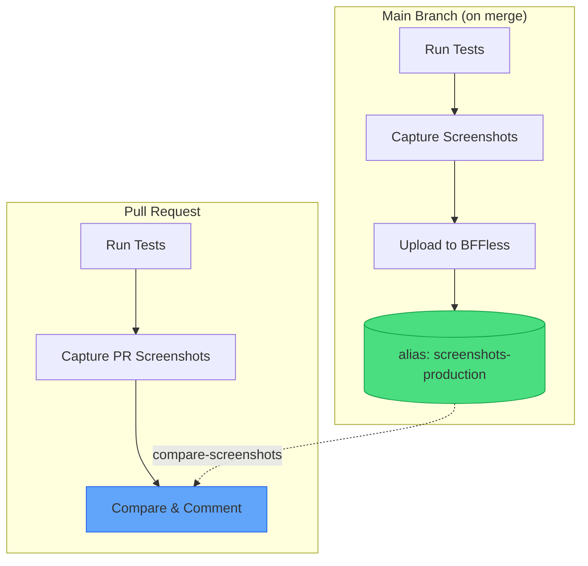

# Visual Regression Testing

This recipe demonstrates how to compare screenshots between your pull requests and production, posting visual diffs as a PR comment. It uses the [`bffless/upload-artifact`](https://github.com/bffless/upload-artifact) action to store baseline screenshots and the [`bffless/compare-screenshots`](https://github.com/bffless/compare-screenshots) action to compare and report results.



## Overview

The pattern works as follows:

1. **Main branch workflow**: After tests pass, capture screenshots and upload them to BFFless with a stable alias (e.g., `screenshots-production`)
2. **PR workflow**: Run tests, capture screenshots, then use `compare-screenshots` to fetch the baseline, compare pixel-by-pixel, and post a PR comment with visual diffs

This gives reviewers immediate visibility into visual changes without leaving the PR.

## Prerequisites

- A project with visual/E2E tests that capture screenshots
- BFFless instance with API access configured
- GitHub repository with Actions enabled

### Supported Screenshot Tools

The `compare-screenshots` action works with any tool that produces PNG screenshots:

| Tool | Description |
|------|-------------|
| **Playwright** | Modern E2E testing with built-in screenshot capture |
| **Puppeteer** | Headless Chrome/Chromium screenshots |
| **Cypress** | E2E testing with screenshot commands |
| **Storybook** | Component screenshots via Chromatic alternatives |
| **Custom scripts** | Any tool that outputs PNG files |

## Step 1: Configure Screenshot Capture

First, set up your test runner to capture screenshots. Here's an example using Playwright:

### Install Dependencies

```bash
pnpm add -D @playwright/test
pnpm exec playwright install chromium
```

### Configure Playwright

```typescript title="playwright.config.ts"
import { defineConfig } from '@playwright/test'

export default defineConfig({
  testDir: './tests',
  snapshotDir: './screenshots',
  use: {
    baseURL: 'http://localhost:3000',
    screenshot: 'on',
  },
  projects: [
    {
      name: 'chromium',
      use: { browserName: 'chromium' },
    },
  ],
})
```

### Add Screenshot Test

```typescript title="tests/visual.spec.ts"
import { test, expect } from '@playwright/test'

test('home page', async ({ page }) => {
  await page.goto('/')
  await page.screenshot({ path: './screenshots/home-default.png' })
})

test('home page with counter', async ({ page }) => {
  await page.goto('/')
  await page.click('button')
  await page.screenshot({ path: './screenshots/home-counter.png' })
})
```

### Add Test Scripts

```json title="package.json"
{
  "scripts": {
    "test:vrt": "playwright test"
  }
}
```

The key output is a directory of PNG screenshots (e.g., `./screenshots/`) that will be compared against the baseline.

## Step 2: Main Branch Workflow

Update your main branch deployment workflow to upload screenshots as a baseline:

```yaml title=".github/workflows/main-deploy.yml"
name: Deploy to Production

on:
  push:
    branches: [main]

permissions:
  contents: read

jobs:
  test-and-deploy:
    runs-on: ubuntu-latest
    steps:
      - uses: actions/checkout@v4

      - uses: pnpm/action-setup@v2
        with:
          version: 8

      - uses: actions/setup-node@v4
        with:
          node-version: '20'
          cache: 'pnpm'

      - run: pnpm install

      - name: Install Playwright browsers
        run: pnpm exec playwright install chromium

      - name: Build app
        run: pnpm build

      - name: Capture screenshots
        run: pnpm test:vrt

      # highlight-start
      - name: Upload screenshot baseline
        uses: bffless/upload-artifact@v1
        with:
          path: screenshots
          api-url: ${{ vars.BFFLESS_URL }}
          api-key: ${{ secrets.BFFLESS_API_KEY }}
          alias: screenshots-production
          description: 'Screenshot baseline for main@${{ github.sha }}'
      # highlight-end

      - name: Deploy
        run: echo "Deploy your app here"
        # ... rest of your deployment steps
```

The `alias: screenshots-production` ensures each push to main overwrites the previous baseline, always keeping the latest production screenshots available.

## Step 3: PR Workflow with Comparison

Update your PR workflow to compare screenshots and post a comment:

```yaml title=".github/workflows/pr-preview.yml"
name: PR Preview

on:
  pull_request:
    branches: ['*']

permissions:
  contents: read
  pull-requests: write  # Required for posting comments

jobs:
  test-and-preview:
    runs-on: ubuntu-latest
    steps:
      - uses: actions/checkout@v4

      - uses: pnpm/action-setup@v2
        with:
          version: 8

      - uses: actions/setup-node@v4
        with:
          node-version: '20'
          cache: 'pnpm'

      - run: pnpm install

      - name: Install Playwright browsers
        run: pnpm exec playwright install chromium

      - name: Build app
        run: pnpm build

      - name: Capture screenshots
        run: pnpm test:vrt

      # highlight-start
      - name: Compare screenshots
        uses: bffless/compare-screenshots@v1
        env:
          GITHUB_TOKEN: ${{ secrets.GITHUB_TOKEN }}
        with:
          path: ./screenshots
          baseline-alias: screenshots-production
          api-url: ${{ vars.BFFLESS_URL }}
          api-key: ${{ secrets.BFFLESS_API_KEY }}
      # highlight-end

      - name: Build preview
        run: pnpm build
        # ... rest of your preview deployment steps
```

The `compare-screenshots` action handles everything:
- Downloads the baseline screenshots from BFFless
- Compares each screenshot pixel-by-pixel using pixelmatch
- Generates diff images highlighting visual differences
- Posts a PR comment with the comparison results
- Generates a GitHub step summary
- Fails if visual differences exceed the threshold (configurable)

## Example PR Comment

When the workflow runs, it posts a comment like this:

[](https://github.com/bffless/demo/pull/1#issuecomment-3914080635)

The comment includes:
- **Summary status** - Quick indicator showing passed/failed screenshots
- **Results table** - Screenshot name, status, and diff percentage for each image
- **Failed screenshots** - Expandable sections showing Production, PR, and Diff images side-by-side

On subsequent pushes to the same PR, the comment is updated rather than creating new comments.

## Configuration Options

### Adjust Diff Threshold

By default, the action fails on any visual difference above 0.1%. Use `threshold` to allow small variations:

```yaml
- name: Compare screenshots
  uses: bffless/compare-screenshots@v1
  env:
    GITHUB_TOKEN: ${{ secrets.GITHUB_TOKEN }}
  with:
    path: ./screenshots
    baseline-alias: screenshots-production
    api-url: ${{ vars.BFFLESS_URL }}
    api-key: ${{ secrets.BFFLESS_API_KEY }}
    threshold: 0.5  # Allow up to 0.5% diff
```

### Adjust Pixel Sensitivity

For minor color differences or anti-aliasing, adjust the pixel-level threshold:

```yaml
- name: Compare screenshots
  uses: bffless/compare-screenshots@v1
  env:
    GITHUB_TOKEN: ${{ secrets.GITHUB_TOKEN }}
  with:
    path: ./screenshots
    baseline-alias: screenshots-production
    api-url: ${{ vars.BFFLESS_URL }}
    api-key: ${{ secrets.BFFLESS_API_KEY }}
    pixel-threshold: 0.2  # More lenient per-pixel comparison (0-1)
    include-anti-aliasing: true  # Include anti-aliasing in diff
```

### Disable Failure on Difference

To report visual changes without failing the workflow:

```yaml
- name: Compare screenshots
  uses: bffless/compare-screenshots@v1
  env:
    GITHUB_TOKEN: ${{ secrets.GITHUB_TOKEN }}
  with:
    path: ./screenshots
    baseline-alias: screenshots-production
    api-url: ${{ vars.BFFLESS_URL }}
    api-key: ${{ secrets.BFFLESS_API_KEY }}
    fail-on-difference: false
```

### Use Screenshot Outputs

Access comparison values in subsequent steps:

```yaml
- name: Compare screenshots
  id: vrt
  uses: bffless/compare-screenshots@v1
  env:
    GITHUB_TOKEN: ${{ secrets.GITHUB_TOKEN }}
  with:
    path: ./screenshots
    baseline-alias: screenshots-production
    api-url: ${{ vars.BFFLESS_URL }}
    api-key: ${{ secrets.BFFLESS_API_KEY }}
    fail-on-difference: false

- name: Check VRT result
  run: |
    echo "Total: ${{ steps.vrt.outputs.total }}"
    echo "Passed: ${{ steps.vrt.outputs.passed }}"
    echo "Failed: ${{ steps.vrt.outputs.failed }}"
    echo "Result: ${{ steps.vrt.outputs.result }}"

    if [ "${{ steps.vrt.outputs.result }}" == "fail" ]; then
      echo "::warning::Visual differences detected"
    fi
```

Available outputs: `total`, `passed`, `failed`, `new`, `missing`, `result`, `report` (JSON), `baseline-commit-sha`, and `upload-url`.

### Custom Comment Header

Customize the PR comment identifier (useful if you have multiple screenshot comparisons):

```yaml
- name: Compare desktop screenshots
  uses: bffless/compare-screenshots@v1
  env:
    GITHUB_TOKEN: ${{ secrets.GITHUB_TOKEN }}
  with:
    path: ./screenshots/desktop
    baseline-alias: screenshots-desktop-production
    api-url: ${{ vars.BFFLESS_URL }}
    api-key: ${{ secrets.BFFLESS_API_KEY }}
    comment-header: '## Desktop Visual Regression'

- name: Compare mobile screenshots
  uses: bffless/compare-screenshots@v1
  env:
    GITHUB_TOKEN: ${{ secrets.GITHUB_TOKEN }}
  with:
    path: ./screenshots/mobile
    baseline-alias: screenshots-mobile-production
    api-url: ${{ vars.BFFLESS_URL }}
    api-key: ${{ secrets.BFFLESS_API_KEY }}
    comment-header: '## Mobile Visual Regression'
```

### Disable Result Upload

By default, PR screenshots and diff images are uploaded to BFFless. To disable:

```yaml
- name: Compare screenshots
  uses: bffless/compare-screenshots@v1
  env:
    GITHUB_TOKEN: ${{ secrets.GITHUB_TOKEN }}
  with:
    path: ./screenshots
    baseline-alias: screenshots-production
    api-url: ${{ vars.BFFLESS_URL }}
    api-key: ${{ secrets.BFFLESS_API_KEY }}
    upload-results: false
```

## Troubleshooting

### "No baseline found" warning

This is expected on the first PR before any code has been merged to main. Once you merge a PR, the main branch workflow will upload the baseline. The action will still report current screenshots.

### Baseline download fails

Check that:
1. The `baseline-alias` matches exactly what you used in `upload-artifact` (`screenshots-production`)
2. The main branch workflow has run successfully at least once
3. The API URL and key are configured correctly in repository variables/secrets

### Screenshots don't match but look identical

Minor rendering differences can cause pixel-level changes. Try:
- Increasing `threshold` (e.g., `0.5` for 0.5% tolerance)
- Increasing `pixel-threshold` (e.g., `0.2` for more lenient color comparison)
- Setting `include-anti-aliasing: true` if differences are at edges

### Different screenshot sizes cause failures

Screenshots must have the same dimensions to be compared. Ensure:
- Consistent viewport size in your test configuration
- Same browser and device settings across main and PR workflows
- No responsive breakpoint differences

### CI screenshots differ from local

Ensure your CI environment matches local:
- Same browser version (use `playwright install chromium` consistently)
- Same fonts installed (consider using a Docker image with fonts)
- Same viewport and device pixel ratio settings

## See It in Action

This recipe is implemented in the [BFFless demo repository](https://github.com/bffless/demo). Open a PR there to see the visual regression testing workflow in action.
