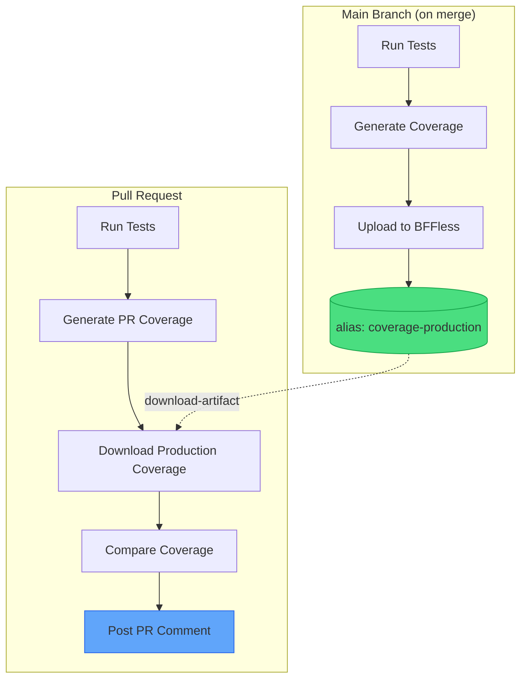

# Coverage Comparison

This recipe demonstrates how to compare test coverage between your pull requests and production, posting the difference as a PR comment. It uses the [`bffless/upload-artifact`](https://github.com/bffless/upload-artifact) and [`bffless/download-artifact`](https://github.com/bffless/download-artifact) GitHub Actions to store and retrieve coverage reports.



## Overview

The pattern works as follows:

1. **Main branch workflow**: After tests pass, upload the coverage report to BFFless with a stable alias (e.g., `coverage-production`)
2. **PR workflow**: Run tests, download the production coverage, compare percentages, and post a comment showing the diff

This gives reviewers immediate visibility into coverage impact without leaving the PR.

## Prerequisites

- A project with tests that generate coverage reports (this recipe uses Vitest, but any tool that outputs `coverage-summary.json` works)
- BFFless instance with API access configured
- GitHub repository with Actions enabled

## Step 1: Configure Test Coverage

First, set up your test runner to output coverage in JSON format. Here's an example using Vitest:

### Install Dependencies

```bash
pnpm add -D vitest @vitest/coverage-v8
```

### Configure Vitest

```typescript title="vitest.config.ts"
import { defineConfig } from 'vitest/config'
import react from '@vitejs/plugin-react'

export default defineConfig({
  plugins: [react()],
  test: {
    environment: 'jsdom',
    globals: true,
    coverage: {
      provider: 'v8',
      reporter: ['text', 'json', 'json-summary', 'html'],
      reportsDirectory: './coverage',
    },
  },
})
```

### Add Test Scripts

```json title="package.json"
{
  "scripts": {
    "test": "vitest run",
    "test:coverage": "vitest run --coverage"
  }
}
```

The key output file is `coverage/coverage-summary.json`, which contains overall coverage percentages.

## Step 2: Main Branch Workflow

Update your main branch deployment workflow to upload coverage as a baseline:

```yaml title=".github/workflows/main-deploy.yml"
name: Deploy to Production

on:
  push:
    branches: [main]

permissions:
  contents: read

jobs:
  test-and-deploy:
    runs-on: ubuntu-latest
    steps:
      - uses: actions/checkout@v4

      - uses: pnpm/action-setup@v2
        with:
          version: 8

      - uses: actions/setup-node@v4
        with:
          node-version: '20'
          cache: 'pnpm'

      - run: pnpm install

      - name: Run tests with coverage
        run: pnpm test:coverage

      # highlight-start
      - name: Upload coverage baseline
        uses: bffless/upload-artifact@v1
        with:
          path: coverage
          api-url: ${{ vars.ASSET_HOST_URL }}
          api-key: ${{ secrets.ASSET_HOST_KEY }}
          alias: coverage-production
          description: 'Coverage baseline for main@${{ github.sha }}'
      # highlight-end

      - name: Build and deploy
        run: pnpm build
        # ... rest of your deployment steps
```

The `alias: coverage-production` ensures each push to main overwrites the previous baseline, always keeping the latest production coverage available.

## Step 3: PR Workflow with Comparison

Update your PR workflow to download the baseline, compare, and comment:

```yaml title=".github/workflows/pr-preview.yml"
name: PR Preview

on:
  pull_request:
    branches: ['*']

permissions:
  contents: read
  pull-requests: write  # Required for posting comments

jobs:
  test-and-preview:
    runs-on: ubuntu-latest
    steps:
      - uses: actions/checkout@v4

      - uses: pnpm/action-setup@v2
        with:
          version: 8

      - uses: actions/setup-node@v4
        with:
          node-version: '20'
          cache: 'pnpm'

      - run: pnpm install

      - name: Run tests with coverage
        run: pnpm test:coverage

      # highlight-start
      - name: Download production coverage
        id: download-coverage
        uses: bffless/download-artifact@v1
        continue-on-error: true  # Don't fail if no baseline exists yet
        with:
          alias: coverage-production
          source-path: coverage
          output-path: ./coverage-production
          api-url: ${{ vars.ASSET_HOST_URL }}
          api-key: ${{ secrets.ASSET_HOST_KEY }}

      - name: Compare coverage and comment on PR
        uses: actions/github-script@v7
        with:
          script: |
            const fs = require('fs');

            // Read PR coverage
            let prCoverage = null;
            try {
              const prSummary = JSON.parse(
                fs.readFileSync('./coverage/coverage-summary.json', 'utf8')
              );
              prCoverage = prSummary.total.lines.pct;
            } catch (e) {
              console.log('Could not read PR coverage:', e.message);
            }

            // Read production coverage
            let prodCoverage = null;
            try {
              const prodSummary = JSON.parse(
                fs.readFileSync('./coverage-production/coverage-summary.json', 'utf8')
              );
              prodCoverage = prodSummary.total.lines.pct;
            } catch (e) {
              console.log('Could not read production coverage:', e.message);
            }

            // Build comment
            let body = '## Coverage Report\n\n';

            if (prCoverage !== null) {
              body += `**PR Coverage:** ${prCoverage.toFixed(2)}%\n\n`;

              if (prodCoverage !== null) {
                const diff = prCoverage - prodCoverage;
                const emoji = diff >= 0 ? '📈' : '📉';
                const sign = diff >= 0 ? '+' : '';
                body += `**Production Coverage:** ${prodCoverage.toFixed(2)}%\n\n`;
                body += `**Change:** ${emoji} ${sign}${diff.toFixed(2)}%\n`;
              } else {
                body += '_No production coverage baseline found._\n';
                body += '_This PR will establish the baseline once merged._\n';
              }
            } else {
              body += '_Could not read coverage report._\n';
            }

            body += '\n---\n';
            body += '_Generated by [BFFless](https://bffless.app) coverage comparison_';

            // Find existing comment to update
            const { data: comments } = await github.rest.issues.listComments({
              owner: context.repo.owner,
              repo: context.repo.repo,
              issue_number: context.issue.number,
            });

            const botComment = comments.find(comment =>
              comment.user.type === 'Bot' &&
              comment.body.includes('## Coverage Report')
            );

            if (botComment) {
              await github.rest.issues.updateComment({
                owner: context.repo.owner,
                repo: context.repo.repo,
                comment_id: botComment.id,
                body: body,
              });
            } else {
              await github.rest.issues.createComment({
                owner: context.repo.owner,
                repo: context.repo.repo,
                issue_number: context.issue.number,
                body: body,
              });
            }
      # highlight-end

      - name: Build preview
        run: pnpm build
        # ... rest of your preview deployment steps
```

## Example PR Comment

When the workflow runs, it posts a comment like this:

[](https://github.com/bffless/demo/pull/1#issuecomment-3914080635)

The comment shows:
- **PR Coverage** - Coverage from the current pull request
- **Production Coverage** - Baseline coverage from the main branch
- **Change** - The difference with an indicator (📈 for increase, 📉 for decrease)

On subsequent pushes to the same PR, the comment is updated rather than creating new comments.

## Extending the Recipe

### Add Coverage Thresholds

Fail the workflow if coverage drops below a threshold:

```yaml
- name: Check coverage threshold
  run: |
    COVERAGE=$(jq '.total.lines.pct' ./coverage/coverage-summary.json)
    if (( $(echo "$COVERAGE < 80" | bc -l) )); then
      echo "Coverage $COVERAGE% is below 80% threshold"
      exit 1
    fi
```

### Compare More Metrics

The `coverage-summary.json` includes multiple metrics. Extend the comparison:

```javascript
const metrics = ['lines', 'statements', 'functions', 'branches'];
let table = '| Metric | PR | Prod | Change |\n|--------|-----|------|--------|\n';

for (const metric of metrics) {
  const pr = prSummary.total[metric].pct;
  const prod = prodSummary.total[metric].pct;
  const diff = pr - prod;
  const sign = diff >= 0 ? '+' : '';
  table += `| ${metric} | ${pr.toFixed(1)}% | ${prod.toFixed(1)}% | ${sign}${diff.toFixed(1)}% |\n`;
}
```

### Block PRs with Coverage Regression

Add a status check that fails if coverage decreases:

```yaml
- name: Check for coverage regression
  if: steps.download-coverage.outcome == 'success'
  run: |
    PR_COV=$(jq '.total.lines.pct' ./coverage/coverage-summary.json)
    PROD_COV=$(jq '.total.lines.pct' ./coverage-production/coverage-summary.json)
    if (( $(echo "$PR_COV < $PROD_COV" | bc -l) )); then
      echo "::error::Coverage decreased from $PROD_COV% to $PR_COV%"
      exit 1
    fi
```

## Troubleshooting

### "No production coverage baseline found"

This is expected on the first PR before any code has been merged to main. Once you merge a PR, the main branch workflow will upload the baseline.

### Download fails with 404

Check that:
1. The `alias` matches exactly between upload and download (`coverage-production`)
2. The main branch workflow has run successfully at least once
3. The API URL and key are configured correctly in repository variables/secrets

### Coverage numbers don't match local

Ensure you're running the same test command locally (`pnpm test:coverage`) and that your CI environment matches your local Node.js version.

## See It in Action

This recipe is implemented in the [BFFless demo repository](https://github.com/bffless/demo). Open a PR there to see the coverage comparison workflow in action.

### Live Coverage Report

The HTML coverage report from the demo repository is hosted on BFFless and available at:

**[demo-coverage.docs.bffless.app](https://demo-coverage.docs.bffless.app)**


This demonstrates how BFFless can host not just your application builds, but also auxiliary artifacts like coverage reports, making them easily accessible to your team.
