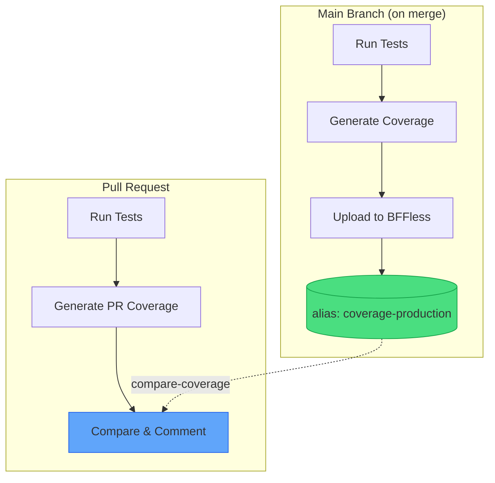

# Coverage Comparison

This recipe demonstrates how to compare test coverage between your pull requests and production, posting the difference as a PR comment. It uses the [`bffless/upload-artifact`](https://github.com/bffless/upload-artifact) action to store baseline coverage and the [`bffless/compare-coverage`](https://github.com/bffless/compare-coverage) action to compare and report results.



## Overview

The pattern works as follows:

1. **Main branch workflow**: After tests pass, upload the coverage report to BFFless with a stable alias (e.g., `coverage-production`)
2. **PR workflow**: Run tests, then use `compare-coverage` to automatically fetch the baseline, compare metrics, and post a PR comment

This gives reviewers immediate visibility into coverage impact without leaving the PR.

## Prerequisites

- A project with tests that generate coverage reports
- BFFless instance with API access configured
- GitHub repository with Actions enabled

### Supported Coverage Formats

The `compare-coverage` action supports multiple coverage formats:

| Format | File Types | Used By |
|--------|------------|---------|
| **lcov** | `.info`, `.lcov` | Jest, c8, nyc, gcov, Vitest |
| **istanbul** | `coverage-final.json` | Jest, nyc, Istanbul |
| **cobertura** | `.xml` | Python (coverage.py), .NET, PHPUnit |
| **clover** | `.xml` | PHP (PHPUnit), Java |
| **jacoco** | `.xml` | Java, Kotlin, Scala |

The format is auto-detected, so you can use this recipe with any of these coverage tools.

## Step 1: Configure Test Coverage

First, set up your test runner to output a coverage report. Here's an example using Vitest with LCOV format:

### Install Dependencies

```bash
pnpm add -D vitest @vitest/coverage-v8
```

### Configure Vitest

```typescript title="vitest.config.ts"
import { defineConfig } from 'vitest/config'
import react from '@vitejs/plugin-react'

export default defineConfig({
  plugins: [react()],
  test: {
    environment: 'jsdom',
    globals: true,
    coverage: {
      provider: 'v8',
      reporter: ['text', 'lcov', 'html'],
      reportsDirectory: './coverage',
    },
  },
})
```

### Add Test Scripts

```json title="package.json"
{
  "scripts": {
    "test": "vitest run",
    "test:coverage": "vitest run --coverage"
  }
}
```

The key output file is `coverage/lcov.info`, which contains detailed coverage data. You can also use `json-summary` format if preferred—the action auto-detects the format.

## Step 2: Main Branch Workflow

Update your main branch deployment workflow to upload coverage as a baseline:

```yaml title=".github/workflows/main-deploy.yml"
name: Deploy to Production

on:
  push:
    branches: [main]

permissions:
  contents: read

jobs:
  test-and-deploy:
    runs-on: ubuntu-latest
    steps:
      - uses: actions/checkout@v4

      - uses: pnpm/action-setup@v2
        with:
          version: 8

      - uses: actions/setup-node@v4
        with:
          node-version: '20'
          cache: 'pnpm'

      - run: pnpm install

      - name: Run tests with coverage
        run: pnpm test:coverage

      # highlight-start
      - name: Upload coverage baseline
        uses: bffless/upload-artifact@v1
        with:
          path: coverage/lcov.info
          api-url: ${{ vars.BFFLESS_URL }}
          api-key: ${{ secrets.BFFLESS_API_KEY }}
          alias: coverage-production
          description: 'Coverage baseline for main@${{ github.sha }}'
      # highlight-end

      - name: Build and deploy
        run: pnpm build
        # ... rest of your deployment steps
```

The `alias: coverage-production` ensures each push to main overwrites the previous baseline, always keeping the latest production coverage available.

## Step 3: PR Workflow with Comparison

Update your PR workflow to compare coverage and post a comment:

```yaml title=".github/workflows/pr-preview.yml"
name: PR Preview

on:
  pull_request:
    branches: ['*']

permissions:
  contents: read
  pull-requests: write  # Required for posting comments

jobs:
  test-and-preview:
    runs-on: ubuntu-latest
    steps:
      - uses: actions/checkout@v4

      - uses: pnpm/action-setup@v2
        with:
          version: 8

      - uses: actions/setup-node@v4
        with:
          node-version: '20'
          cache: 'pnpm'

      - run: pnpm install

      - name: Run tests with coverage
        run: pnpm test:coverage

      # highlight-start
      - name: Compare coverage
        uses: bffless/compare-coverage@v1
        env:
          GITHUB_TOKEN: ${{ secrets.GITHUB_TOKEN }}
        with:
          path: ./coverage/lcov.info
          baseline-alias: coverage-production
          api-url: ${{ vars.BFFLESS_URL }}
          api-key: ${{ secrets.BFFLESS_API_KEY }}
      # highlight-end

      - name: Build preview
        run: pnpm build
        # ... rest of your preview deployment steps
```

The `compare-coverage` action handles everything:
- Downloads the baseline coverage from BFFless
- Parses both coverage reports
- Compares metrics (lines, branches, functions, statements)
- Posts a PR comment with the comparison table
- Generates a GitHub step summary
- Fails if coverage regresses (configurable)

## Example PR Comment

When the workflow runs, it posts a comment like this:

[](https://github.com/bffless/demo/pull/1#issuecomment-3914080635)

The comment includes:
- **Summary callout** - Quick indicator if coverage improved, regressed, or stayed the same
- **Metrics table** - Side-by-side comparison of all coverage metrics (statements, branches, functions, lines)
- **Baseline info** - Shows which commit the baseline came from

On subsequent pushes to the same PR, the comment is updated rather than creating new comments.

## Configuration Options

### Allow Minor Regression

By default, the action fails on any coverage regression. Use `threshold` to allow small decreases:

```yaml
- name: Compare coverage
  uses: bffless/compare-coverage@v1
  env:
    GITHUB_TOKEN: ${{ secrets.GITHUB_TOKEN }}
  with:
    path: ./coverage/lcov.info
    baseline-alias: coverage-production
    api-url: ${{ vars.BFFLESS_URL }}
    api-key: ${{ secrets.BFFLESS_API_KEY }}
    threshold: 1  # Allow up to 1% regression
```

### Disable Failure on Regression

To report coverage changes without failing the workflow:

```yaml
- name: Compare coverage
  uses: bffless/compare-coverage@v1
  env:
    GITHUB_TOKEN: ${{ secrets.GITHUB_TOKEN }}
  with:
    path: ./coverage/lcov.info
    baseline-alias: coverage-production
    api-url: ${{ vars.BFFLESS_URL }}
    api-key: ${{ secrets.BFFLESS_API_KEY }}
    fail-on-regression: false
```

### Use Coverage Outputs

Access coverage values in subsequent steps:

```yaml
- name: Compare coverage
  id: coverage
  uses: bffless/compare-coverage@v1
  env:
    GITHUB_TOKEN: ${{ secrets.GITHUB_TOKEN }}
  with:
    path: ./coverage/lcov.info
    baseline-alias: coverage-production
    api-url: ${{ vars.BFFLESS_URL }}
    api-key: ${{ secrets.BFFLESS_API_KEY }}
    fail-on-regression: false

- name: Check coverage result
  run: |
    echo "Lines: ${{ steps.coverage.outputs.lines }}%"
    echo "Delta: ${{ steps.coverage.outputs.lines-delta }}%"
    echo "Result: ${{ steps.coverage.outputs.result }}"

    if [ "${{ steps.coverage.outputs.result }}" == "fail" ]; then
      echo "::warning::Coverage regressed beyond threshold"
    fi
```

Available outputs: `statements`, `branches`, `functions`, `lines`, and their `-delta` variants. The `result` output is `pass`, `fail`, or `improved`.

### Custom Comment Header

Customize the PR comment identifier (useful if you have multiple coverage reports):

```yaml
- name: Compare frontend coverage
  uses: bffless/compare-coverage@v1
  env:
    GITHUB_TOKEN: ${{ secrets.GITHUB_TOKEN }}
  with:
    path: ./coverage/lcov.info
    baseline-alias: coverage-frontend-production
    api-url: ${{ vars.BFFLESS_URL }}
    api-key: ${{ secrets.BFFLESS_API_KEY }}
    comment-header: '## Frontend Coverage'

- name: Compare backend coverage
  uses: bffless/compare-coverage@v1
  env:
    GITHUB_TOKEN: ${{ secrets.GITHUB_TOKEN }}
  with:
    path: ./backend-coverage/lcov.info
    baseline-alias: coverage-backend-production
    api-url: ${{ vars.BFFLESS_URL }}
    api-key: ${{ secrets.BFFLESS_API_KEY }}
    comment-header: '## Backend Coverage'
```

## Troubleshooting

### "No baseline found" warning

This is expected on the first PR before any code has been merged to main. Once you merge a PR, the main branch workflow will upload the baseline. The action will still report current coverage.

### Baseline download fails

Check that:
1. The `baseline-alias` matches exactly what you used in `upload-artifact` (`coverage-production`)
2. The main branch workflow has run successfully at least once
3. The API URL and key are configured correctly in repository variables/secrets

### Coverage numbers don't match local

Ensure you're running the same test command locally (`pnpm test:coverage`) and that your CI environment matches your local Node.js version.

### Wrong coverage format detected

If auto-detection picks the wrong format, explicitly set it:

```yaml
- name: Compare coverage
  uses: bffless/compare-coverage@v1
  env:
    GITHUB_TOKEN: ${{ secrets.GITHUB_TOKEN }}
  with:
    path: ./coverage/lcov.info
    baseline-alias: coverage-production
    api-url: ${{ vars.BFFLESS_URL }}
    api-key: ${{ secrets.BFFLESS_API_KEY }}
    format: lcov  # Explicitly set format
```

## See It in Action

This recipe is implemented in the [BFFless demo repository](https://github.com/bffless/demo). Open a PR there to see the coverage comparison workflow in action.

### Live Coverage Report

The HTML coverage report from the demo repository is hosted on BFFless and available at:

**[demo-coverage.docs.bffless.app](https://demo-coverage.docs.bffless.app)**


This demonstrates how BFFless can host not just your application builds, but also auxiliary artifacts like coverage reports, making them easily accessible to your team.
