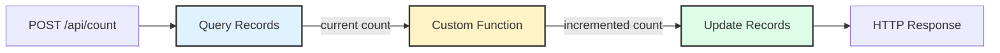

# Server-Side State

This recipe demonstrates how to use BFFless Data Tables (DB Records) as a server-side key-value store for application state. You'll learn how to persist state across requests, create GET/POST API endpoints, and use Custom Functions for state transformations.

## Overview

Using DB Records as a state store provides:

1. **Persistent storage** - State survives page refreshes and server restarts
2. **No backend code** - Build stateful APIs visually with Pipelines
3. **JSON flexibility** - Store complex objects in a single field
4. **Audit trail** - Track when state was last updated via timestamps

This pattern is perfect for counters, feature flags, user preferences, and any server-persisted state on static sites.

## Live Example

We have a click counter demo running on [demo.docs.bffless.app](https://demo.docs.bffless.app). The counter state is stored in a DB Record and accessed via Pipeline API endpoints:

- **GET `/api/count`** - Returns the current count
- **POST `/api/count`** - Increments and returns the updated count

Try it yourself—open the demo in multiple browser tabs and watch the count sync across all of them.

## Step 1: Create the Data Schema

First, create a DB Record to serve as your key-value store.

1. Navigate to your project in the BFFless admin
2. Go to **Pipelines** → **DB Records** tab
3. Click **Create DB Record**
4. Name it `keystore`
5. Add the following fields:

| Field | Type | Required | Description |
|-------|------|----------|-------------|
| `key` | String | Yes | Identifier for the state value |
| `value` | JSON | Yes | The state data (any JSON structure) |
| `updated_at` | Date | Yes | Last update timestamp |


After creating the schema, add an initial record:

1. Click into the `keystore` DB Record
2. Click **Add Record**
3. Set:
   - `key`: `"click_count"`
   - `value`: `{"count": 0}`
   - `updated_at`: current date/time

Note the **Record ID** (UUID) that's generated—you'll need this for the pipeline configuration.

## Step 2: Create the GET Pipeline

Create a Pipeline to read the current count.

1. Go to **Pipelines** → **Pipelines** tab
2. Click **Create Pipeline**
3. Configure the basic settings:


| Setting | Value |
|---------|-------|
| **Name** | `get-count` |
| **Path** | `/api/count` |
| **Method** | GET |
| **Rule Type** | Pipeline |

### Add Handler 1: Query Records

Add a Data Query handler to fetch the current state:


| Setting | Value |
|---------|-------|
| **Handler Type** | Data Query |
| **Source Schema** | `keystore` |
| **Record ID** | The UUID of your click_count record |
| **Return Single Object** | Enabled |

Name this step `getCount` so you can reference it in later steps.


### Add Terminal Handler: HTTP Response

Add a Response Handler to return the count:


| Setting | Value |
|---------|-------|
| **Handler Type** | Response |
| **Status** | 200 OK |
| **Body** | `{ "count": {{steps.getCount.value.count}} }` |

The expression `{{steps.getCount.value.count}}` references the `value.count` field from the query result.

## Step 3: Create the POST Pipeline

Create a Pipeline to increment and update the count.

1. Click **Create Pipeline**
2. Configure the basic settings:


| Setting | Value |
|---------|-------|
| **Name** | `update-count` |
| **Path** | `/api/count` |
| **Method** | POST |
| **Rule Type** | Pipeline |

### Add Handler 1: Query Records

First, fetch the current count (same as the GET pipeline):


| Setting | Value |
|---------|-------|
| **Handler Type** | Data Query |
| **Source Schema** | `keystore` |
| **Record ID** | The UUID of your click_count record |
| **Return Single Object** | Enabled |

Name this step `query`.

### Add Handler 2: Custom Function

Add a Function Handler to increment the count:


```javascript
const count = data.steps.query.value.count;
return {
  ...data.input,
  value: { count: count + 1 },
  timestamp: new Date().toISOString(),
};
```

This function:
1. Reads the current count from the query step
2. Returns a new `value` object with the incremented count
3. Includes a `timestamp` for the `updated_at` field

Name this step `updateCountFunction`.

### Add Handler 3: Update Records

Update the DB Record with the new values:


| Setting | Value |
|---------|-------|
| **Handler Type** | Data Update |
| **Target Schema** | `keystore` |
| **Record ID** | The UUID of your click_count record |

Map the update fields:
- `value` → `{{steps.updateCountFunction.value}}`
- `updated_at` → `{{steps.updateCountFunction.timestamp}}`

### Add Terminal Handler: HTTP Response

Return the updated count:


| Setting | Value |
|---------|-------|
| **Handler Type** | Response |
| **Status** | 200 OK |
| **Body** | `{ "count": {{steps.updateCountFunction.value.count}} }` |

## Pipeline Flow

Here's how the POST pipeline executes:



## Step 4: Use from Frontend

### JavaScript

```javascript
// Get current count
async function getCount() {
  const response = await fetch('/api/count');
  const { count } = await response.json();
  return count;
}

// Increment count
async function incrementCount() {
  const response = await fetch('/api/count', { method: 'POST' });
  const { count } = await response.json();
  return count;
}

// Usage
const currentCount = await getCount();
console.log('Current count:', currentCount);

const newCount = await incrementCount();
console.log('New count:', newCount);
```

### React Component

```tsx title="ClickCounter.tsx"
import { useState, useEffect } from 'react';

export function ClickCounter() {
  const [count, setCount] = useState<number | null>(null);
  const [isLoading, setIsLoading] = useState(false);

  // Fetch initial count
  useEffect(() => {
    fetch('/api/count')
      .then((res) => res.json())
      .then((data) => setCount(data.count));
  }, []);

  const handleClick = async () => {
    setIsLoading(true);
    try {
      const response = await fetch('/api/count', { method: 'POST' });
      const data = await response.json();
      setCount(data.count);
    } finally {
      setIsLoading(false);
    }
  };

  if (count === null) {
    return <p>Loading...</p>;
  }

  return (
    <div>
      <p>Count: {count}</p>
      <button onClick={handleClick} disabled={isLoading}>
        {isLoading ? 'Updating...' : 'Increment'}
      </button>
    </div>
  );
}
```

## Tips

### Use Meaningful Keys

When storing multiple state values, use descriptive keys:

```
feature_flags
user_preferences_default
analytics_session_12345
rate_limit_192.168.1.1
```

### Handle Race Conditions

The simple increment pattern shown here is vulnerable to race conditions under high concurrency. For critical counters, consider:

1. **Atomic operations** - Use a database that supports atomic increment operations
2. **Optimistic locking** - Include a version field and retry on conflict
3. **Queue-based updates** - Process increments sequentially via a queue

For most use cases (page view counters, feature flag reads), the simple pattern works fine.

### Validate State Structure

Use the Form Handler before the Custom Function to validate incoming state updates:

```json
{
  "fields": [
    { "name": "value", "type": "object", "required": true }
  ]
}
```

### Add Error Handling

In production, wrap your fetch calls with proper error handling:

```javascript
async function safeIncrement() {
  try {
    const response = await fetch('/api/count', { method: 'POST' });
    if (!response.ok) {
      throw new Error(`HTTP ${response.status}`);
    }
    return await response.json();
  } catch (error) {
    console.error('Failed to increment:', error);
    return null;
  }
}
```

## Use Cases

This pattern extends beyond simple counters:

| Use Case | Key | Value Structure |
|----------|-----|-----------------|
| **Click counter** | `click_count` | `{ count: 42 }` |
| **Feature flags** | `feature_flags` | `{ dark_mode: true, beta_features: false }` |
| **User preferences** | `prefs_user123` | `{ theme: "dark", language: "en" }` |
| **Rate limiting** | `rate_192.168.1.1` | `{ requests: 5, window_start: "..." }` |
| **Session state** | `session_abc123` | `{ cart: [...], step: 2 }` |
| **A/B test assignments** | `ab_user456` | `{ variant: "B", enrolled_at: "..." }` |

## Related Features

- [Pipelines](/features/pipelines) - Full documentation on Pipeline handlers and expressions
- [Proxy Rules](/features/proxy-rules) - Alternative approach using external APIs
