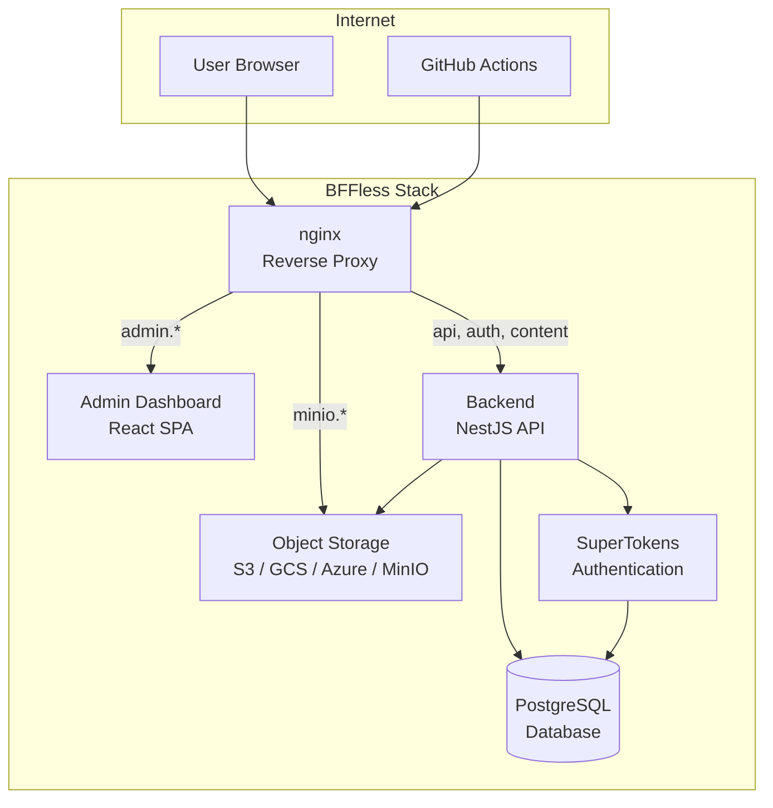
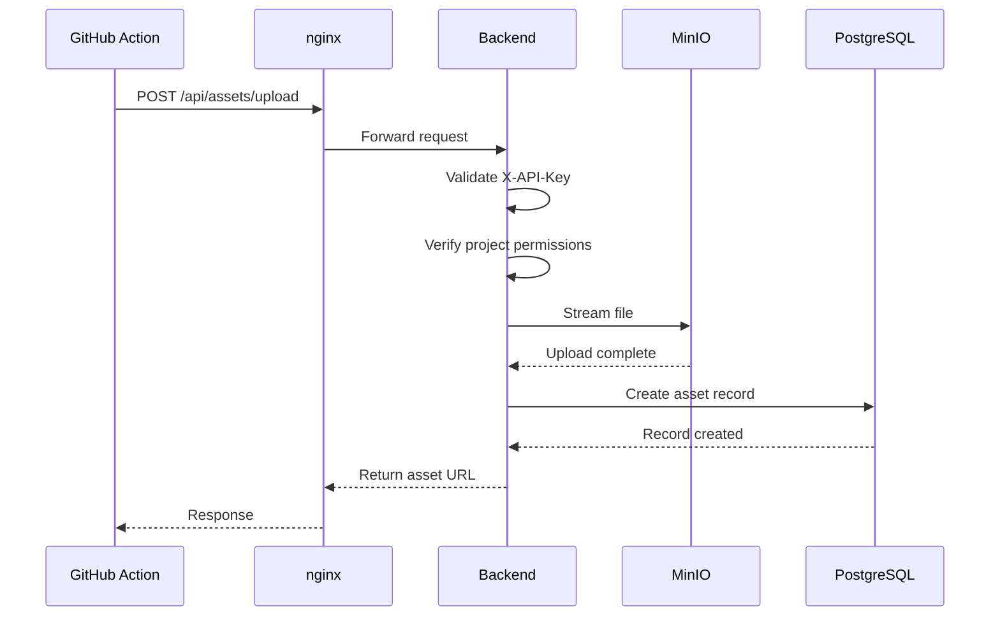
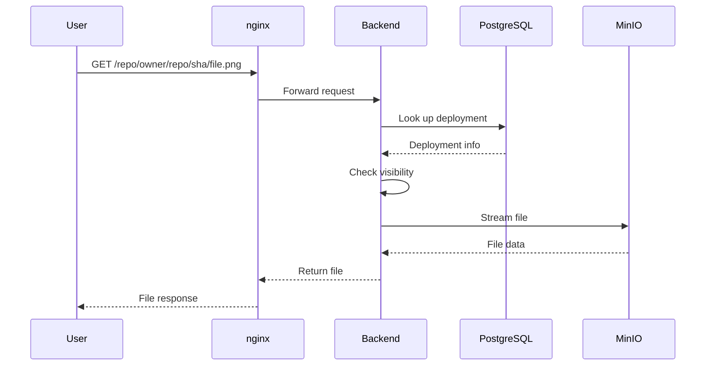
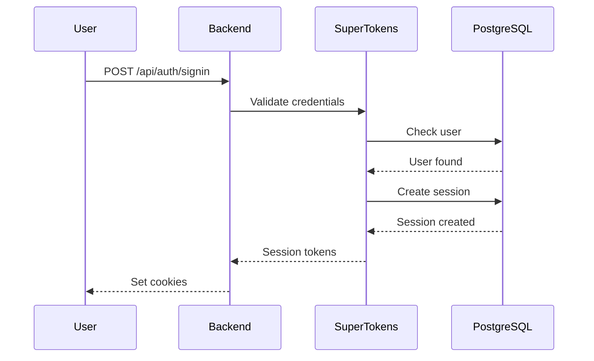
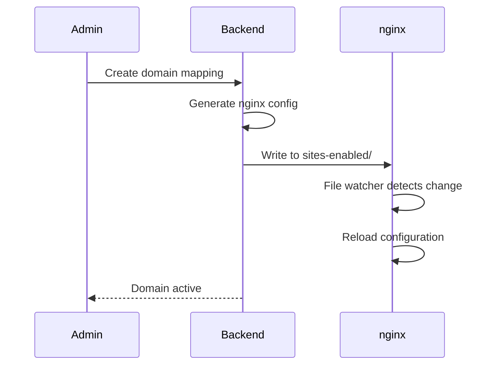
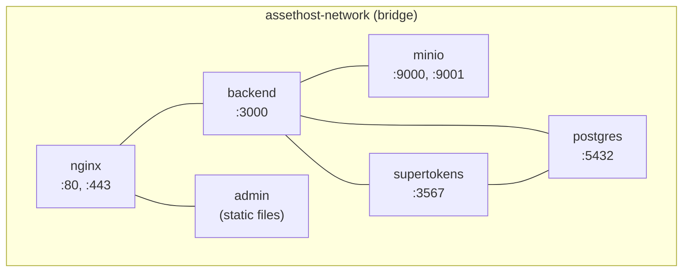

# Architecture

System architecture for BFFless.

## Overview



## Components

### nginx (Reverse Proxy)

The nginx container handles all incoming HTTP/HTTPS traffic.

**Responsibilities:**
- SSL/TLS termination
- Routing requests based on domain/subdomain
- Serving frontend static files
- Proxying API requests to backend
- Dynamic domain configuration via file watcher

**Configuration:**
- Main config: `docker/nginx/nginx.conf`
- Dynamic configs: `docker/nginx/sites-enabled/`

**Domain Routing:**

| Domain | Routes To |
|--------|-----------|
| `admin.domain.com` | Admin Dashboard (React SPA) |
| `domain.com/api/*` | Backend API |
| `minio.domain.com` | MinIO Console (only when using self-hosted MinIO) |
| `www.domain.com` | Deployed content (via backend) |
| `*.domain.com` (custom) | Deployed content (via backend) |

### Admin Dashboard (React SPA)

Single-page React application for managing sites, deployments, and settings. Served at `admin.yourdomain.com`.

**Technology Stack:**
- React 18 with TypeScript
- Vite for building/bundling
- Redux Toolkit for state management
- RTK Query for API calls
- TailwindCSS for styling
- Radix UI for components

**Key Directories:**

```
apps/frontend/src/
├── components/     # Reusable UI components
├── pages/          # Route components
├── services/       # RTK Query API definitions
├── store/          # Redux slices
└── hooks/          # Custom React hooks
```

**State Management:**
- RTK Query handles API caching with tag-based invalidation
- Tags: `Asset`, `ApiKey`, `User`, `Setup`, `Project`

### Backend (NestJS API)

REST API server built with NestJS.

**Technology Stack:**
- NestJS framework
- TypeScript
- Drizzle ORM for database
- SuperTokens for authentication
- Multer for file uploads

**Key Modules:**

```
apps/backend/src/
├── auth/           # Authentication (SuperTokens integration)
├── assets/         # Asset upload/download
├── deployments/    # Deployment management
├── projects/       # Project CRUD
├── storage/        # Storage adapter layer
├── setup/          # First-run setup wizard
├── repo-browser/   # Repository file browsing
└── db/             # Database schemas and migrations
```

### PostgreSQL (Database)

PostgreSQL 15 stores all application data.

**Databases:**
- `assethost` - Main application data
- `supertokens` - Authentication data (separate database)

**Key Tables:**
- `users` - User accounts
- `projects` - Repository projects
- `assets` - Uploaded files metadata
- `api_keys` - API key records
- `deployment_aliases` - Named deployment aliases
- `domain_mappings` - Custom domain configurations

See [Database Schema](/reference/database-schema) for complete details.

### Object Storage

S3-compatible object storage for uploaded assets. BFFless supports multiple storage backends:

- **MinIO** - Self-hosted S3-compatible storage (default for Docker)
- **AWS S3** - Amazon Simple Storage Service
- **Google Cloud Storage** - GCS with S3 compatibility mode
- **Azure Blob Storage** - Azure's object storage
- **Local Filesystem** - For development only

**Storage Key Format:**
```
{owner}/{repo}/{commitSha}/{path/to/file}
```

Objects are stored in a configurable bucket (e.g., `assets`) with keys following the pattern above.

**Examples:**
```
acme-corp/web-app/abc123def/index.html
acme-corp/web-app/abc123def/css/style.css
acme-corp/web-app/abc123def/images/logo.png
```

### SuperTokens (Authentication)

Handles user authentication and session management.

**Features:**
- Email/password authentication
- Session management with JWT
- Automatic token refresh
- Password reset flow

**Integration:**
- Uses dedicated `supertokens` PostgreSQL database
- Connected via internal Docker network

## Request Flows

### Asset Upload (GitHub Action)



### Asset Access (Public)



### User Authentication



### Dynamic Domain Creation



## Storage Architecture

### Storage Adapter Pattern

All storage operations use a common interface:

```typescript
interface IStorageAdapter {
  upload(key: string, file: Buffer, mimeType: string): Promise<void>;
  download(key: string): Promise<Buffer>;
  delete(key: string): Promise<void>;
  exists(key: string): Promise<boolean>;
  getSignedUrl(key: string, expiresIn: number): Promise<string>;
}
```

**Available Adapters:**
- `LocalStorageAdapter` - Filesystem (development)
- `MinioStorageAdapter` - S3-compatible (production)
- `S3StorageAdapter` - AWS S3
- `GCSStorageAdapter` - Google Cloud Storage
- `AzureStorageAdapter` - Azure Blob Storage

**Configuration:**
Storage type is configured via `STORAGE_TYPE` environment variable and credentials are stored encrypted in the database.

### Storage Key Format

```
{owner}/{repo}/{commitSha}/{path/to/file}
```

Objects are stored in a configurable bucket with keys following this pattern. The path includes subdirectories and filename.

**Benefits:**
- SHA-based immutability
- Natural organization by repository
- Easy migration between storage backends
- Supports versioning through commit SHAs

## Deployment Alias System

Deployments support multiple access patterns:

### SHA URL (Immutable)

```
/repo/{owner}/{repo}/{commitSha}/path/to/file
```

Always points to exact version of files uploaded with that SHA.

### Alias URL (Mutable)

```
/repo/{owner}/{repo}/alias/{alias}/path/to/file
```

Points to whatever SHA the alias currently references.

**Common Aliases:**
- `production` - Current production release
- `staging` - Pre-release testing
- `main` - Latest main branch build
- `dev` - Development builds

**Use Case:**
Pin `production` to a stable release while new commits continue uploading to SHA URLs.

## Security Model

### Authentication Layers

1. **Session Auth** - For web UI (SuperTokens cookies)
2. **API Key Auth** - For CI/CD (X-API-Key header)
3. **Public Access** - For public assets (no auth required)

### Guards

```typescript
@UseGuards(SessionAuthGuard)     // Web users
@UseGuards(ApiKeyGuard)          // CI/CD
@UseGuards(OptionalAuthGuard)    // Public with optional auth
```

### Data Protection

- Storage credentials encrypted with AES-256
- API keys hashed with bcrypt
- Sessions managed by SuperTokens
- HTTPS enforced in production

See [Security](/reference/security) for complete security documentation.

## Docker Networking

All containers communicate over the `assethost-network` bridge:



**Internal Hostnames:**
- `postgres` - PostgreSQL database
- `backend` - NestJS API
- `minio` - Object storage (only when using self-hosted MinIO)
- `supertokens` - Authentication
- `nginx` - Reverse proxy

## Development vs Production

| Aspect | Development | Production |
|--------|-------------|------------|
| Admin Dashboard | Vite dev server | Built static files |
| SSL | HTTP only | HTTPS with certificates |
| Storage | Local filesystem | S3 / GCS / Azure / MinIO |
| Database | Local PostgreSQL | Docker PostgreSQL |
| Auth | HTTP cookies | Secure cookies |
| Images | Built locally | Pre-built from GHCR |

## Related Documentation

- [Database Schema](/reference/database-schema) - Table definitions
- [Security](/reference/security) - Security considerations
- [API Reference](/reference/api) - REST API documentation
- [Storage Backends](/configuration/storage-backends) - Storage configuration
