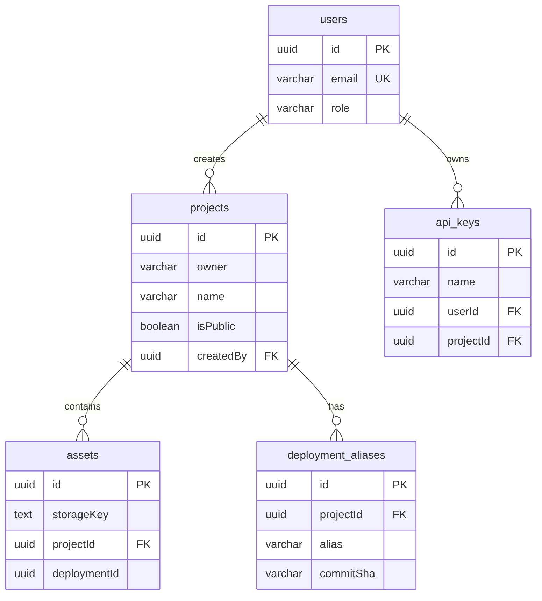
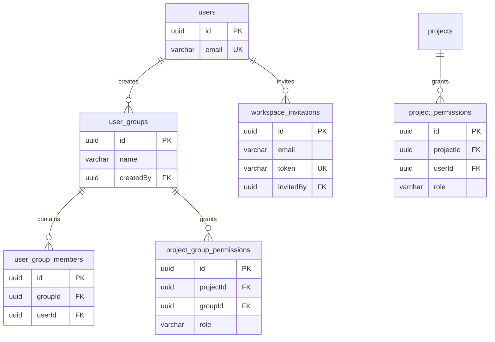
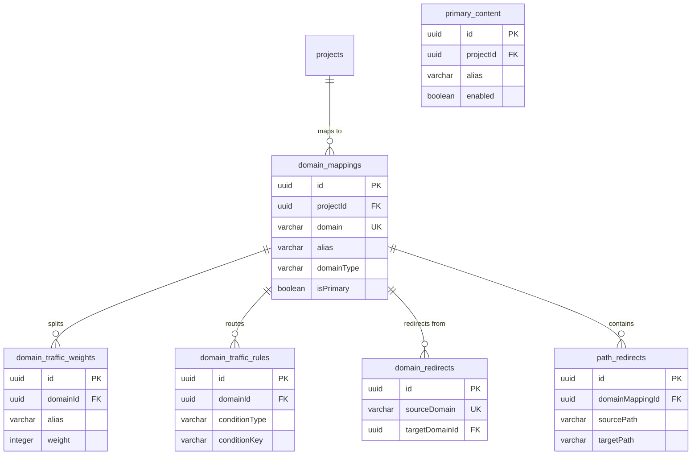
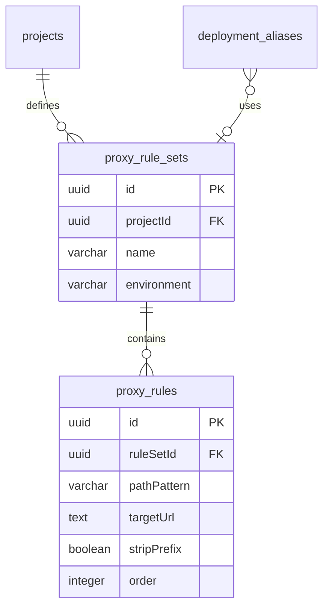
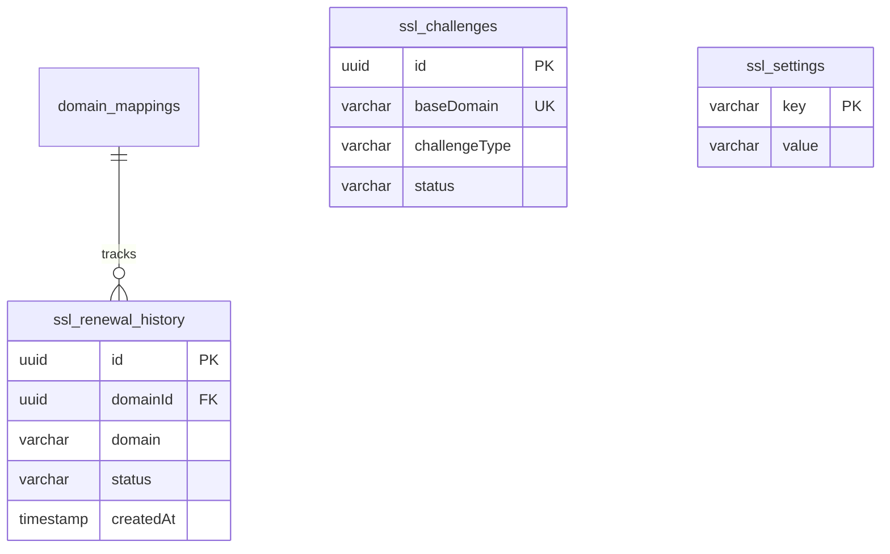
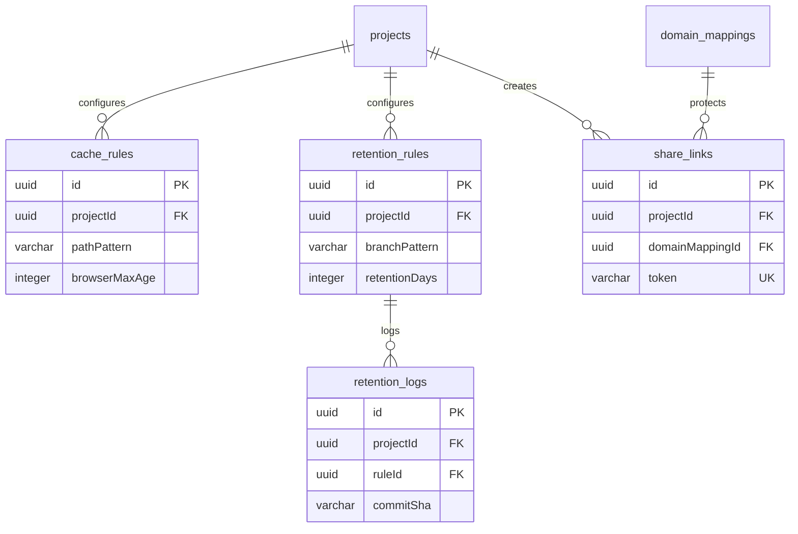
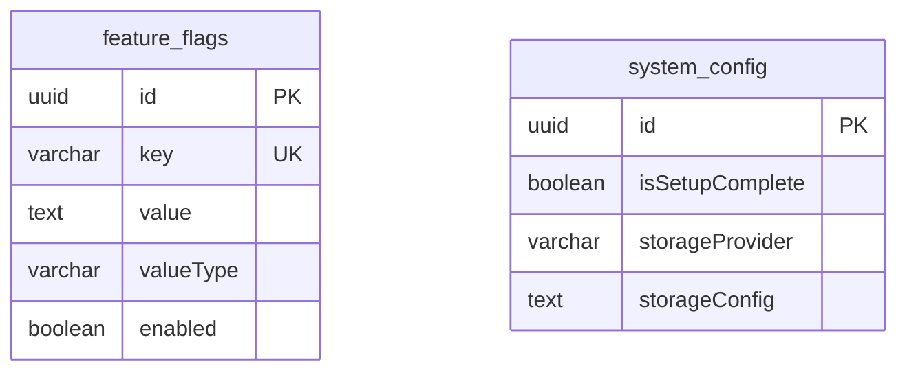

# Database Schema

Database tables and relationships for BFFless.

## Overview

BFFless uses two PostgreSQL databases:

- **`assethost`** - Main application data (all tables documented below)
- **`supertokens`** - Authentication data (managed by SuperTokens, separate database)

All schema definitions are in TypeScript at `apps/backend/src/db/schema/`.

:::note Schema-First Approach
This project uses a schema-first approach. Never write manual SQL migrations - always modify TypeScript schema files and generate migrations.
:::

## Table Reference

### Core Tables

| Table | Description |
|-------|-------------|
| `users` | User accounts |
| `projects` | Repository projects containing deployments |
| `assets` | Uploaded file metadata |
| `deployment_aliases` | Named aliases pointing to specific deployments |
| `api_keys` | API keys for CI/CD authentication |
| `system_config` | System-wide configuration (singleton) |

### Permissions Tables

| Table | Description |
|-------|-------------|
| `user_groups` | Groups of users for batch permissions |
| `user_group_members` | User membership in groups |
| `project_permissions` | Per-user project access |
| `project_group_permissions` | Per-group project access |
| `workspace_invitations` | Pending user invitations |

### Domain & Routing Tables

| Table | Description |
|-------|-------------|
| `domain_mappings` | Custom domain configurations |
| `domain_redirects` | Domain-level redirects |
| `domain_traffic_weights` | A/B testing traffic splits |
| `domain_traffic_rules` | Conditional routing rules |
| `primary_content` | Primary domain content settings |
| `path_redirects` | Path-level redirects within domains |
| `path_preferences` | Per-path settings (e.g., SPA mode) |

### Proxy Tables

| Table | Description |
|-------|-------------|
| `proxy_rule_sets` | Reusable groups of proxy rules |
| `proxy_rules` | Individual reverse proxy configurations |

### SSL Tables

| Table | Description |
|-------|-------------|
| `ssl_challenges` | ACME challenge data for certificate issuance |
| `ssl_settings` | SSL configuration key-value pairs |
| `ssl_renewal_history` | Certificate renewal audit log |

### Content Management Tables

| Table | Description |
|-------|-------------|
| `cache_rules` | HTTP caching behavior per path pattern |
| `retention_rules` | Automatic cleanup policies for old commits |
| `retention_logs` | Audit log of deleted content |
| `share_links` | Temporary access links for private content |

### Configuration Tables

| Table | Description |
|-------|-------------|
| `feature_flags` | Runtime feature flag overrides |

---

## Core Tables



### users

User accounts for authentication and authorization.

| Column | Type | Nullable | Default | Description |
|--------|------|----------|---------|-------------|
| `id` | UUID | No | random | Primary key |
| `email` | VARCHAR(255) | No | - | Unique email address |
| `role` | VARCHAR(50) | No | `'member'` | User role (`admin`, `user`, `member`) |
| `disabled` | BOOLEAN | No | `false` | Whether account is disabled |
| `disabledAt` | TIMESTAMP | Yes | - | When account was disabled |
| `disabledBy` | UUID | Yes | - | Who disabled the account |
| `createdAt` | TIMESTAMP | No | now() | Creation timestamp |
| `updatedAt` | TIMESTAMP | No | now() | Last update timestamp |

### projects

Repository projects that contain deployments.

| Column | Type | Nullable | Default | Description |
|--------|------|----------|---------|-------------|
| `id` | UUID | No | random | Primary key |
| `owner` | VARCHAR(255) | No | - | Repository owner (e.g., "acme-corp") |
| `name` | VARCHAR(255) | No | - | Repository name (e.g., "web-app") |
| `displayName` | VARCHAR(255) | Yes | - | Optional friendly display name |
| `description` | TEXT | Yes | - | Project description |
| `isPublic` | BOOLEAN | No | `false` | Whether assets are publicly accessible |
| `unauthorizedBehavior` | VARCHAR(20) | No | `'not_found'` | `'not_found'` or `'redirect_login'` |
| `requiredRole` | VARCHAR(20) | No | `'authenticated'` | Minimum role for access |
| `settings` | JSONB | Yes | - | Extensible settings object |
| `defaultProxyRuleSetId` | UUID | Yes | - | Default proxy rules for this project |
| `createdBy` | UUID | No | - | FK to users.id |
| `createdAt` | TIMESTAMP | No | now() | Creation timestamp |
| `updatedAt` | TIMESTAMP | No | now() | Last update timestamp |

### assets

Uploaded file metadata.

| Column | Type | Nullable | Default | Description |
|--------|------|----------|---------|-------------|
| `id` | UUID | No | random | Primary key |
| `fileName` | VARCHAR(255) | No | - | Original filename |
| `originalPath` | TEXT | Yes | - | Original file path |
| `storageKey` | TEXT | No | - | Storage location key |
| `mimeType` | VARCHAR(100) | No | - | File MIME type |
| `size` | INTEGER | No | - | File size in bytes |
| `projectId` | UUID | No | - | FK to projects.id |
| `branch` | VARCHAR(255) | Yes | - | Git branch name |
| `commitSha` | VARCHAR(40) | Yes | - | Git commit SHA |
| `assetType` | VARCHAR(20) | No | `'commits'` | `'commits'`, `'uploads'`, `'static'` |
| `deploymentId` | UUID | Yes | - | Groups files from same deployment |
| `publicPath` | TEXT | Yes | - | Path within deployment |
| `contentHash` | TEXT | Yes | - | MD5 hash for ETag optimization |
| `committedAt` | TIMESTAMP | Yes | - | Git commit timestamp |
| `createdAt` | TIMESTAMP | No | now() | Upload timestamp |
| `updatedAt` | TIMESTAMP | No | now() | Last update timestamp |

### deployment_aliases

Named aliases pointing to specific deployments.

| Column | Type | Nullable | Default | Description |
|--------|------|----------|---------|-------------|
| `id` | UUID | No | random | Primary key |
| `projectId` | UUID | No | - | FK to projects.id |
| `repository` | VARCHAR(255) | No | - | Repository identifier (deprecated) |
| `alias` | VARCHAR(100) | No | - | Alias name (e.g., "production") |
| `commitSha` | VARCHAR(40) | No | - | Target commit SHA |
| `deploymentId` | UUID | No | - | Target deployment ID |
| `isPublic` | BOOLEAN | Yes | - | Visibility override (null = inherit) |
| `unauthorizedBehavior` | VARCHAR(20) | Yes | - | Access control override |
| `requiredRole` | VARCHAR(20) | Yes | - | Role requirement override |
| `isAutoPreview` | BOOLEAN | No | `false` | Auto-generated preview alias |
| `basePath` | VARCHAR(512) | Yes | - | Base path for SPA preview |
| `proxyRuleSetId` | UUID | Yes | - | Override proxy rules |
| `createdAt` | TIMESTAMP | No | now() | Creation timestamp |
| `updatedAt` | TIMESTAMP | No | now() | Last update timestamp |

### api_keys

API keys for CI/CD authentication.

| Column | Type | Nullable | Default | Description |
|--------|------|----------|---------|-------------|
| `id` | UUID | No | random | Primary key |
| `name` | VARCHAR(255) | No | - | Human-readable key name |
| `key` | VARCHAR(255) | No | - | Bcrypt-hashed key value |
| `userId` | UUID | No | - | FK to users.id |
| `projectId` | UUID | Yes | - | FK to projects.id (null = global) |
| `expiresAt` | TIMESTAMP | Yes | - | Optional expiration |
| `lastUsedAt` | TIMESTAMP | Yes | - | Last usage timestamp |
| `createdAt` | TIMESTAMP | No | now() | Creation timestamp |

### system_config

System-wide configuration (singleton table).

| Column | Type | Nullable | Default | Description |
|--------|------|----------|---------|-------------|
| `id` | UUID | No | random | Primary key |
| `isSetupComplete` | BOOLEAN | No | `false` | Setup wizard completed |
| `storageProvider` | VARCHAR(50) | Yes | - | `'local'`, `'minio'`, `'s3'`, `'gcs'`, `'azure'` |
| `storageConfig` | TEXT | Yes | - | Encrypted storage credentials |
| `emailProvider` | VARCHAR(50) | Yes | - | Email provider type |
| `emailConfig` | TEXT | Yes | - | Encrypted email credentials |
| `cacheConfig` | TEXT | Yes | - | Encrypted cache config |
| `jwtSecret` | TEXT | Yes | - | JWT signing secret |
| `apiKeySalt` | TEXT | Yes | - | API key hashing salt |
| `allowPublicSignups` | BOOLEAN | No | `false` | Allow public registration |
| `createdAt` | TIMESTAMP | No | now() | Creation timestamp |
| `updatedAt` | TIMESTAMP | No | now() | Last update timestamp |

---

## Permissions Tables



### user_groups

Groups of users for batch permissions.

| Column | Type | Nullable | Default | Description |
|--------|------|----------|---------|-------------|
| `id` | UUID | No | random | Primary key |
| `name` | VARCHAR(255) | No | - | Group name |
| `description` | TEXT | Yes | - | Group description |
| `createdBy` | UUID | No | - | FK to users.id |
| `createdAt` | TIMESTAMP | No | now() | Creation timestamp |
| `updatedAt` | TIMESTAMP | No | now() | Last update timestamp |

### user_group_members

User membership in groups.

| Column | Type | Nullable | Default | Description |
|--------|------|----------|---------|-------------|
| `id` | UUID | No | random | Primary key |
| `groupId` | UUID | No | - | FK to user_groups.id |
| `userId` | UUID | No | - | FK to users.id |
| `addedBy` | UUID | Yes | - | FK to users.id |
| `addedAt` | TIMESTAMP | No | now() | When user was added |

### project_permissions

Per-user project access.

| Column | Type | Nullable | Default | Description |
|--------|------|----------|---------|-------------|
| `id` | UUID | No | random | Primary key |
| `projectId` | UUID | No | - | FK to projects.id |
| `userId` | UUID | No | - | FK to users.id |
| `role` | VARCHAR(50) | No | - | `'owner'`, `'admin'`, `'contributor'`, `'viewer'` |
| `grantedBy` | UUID | Yes | - | FK to users.id |
| `grantedAt` | TIMESTAMP | No | now() | When permission was granted |

### project_group_permissions

Per-group project access.

| Column | Type | Nullable | Default | Description |
|--------|------|----------|---------|-------------|
| `id` | UUID | No | random | Primary key |
| `projectId` | UUID | No | - | FK to projects.id |
| `groupId` | UUID | No | - | FK to user_groups.id |
| `role` | VARCHAR(50) | No | - | `'admin'`, `'contributor'`, `'viewer'` |
| `grantedBy` | UUID | Yes | - | FK to users.id |
| `grantedAt` | TIMESTAMP | No | now() | When permission was granted |

### workspace_invitations

Pending user invitations.

| Column | Type | Nullable | Default | Description |
|--------|------|----------|---------|-------------|
| `id` | UUID | No | random | Primary key |
| `email` | VARCHAR(255) | No | - | Invited email address |
| `role` | VARCHAR(32) | No | `'user'` | Role to assign on acceptance |
| `token` | VARCHAR(255) | No | - | Unique invitation token |
| `invitedBy` | UUID | Yes | - | FK to users.id |
| `expiresAt` | TIMESTAMP | No | - | When invitation expires |
| `acceptedAt` | TIMESTAMP | Yes | - | When accepted (null if pending) |
| `acceptedUserId` | UUID | Yes | - | FK to users.id (who accepted) |
| `createdAt` | TIMESTAMP | No | now() | Creation timestamp |

---

## Domain & Routing Tables



### domain_mappings

Custom domain configurations.

| Column | Type | Nullable | Default | Description |
|--------|------|----------|---------|-------------|
| `id` | UUID | No | random | Primary key |
| `projectId` | UUID | Yes | - | FK to projects.id |
| `alias` | VARCHAR(255) | Yes | - | Target deployment alias |
| `path` | VARCHAR(500) | Yes | - | Path within deployment |
| `domain` | VARCHAR(255) | No | - | Custom domain name (unique) |
| `domainType` | VARCHAR(20) | No | - | `'subdomain'`, `'custom'`, `'redirect'` |
| `redirectTarget` | VARCHAR(255) | Yes | - | Target for redirect type |
| `isActive` | BOOLEAN | No | `true` | Whether mapping is active |
| `isPublic` | BOOLEAN | Yes | - | Visibility override |
| `sslEnabled` | BOOLEAN | No | `false` | SSL/HTTPS enabled |
| `sslExpiresAt` | TIMESTAMP | Yes | - | Certificate expiration |
| `dnsVerified` | BOOLEAN | No | `false` | DNS verification status |
| `autoRenewSsl` | BOOLEAN | No | `true` | Auto-renew SSL certificates |
| `stickySessionsEnabled` | BOOLEAN | No | `true` | Enable sticky sessions |
| `stickySessionDuration` | INTEGER | No | `86400` | Session duration in seconds |
| `isSpa` | BOOLEAN | No | `false` | SPA mode (404 → index.html) |
| `isPrimary` | BOOLEAN | No | `false` | Primary domain flag |
| `wwwBehavior` | VARCHAR(20) | Yes | - | WWW redirect behavior |
| `createdBy` | UUID | No | - | FK to users.id |
| `createdAt` | TIMESTAMP | No | now() | Creation timestamp |
| `updatedAt` | TIMESTAMP | No | now() | Last update timestamp |

### domain_traffic_weights

A/B testing traffic splits.

| Column | Type | Nullable | Default | Description |
|--------|------|----------|---------|-------------|
| `id` | UUID | No | random | Primary key |
| `domainId` | UUID | No | - | FK to domain_mappings.id |
| `alias` | VARCHAR(255) | No | - | Target alias |
| `weight` | INTEGER | No | - | Traffic percentage (0-100) |
| `isActive` | BOOLEAN | No | `true` | Whether weight is active |
| `createdAt` | TIMESTAMP | No | now() | Creation timestamp |
| `updatedAt` | TIMESTAMP | No | now() | Last update timestamp |

### domain_traffic_rules

Conditional routing rules.

| Column | Type | Nullable | Default | Description |
|--------|------|----------|---------|-------------|
| `id` | UUID | No | random | Primary key |
| `domainId` | UUID | No | - | FK to domain_mappings.id |
| `alias` | VARCHAR(255) | No | - | Target alias |
| `conditionType` | VARCHAR(20) | No | - | `'query_param'` or `'cookie'` |
| `conditionKey` | VARCHAR(255) | No | - | Parameter/cookie name |
| `conditionValue` | VARCHAR(500) | No | - | Value to match |
| `priority` | INTEGER | No | `100` | Evaluation order (lower first) |
| `isActive` | BOOLEAN | No | `true` | Whether rule is active |
| `label` | VARCHAR(255) | Yes | - | Human-readable label |
| `createdAt` | TIMESTAMP | No | now() | Creation timestamp |
| `updatedAt` | TIMESTAMP | No | now() | Last update timestamp |

### primary_content

Primary domain content settings (singleton per workspace).

| Column | Type | Nullable | Default | Description |
|--------|------|----------|---------|-------------|
| `id` | UUID | No | random | Primary key |
| `enabled` | BOOLEAN | No | `false` | Primary content routing enabled |
| `projectId` | UUID | Yes | - | FK to projects.id |
| `alias` | VARCHAR(255) | Yes | - | Target alias |
| `path` | VARCHAR(500) | Yes | - | Path within deployment |
| `wwwEnabled` | BOOLEAN | No | `true` | Enable www subdomain |
| `wwwBehavior` | VARCHAR(50) | No | `'redirect-to-www'` | WWW redirect behavior |
| `isSpa` | BOOLEAN | No | `false` | SPA mode |
| `configuredBy` | UUID | Yes | - | FK to users.id |
| `createdAt` | TIMESTAMP | No | now() | Creation timestamp |
| `updatedAt` | TIMESTAMP | No | now() | Last update timestamp |

---

## Proxy Tables



### proxy_rule_sets

Reusable groups of proxy rules.

| Column | Type | Nullable | Default | Description |
|--------|------|----------|---------|-------------|
| `id` | UUID | No | random | Primary key |
| `projectId` | UUID | No | - | FK to projects.id |
| `name` | VARCHAR(255) | No | - | Rule set name (unique per project) |
| `description` | TEXT | Yes | - | Description |
| `environment` | VARCHAR(50) | Yes | - | Environment tag |
| `createdAt` | TIMESTAMP | No | now() | Creation timestamp |
| `updatedAt` | TIMESTAMP | No | now() | Last update timestamp |

### proxy_rules

Individual reverse proxy configurations.

| Column | Type | Nullable | Default | Description |
|--------|------|----------|---------|-------------|
| `id` | UUID | No | random | Primary key |
| `ruleSetId` | UUID | No | - | FK to proxy_rule_sets.id |
| `pathPattern` | VARCHAR(500) | No | - | URL pattern to match |
| `targetUrl` | TEXT | No | - | Target URL for forwarding |
| `stripPrefix` | BOOLEAN | No | `true` | Remove matched prefix |
| `order` | INTEGER | No | `0` | Evaluation order |
| `timeout` | INTEGER | No | `30000` | Request timeout (ms) |
| `preserveHost` | BOOLEAN | No | `false` | Keep original Host header |
| `forwardCookies` | BOOLEAN | No | `false` | Forward cookies to target |
| `headerConfig` | JSONB | Yes | - | Header configuration (encrypted) |
| `authTransform` | JSONB | Yes | - | Auth transformation config |
| `isEnabled` | BOOLEAN | No | `true` | Whether rule is active |
| `description` | TEXT | Yes | - | Rule description |
| `createdAt` | TIMESTAMP | No | now() | Creation timestamp |
| `updatedAt` | TIMESTAMP | No | now() | Last update timestamp |

---

## SSL Tables



### ssl_challenges

ACME challenge data for certificate issuance.

| Column | Type | Nullable | Default | Description |
|--------|------|----------|---------|-------------|
| `id` | UUID | No | random | Primary key |
| `baseDomain` | VARCHAR(255) | No | - | Base domain (unique) |
| `challengeType` | VARCHAR(20) | No | - | `'dns-01'` or `'http-01'` |
| `recordName` | VARCHAR(255) | No | - | DNS record name |
| `recordValue` | TEXT | No | - | TXT record value |
| `token` | VARCHAR(255) | No | - | ACME challenge token |
| `orderData` | TEXT | No | - | Serialized ACME order |
| `authzData` | TEXT | No | - | Serialized authorizations |
| `status` | VARCHAR(20) | No | `'pending'` | Challenge status |
| `expiresAt` | TIMESTAMP | No | - | When challenge expires |
| `createdAt` | TIMESTAMP | No | now() | Creation timestamp |
| `updatedAt` | TIMESTAMP | No | now() | Last update timestamp |

### ssl_settings

SSL configuration key-value pairs.

| Column | Type | Nullable | Default | Description |
|--------|------|----------|---------|-------------|
| `key` | VARCHAR(50) | No | - | Setting key (PK) |
| `value` | VARCHAR(255) | No | - | Setting value |
| `updatedAt` | TIMESTAMP | No | now() | Last update timestamp |

### ssl_renewal_history

Certificate renewal audit log.

| Column | Type | Nullable | Default | Description |
|--------|------|----------|---------|-------------|
| `id` | UUID | No | random | Primary key |
| `domainId` | UUID | Yes | - | FK to domain_mappings.id |
| `certificateType` | VARCHAR(20) | No | - | `'wildcard'` or `'individual'` |
| `domain` | VARCHAR(255) | No | - | Domain name (preserved if deleted) |
| `status` | VARCHAR(20) | No | - | `'success'`, `'failed'`, `'skipped'` |
| `errorMessage` | TEXT | Yes | - | Error details if failed |
| `previousExpiresAt` | TIMESTAMP | Yes | - | Previous expiration |
| `newExpiresAt` | TIMESTAMP | Yes | - | New expiration |
| `triggeredBy` | VARCHAR(20) | No | - | `'auto'` or `'manual'` |
| `createdAt` | TIMESTAMP | No | now() | When renewal occurred |

---

## Content Management Tables



### cache_rules

HTTP caching behavior per path pattern.

| Column | Type | Nullable | Default | Description |
|--------|------|----------|---------|-------------|
| `id` | UUID | No | random | Primary key |
| `projectId` | UUID | No | - | FK to projects.id |
| `pathPattern` | VARCHAR(500) | No | - | Glob pattern to match |
| `browserMaxAge` | INTEGER | No | `300` | Browser cache max-age (seconds) |
| `cdnMaxAge` | INTEGER | Yes | - | CDN s-maxage (seconds) |
| `staleWhileRevalidate` | INTEGER | Yes | - | SWR duration (seconds) |
| `immutable` | BOOLEAN | No | `false` | Content is immutable |
| `cacheability` | VARCHAR(10) | Yes | - | `'public'` or `'private'` |
| `priority` | INTEGER | No | `100` | Rule priority (lower first) |
| `isEnabled` | BOOLEAN | No | `true` | Whether rule is enabled |
| `name` | VARCHAR(100) | Yes | - | Human-readable name |
| `description` | VARCHAR(500) | Yes | - | Rule description |
| `createdAt` | TIMESTAMP | No | now() | Creation timestamp |
| `updatedAt` | TIMESTAMP | No | now() | Last update timestamp |

### retention_rules

Automatic cleanup policies for old commits.

| Column | Type | Nullable | Default | Description |
|--------|------|----------|---------|-------------|
| `id` | UUID | No | random | Primary key |
| `projectId` | UUID | No | - | FK to projects.id |
| `name` | VARCHAR(100) | No | - | Rule name |
| `branchPattern` | VARCHAR(255) | No | - | Glob pattern for branches |
| `excludeBranches` | JSONB | No | `[]` | Branches to exclude |
| `retentionDays` | INTEGER | No | - | Delete after N days |
| `keepWithAlias` | BOOLEAN | No | `true` | Keep commits with aliases |
| `keepMinimum` | INTEGER | No | `0` | Keep N most recent |
| `pathPatterns` | JSONB | Yes | - | File patterns for partial deletion |
| `pathMode` | VARCHAR(10) | Yes | - | `'include'` or `'exclude'` |
| `enabled` | BOOLEAN | No | `true` | Whether rule is enabled |
| `lastRunAt` | TIMESTAMP | Yes | - | Last execution time |
| `nextRunAt` | TIMESTAMP | Yes | - | Next scheduled run |
| `lastRunSummary` | JSONB | Yes | - | Summary of last execution |
| `createdAt` | TIMESTAMP | No | now() | Creation timestamp |
| `updatedAt` | TIMESTAMP | No | now() | Last update timestamp |

### retention_logs

Audit log of deleted content.

| Column | Type | Nullable | Default | Description |
|--------|------|----------|---------|-------------|
| `id` | UUID | No | random | Primary key |
| `projectId` | UUID | No | - | FK to projects.id |
| `ruleId` | UUID | Yes | - | FK to retention_rules.id |
| `commitSha` | VARCHAR(40) | No | - | Deleted commit SHA |
| `branch` | VARCHAR(255) | Yes | - | Branch name |
| `assetCount` | INTEGER | No | - | Number of assets deleted |
| `freedBytes` | BIGINT | No | - | Bytes freed |
| `isPartial` | BOOLEAN | No | `false` | Partial deletion |
| `deletedAt` | TIMESTAMP | No | now() | When deletion occurred |

### share_links

Temporary access links for private content.

| Column | Type | Nullable | Default | Description |
|--------|------|----------|---------|-------------|
| `id` | UUID | No | random | Primary key |
| `projectId` | UUID | Yes | - | FK to projects.id |
| `domainMappingId` | UUID | Yes | - | FK to domain_mappings.id |
| `token` | VARCHAR(64) | No | - | Unique share token |
| `label` | VARCHAR(255) | Yes | - | Human-readable label |
| `isActive` | BOOLEAN | No | `true` | Whether link is active |
| `expiresAt` | TIMESTAMP | Yes | - | Optional expiration |
| `lastUsedAt` | TIMESTAMP | Yes | - | Last usage time |
| `useCount` | INTEGER | No | `0` | Number of uses |
| `createdBy` | UUID | No | - | FK to users.id |
| `createdAt` | TIMESTAMP | No | now() | Creation timestamp |
| `updatedAt` | TIMESTAMP | No | now() | Last update timestamp |

---

## Configuration Tables



### feature_flags

Runtime feature flag overrides.

| Column | Type | Nullable | Default | Description |
|--------|------|----------|---------|-------------|
| `id` | UUID | No | random | Primary key |
| `key` | VARCHAR(100) | No | - | Flag identifier (unique) |
| `value` | TEXT | No | - | Flag value (JSON-encoded) |
| `valueType` | VARCHAR(20) | No | `'boolean'` | `'boolean'`, `'string'`, `'number'`, `'json'` |
| `description` | TEXT | Yes | - | Human-readable description |
| `enabled` | BOOLEAN | No | `true` | Whether flag is active |
| `createdAt` | TIMESTAMP | No | now() | Creation timestamp |
| `updatedAt` | TIMESTAMP | No | now() | Last update timestamp |

---

## Working with the Schema

### Generate Migrations

After modifying schema files:

```bash
cd apps/backend
pnpm db:generate
```

### Apply Migrations

```bash
pnpm db:migrate
```

### View Database

```bash
# Local development
pnpm db:studio

# Docker database
pnpm db:studio:docker
```

### Schema Location

All schema files are in `apps/backend/src/db/schema/`:

```
schema/
├── index.ts
├── users.schema.ts
├── projects.schema.ts
├── assets.schema.ts
├── api-keys.schema.ts
├── deployment-aliases.schema.ts
├── system-config.schema.ts
├── user-groups.schema.ts
├── project-permissions.schema.ts
├── workspace-invitations.schema.ts
├── domain-mappings.schema.ts
├── domain-redirects.schema.ts
├── domain-traffic-weights.schema.ts
├── domain-traffic-rules.schema.ts
├── primary-content.schema.ts
├── path-redirects.schema.ts
├── path-preferences.schema.ts
├── proxy-rule-sets.schema.ts
├── proxy-rules.schema.ts
├── ssl-challenges.schema.ts
├── ssl-settings.schema.ts
├── ssl-renewal-history.schema.ts
├── cache-rules.schema.ts
├── retention-rules.schema.ts
├── share-links.schema.ts
└── feature-flags.schema.ts
```

## Related Documentation

- [Architecture](/reference/architecture) - System architecture
- [API Reference](/reference/api) - REST API documentation
- [Security](/reference/security) - Data protection details
