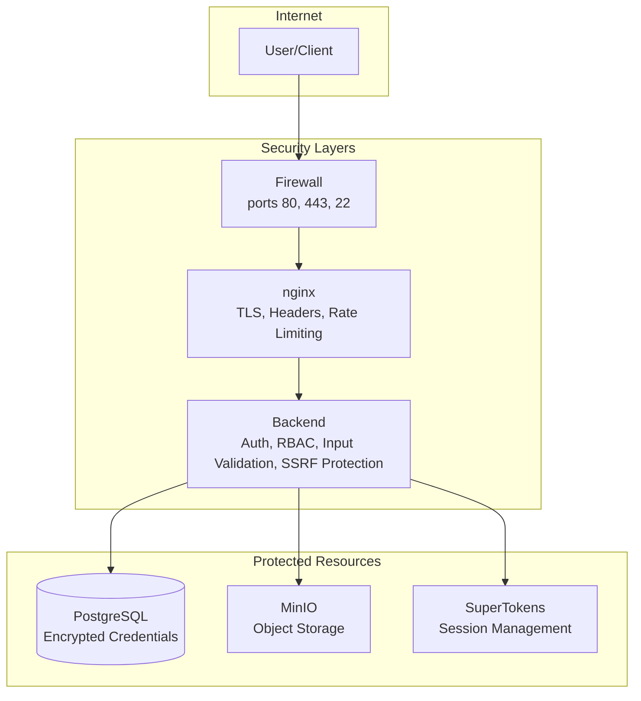

# Security

Security model and best practices for BFFless.

## Overview

The platform implements multiple security layers:

1. **Authentication** - User sessions and API keys
2. **Authorization** - Role-based access control
3. **Data Protection** - Encryption at rest and in transit
4. **Network Security** - SSRF protection, secure headers



## Authentication

### User Authentication

- **Method**: SuperTokens with email/password
- **Sessions**: HTTP-only cookies (no JavaScript access)
- **Token refresh**: Automatic with sliding window
- **Password hashing**: bcrypt (handled by SuperTokens)

### API Key Authentication

- **Method**: `X-API-Key` header
- **Storage**: bcrypt-hashed in database
- **Scope**: Project-level or global
- **Features**: Optional expiration, usage tracking

### Session Security

| Setting | Development | Production |
|---------|-------------|------------|
| Cookie `Secure` | `false` | `true` |
| Cookie `HttpOnly` | `true` | `true` |
| Cookie `SameSite` | `Lax` | `Strict` |
| Token rotation | Enabled | Enabled |

## Authorization

### Role-Based Access Control

| Role | Permissions |
|------|-------------|
| `admin` | Full access to all resources |
| `user` | Access to own projects and assigned resources |

### Project Permissions

| Permission | Description |
|------------|-------------|
| Owner | Full control (CRUD, settings, members) |
| Member | Upload and view assets |
| Viewer | Read-only access |

### Resource Access Rules

| Resource | Public | Authenticated | Owner/Admin |
|----------|--------|---------------|-------------|
| Public assets | Read | Read | Full |
| Private assets | None | Project members | Full |
| Project settings | None | View | Edit |
| API keys | None | Own keys | All keys |

## Data Protection

### Encryption at Rest

**Storage Credentials:**
- Encrypted with AES-256 using `ENCRYPTION_KEY`
- Stored in `system_config.storageConfig` field
- Includes MinIO/S3/GCS/Azure credentials

**Proxy Header Secrets:**
- API keys in proxy rules are encrypted
- Same encryption as storage credentials

**API Keys:**
- Hashed with bcrypt before storage
- Original value shown only once at creation

**Passwords:**
- Managed by SuperTokens
- bcrypt hashing with salt

### Encryption in Transit

**External:**
- HTTPS required in production
- TLS 1.2+ for all connections
- Valid SSL certificates (Let's Encrypt recommended)

**Internal:**
- Docker network isolation
- Services communicate over private network
- No exposed internal ports (except management)

### ENCRYPTION_KEY

The `ENCRYPTION_KEY` is critical:

```bash
# Generate a secure key
openssl rand -base64 32
```

**Rules:**
- Set before first run
- Never change after setup
- Back up securely
- If lost, reconfigure all storage settings

## Network Security

### SSRF Protection

Proxy rules validate target URLs:

- HTTPS required (HTTP blocked)
- Internal IPs blocked:
  - `127.0.0.0/8` (localhost)
  - `10.0.0.0/8` (private)
  - `172.16.0.0/12` (private)
  - `192.168.0.0/16` (private)
  - `169.254.0.0/16` (link-local)
- `localhost` blocked

### Security Headers

nginx adds these headers:

```nginx
# Prevent clickjacking
X-Frame-Options: DENY

# Prevent MIME-type sniffing
X-Content-Type-Options: nosniff

# Enable XSS filter
X-XSS-Protection: 1; mode=block

# Content Security Policy
Content-Security-Policy: default-src 'self'

# Strict Transport Security (HTTPS only)
Strict-Transport-Security: max-age=31536000; includeSubDomains
```

### Firewall Rules

Recommended firewall configuration:

```bash
# Allow SSH
ufw allow 22/tcp

# Allow HTTP (for ACME challenges)
ufw allow 80/tcp

# Allow HTTPS
ufw allow 443/tcp

# Enable firewall
ufw enable
```

Block all other incoming traffic.

## Input Validation

### File Uploads

- MIME type validation
- File size limits
- Path traversal prevention
- Filename sanitization

### API Inputs

- Request body validation (class-validator)
- Parameter sanitization
- SQL injection prevention (Drizzle ORM)

### Path Traversal Protection

Storage adapters prevent directory traversal:

```typescript
// ✗ Blocked
/repo/owner/repo/sha/../../../etc/passwd

// ✓ Allowed
/repo/owner/repo/sha/assets/image.png
```

## Rate Limiting

### Default Limits

| Endpoint | Limit |
|----------|-------|
| Authentication | 10 requests/minute |
| API upload | 10 requests/minute per key |
| General API | 100 requests/minute |

### Headers

```
X-RateLimit-Limit: 100
X-RateLimit-Remaining: 95
X-RateLimit-Reset: 1640000000
```

## Audit Logging

### Logged Events

- User authentication (login/logout)
- API key creation/deletion
- Project creation/deletion
- Permission changes
- Configuration changes

### Log Locations

```bash
# Application logs
docker compose logs backend

# nginx access logs
docker compose logs nginx
```

## Best Practices

### Deployment

- [ ] Use HTTPS in production (`COOKIE_SECURE=true`)
- [ ] Set strong `ENCRYPTION_KEY`
- [ ] Use unique database passwords
- [ ] Enable firewall (80, 443, 22 only)
- [ ] Keep Docker images updated
- [ ] Regular backups (database + encryption key)

### API Keys

- [ ] Use project-scoped keys (not global)
- [ ] Set expiration dates
- [ ] Rotate keys periodically
- [ ] Revoke unused keys
- [ ] Use secrets management in CI/CD

### User Management

- [ ] Use strong passwords
- [ ] Limit admin accounts
- [ ] Review user access regularly
- [ ] Remove inactive accounts

### Monitoring

- [ ] Monitor authentication failures
- [ ] Set up alerts for unusual activity
- [ ] Review logs regularly
- [ ] Track API key usage

## Security Checklist

### Before Production

- [ ] `COOKIE_SECURE=true`
- [ ] `COOKIE_DOMAIN` set correctly
- [ ] HTTPS with valid certificate
- [ ] Strong passwords for all services
- [ ] Firewall configured
- [ ] `ENCRYPTION_KEY` backed up securely

### Regular Maintenance

- [ ] Update Docker images monthly
- [ ] Rotate API keys quarterly
- [ ] Review user access monthly
- [ ] Check SSL certificate expiry
- [ ] Review audit logs weekly

## Vulnerability Reporting

If you discover a security vulnerability:

1. **Do NOT** open a public GitHub issue
2. Email security details to the maintainers
3. Include:
   - Description of the vulnerability
   - Steps to reproduce
   - Potential impact
   - Suggested fix (if any)

We aim to respond within 48 hours and will:
- Acknowledge receipt
- Investigate the issue
- Provide a fix timeline
- Credit reporters (if desired)

## Related Documentation

- [Authentication](/configuration/authentication) - Auth configuration
- [Environment Variables](/configuration/environment-variables) - Security settings
- [Architecture](/reference/architecture) - System overview
- [Troubleshooting](/troubleshooting) - Security issues
