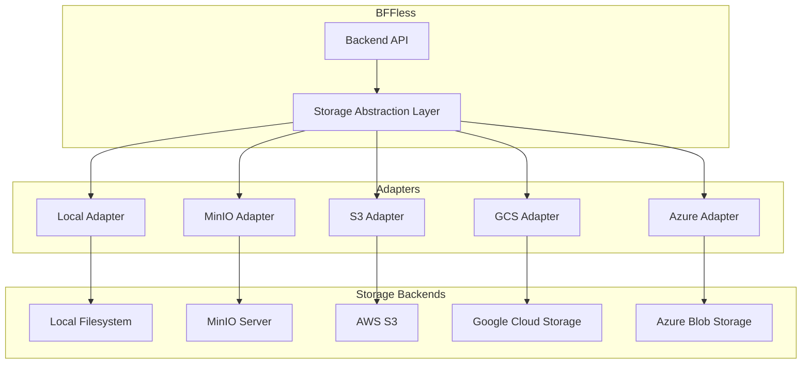

# Storage Overview

BFFless supports multiple storage backends with a unified interface. Choose the provider that best fits your deployment needs.

## Quick Start

| Deployment Type | Recommended Provider | Guide |
|-----------------|---------------------|-------|
| **Development** | Local or MinIO | [MinIO Setup](/storage/minio) |
| **Small Production** | MinIO or S3 | [AWS S3 Setup](/storage/aws-s3) |
| **AWS Deployment** | AWS S3 | [AWS S3 Setup](/storage/aws-s3) |
| **GCP Deployment** | Google Cloud Storage | [Google Cloud Storage Setup](/storage/google-cloud-storage) |
| **Azure Deployment** | Azure Blob Storage | [Azure Blob Storage Setup](/storage/azure-blob-storage) |
| **Self-Hosted** | MinIO | [MinIO Setup](/storage/minio) |

## Storage Provider Guides

### Cloud Providers

- **[AWS S3 Setup](/storage/aws-s3)** - Amazon S3 and S3-compatible services (DigitalOcean Spaces, Backblaze B2, Cloudflare R2, Wasabi)
- **[Google Cloud Storage Setup](/storage/google-cloud-storage)** - GCS with service accounts, Workload Identity, and ADC
- **[Azure Blob Storage Setup](/storage/azure-blob-storage)** - Azure Blob with account keys, connection strings, and Managed Identity

### Self-Hosted

- **[MinIO Setup](/storage/minio)** - Self-hosted S3-compatible object storage

## Additional Guides

- **[Caching Setup](/storage/caching)** - In-memory and Redis caching for improved performance
- **[Migration Guide](/storage/migration-guide)** - Migrate data between storage providers

## Feature Comparison

| Feature | Local | MinIO | S3 | GCS | Azure |
|---------|-------|-------|-----|-----|-------|
| Self-hosted | Yes | Yes | No | No | No |
| Presigned URLs | No | Yes | Yes | Yes | Yes |
| Versioning | No | Yes | Yes | Yes | Yes |
| Lifecycle Policies | No | Yes | Yes | Yes | Yes |
| CDN Integration | Manual | Manual | CloudFront | Cloud CDN | Azure CDN |
| Cost | Free | Free* | Pay-per-use | Pay-per-use | Pay-per-use |
| Managed Service | No | No | Yes | Yes | Yes |
| SLA | N/A | N/A | 99.9% | 99.9% | 99.9% |

*MinIO is free software; infrastructure costs apply.

## Architecture



## Common Patterns

### Development Setup

```bash
# Use local storage or MinIO
STORAGE_TYPE=local
LOCAL_STORAGE_PATH=/data/bffless-storage

# Or with MinIO (recommended)
pnpm dev:services  # Starts PostgreSQL + MinIO
```

### Production Setup

```bash
# AWS S3
STORAGE_TYPE=s3
S3_REGION=us-east-1
S3_BUCKET=my-bffless-bucket
S3_ACCESS_KEY_ID=AKIA...
S3_SECRET_ACCESS_KEY=...

# With caching
CACHE_ENABLED=true
CACHE_TYPE=redis
REDIS_HOST=redis.example.com
```

### Multi-Region Setup

For global deployments, consider:

1. **Multi-region storage** (GCS multi-region, S3 Cross-Region Replication)
2. **CDN** for edge caching (CloudFront, Cloud CDN, Azure CDN)
3. **Regional BFFless instances** with shared database

## Security Checklist

- [ ] Use IAM roles/Managed Identity when possible (avoid static keys)
- [ ] Enable encryption at rest
- [ ] Block public access (use presigned/SAS URLs)
- [ ] Enable audit logging
- [ ] Rotate credentials regularly
- [ ] Use least-privilege permissions
- [ ] Enable versioning for data protection
- [ ] Configure lifecycle policies for cost optimization

## Troubleshooting

See individual provider guides for specific troubleshooting. Common issues:

1. **Connection Failed** - Check credentials and network connectivity
2. **Access Denied** - Verify IAM permissions
3. **Slow Performance** - Enable caching, consider CDN
4. **High Costs** - Review storage classes and lifecycle policies

## Getting Help

- Check the specific provider guide for detailed troubleshooting
- Review BFFless logs: `docker logs bffless-backend`
- Test storage connection: Settings → Storage → Test Connection
- [GitHub Issues](https://github.com/bffless/ce/issues)
